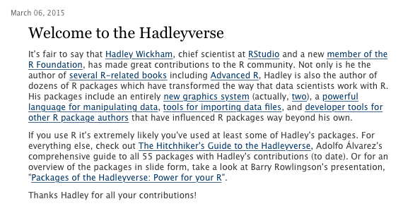

---
title       : "An Introduction to R"
subtitle    : "Day 1: Morning, Session 1"
author      : Daniel Anderson
job         : "R Training: Florida State University, June 21, 2016"
framework   : io2012    # {io2012, html5slides, shower, dzslides, ...}
highlighter : highlight.js  # {highlight.js, prettify, highlight}
hitheme     : zenburn      # 
widgets     : [mathjax]     # {mathjax, quiz, bootstrap}
mode        : selfcontained # {standalone, draft}
knit        : slidify::knit2slides
--- &twocol
```{r setup, include = FALSE}
knitr::opts_knit$set(root.dir = "/Users/Daniel/Dropbox/Teaching/FSU_June16/")
#knitr::opts_chunk$set(fig.height = 6, fig.width = 13)
```
<style>
em {
  font-style: italic
}
</style>

<style>
strong {
  font-weight: bold;
}
</style>

## Hi!

*** =left

# Who am I?
Daniel Anderson 
* IES post-doc at UO <span style="color:green; font-size:8pt;"> (Go Ducks!) </span>
* Dad (two daughters: 4 and 2)
* Quantitative educational researcher who **loves** R
* Primary areas of interest
  + R, big data, "educational data science"
  + Growth modeling (primarily through multilevel models)
  + Bayesian estimation (still learning, always learning)
  + Systems-level processes (specifically teachers)

*** =right

<div align = "center">

</div>

----
## My jump to R
* Began in earnest about 3 years ago
* Time consuming
* Very frustrating at times 
* One of the most professionally rewarding things I've done
* I'm still learning more every day

----
## Exciting parts of R (to me)
* Dynamic document generation
* Incredible graphing power (which is expanding all the time)
* Extremely flexible
* Substantial gains in efficiency
* Lots of really smart people working hard every day to make R better

---- &twocol
# Dynamic document generation

*** =left
<div align = "right">

</div>

*** =right
<div align = "left">

</div>

---- &twocol
# More advanced dynamic documents

*** =left
<div align = "right">

</div>

*** =right
<div align = "left">

</div>


---- &twocol
# Incredible graphing power

High density scatterplot

```{r seda, include = FALSE}
library(readstata13)

## READS IN DATA FROM SEDA SITE, USES FILES WITH 1 OBS PER DISTRICT,
## GRADE EQUIVALENT UNITS
d1 <- read.dta13("https://stacks.stanford.edu/file/druid:db586ns4974/district%20means%20grade%20equivalent%20std%20(gs)%20(pooled%20year,%20grade%20and%20sub).dta", convert.factors = FALSE)
d1$leaid <- sprintf("%07d", d1$leaid)

## LOADS DISTRICT COVARIATES, USES FILES WITH 1 OBS PER DISTRICT
d2 <- read.dta13("https://stacks.stanford.edu/file/druid:db586ns4974/district%20covariates.dta")

## LOADS DISTRICT GAPS, USES FILES WITH 1 OBS PER DISTRICT
## (NOTE: LEAID is num, not chr)
d3 <- read.dta13("https://stacks.stanford.edu/file/druid:db586ns4974/district%20gaps%20(pooled%20year,%20grade%20and%20sub).dta", convert.factors = FALSE)
d3$leaid <- sprintf("%07d", d3$leaid)

## MERGES FILES
## warning: due to some missing values you will get duplicate columns of
## "leaname" "fips" and "stateabb.x"
d <- merge(x = d1, y = d2, by = "leaid", all = TRUE)
d <- merge(x = d,  y = d3, by = "leaid", all = TRUE)

## PLOTTING SYMBOL WEIGHTS
d$wt <- sqrt(d$avgrdall)/25

dens <- densCols(d$perfrl, d$gsmean_pool, 
  colramp = colorRampPalette(c("black", "white")))

# Nice b & w version
#cols <-  colorRampPalette(c("gray90", "black"))(250)
cols <-  colorRampPalette(c("#000099", "#00FEFF", "#45FE4F", 
                            "#FCFF00", "#FF9400", "#FF3100"))(250)
d$dens <- col2rgb(dens)[1,] + 1
d$col <- cols[d$dens]
d <- d[order(d$dens),]
```

*** =left

```{r standardScatter, echo = FALSE, fig.height = 8, fig.width = 6, message = FALSE}
plot(gsmean_pool ~ perfrl, data = d, bty = "n")
```

*** =right

```{r hdScatter, echo = FALSE, fig.height = 8, fig.width = 6, message = FALSE}
plot(gsmean_pool ~ perfrl, data=d, pch=20, col=col, cex=2, bty = "n")
library(MASS)

zd <- na.omit(cbind(d$perfrl, d$gsmean_pool))
z <- kde2d(zd[ ,1], zd[ ,2], n=50)
contour(z, drawlabels=FALSE, nlevels=8, add=TRUE)
```


----
## Flexible, clean, displays

```{r cleanPlot, echo = FALSE, fig.height = 7, fig.width = 11}
xbar.therapy <- 92
s.therapy <- 8.5
xbar.placebo <- 85
s.placebo <- 9.1
n <- 15
xdiff <- xbar.therapy - xbar.placebo
sdiff <- sqrt((s.therapy^2 + s.placebo^2)/2) * sqrt(2/n)
sdiff <- sqrt(s.therapy^2 + s.placebo^2)/sqrt(n)

muH0 <- 0
muH1 <- 8

t0 <- (xdiff - muH0)/sdiff
par(cex.main = 1.5, mar = c(4, 4.5, 4.5, 1), mgp = c(3.5, 1, 0), cex.lab = 1.5, 
    font.lab = 2, cex.axis = 1.8, bty = "n", las = 1)

x <- seq(-15, 30, by = 0.001)
y <- dt(x/sdiff, df = 28)
y3 <- dt((x - 9)/sdiff, df = 28)
plot(x, y, type = "l", axes = FALSE, xlab = NA, ylab = NA, xlim = c(-15, 30), 
    lwd = 2)
lines(x, y3, lwd = 2)
axis(side = 1, at = seq(-15, 30, by = 5), labels = seq(-15, 30, by = 5), cex.axis = 1.6, 
    lwd = 2)
axis(side = 1, at = 7, pos = 0, col = "red4", col.axis = "red4", lwd = 2, cex.axis = 1.6, 
    padj = 0.6)

# shade critical regions:
tcrit <- qt(0.975, df = 28)
cord.x <- c(tcrit, seq(tcrit, 4, 0.001), 4) * sdiff
cord.y <- c(0, dt(seq(tcrit, 4, 0.001), df = 28), 0)
polygon(cord.x, cord.y, col = "grey")
cord.x <- c(-4, seq(-4, -tcrit, 0.001), -tcrit) * sdiff
cord.y <- c(0, dt(seq(-4, -tcrit, 0.001), df = 24), 0)
polygon(cord.x, cord.y, col = "grey")

# shade type-II error region
xcrit <- tcrit * sdiff
cord.x <- c(-5, seq(-5, xcrit, 0.001), xcrit)
cord.y <- c(0, dt(((seq(-5, xcrit, 0.001) - 9)/sdiff), df = 28), 0)
polygon(cord.x, cord.y, col = "grey90")

# add lines and text:
abline(v = xdiff, col = "red4", lwd = 2)
text(-16.3, 0.3, expression(paste(H[0], " : ", mu[diff], " = 0", sep = "")), 
    adj = 0, cex = 1.8)
text(13, 0.3, expression(paste(H[1], " : ", mu[diff], "" >= 9, , sep = "")), 
    adj = 0, cex = 1.8)
text(10, 0.08, expression(paste(alpha)), adj = 0, col = "red4", cex = 1.8)
text(-11, 0.08, expression(paste(alpha)), adj = 0, col = "red4", cex = 1.8)
text(1, 0.08, expression(paste(beta)), adj = 0, col = "red4", cex = 1.8)
mtext(expression(bar(x)[diff]), side = 1, line = 2, at = 6.5, adj = 0, col = "red4", 
    cex = 1.8, padj = 0.4)
lines(c(10, 8), c(0.05, 0.01), col = "red4", lwd = 2)
lines(c(-10, -8), c(0.05, 0.01), col = "red4", lwd = 2)
lines(c(2, 4), c(0.05, 0.01), col = "red4", lwd = 2)
```

<span style="color:gray; font-size:10pt;">Credit: Mijke Rhemtulla 
 (http://shinyapps.org/apps/RGraphCompendium/index.php#densities) </span>

----
# Other exciting aspects
* Flexibility comes from ability to write custom functions (which we'll discuss)
  + Essentially nothing is out of the question ("the question is not if, but how") 
* Efficiency
  + Batch processing
  + Loops
* Extensions of R
  + RStudio people
      - Hadley Wickham
      - Yihui Xie
  + *lme4* team
      - Douglas Bates
      - Martin Mächler
      - Ben Bolker
  + Many, many others


--- &twocol
*** =left
## Welcome to R

```{r, welcomFig, echo = FALSE}
curve(x^3, from = -50, to = 50, lty = 3, col = "cadetblue3", lwd = 3,
	axes = FALSE, xlab = "Time", ylab = "Learning", 
	main = "The R learning curve (as I see it)")
axis(1, at = seq(-50, 50, 10),  labels = seq(0, 100, 10))
axis(2, at = seq(-1e5, 1e5, 2e4),  labels = seq(0, 101, 10))
```

*** =right
* Moving from point-and-click interfaces to R is a substantial shift 
* It will take time to get used to a code-based interface 
* It will take time to shift the way you think about data 
* Be patient with yourself.

---- &twocol
## Overview of this training
*** =left
### Basic philosophy
* Part art, part science, part technical details
  - Analogy to songwriting: tools vs process
* The only way to **truly** become proficient at the art, is through doing.
  - you learn from me, I learn from you.
  - You'll practice throughout this training (more today than
    tomorrow)
* This course is about jumping into a whole new framework for the processing,
  analysis, and visualization of data. 
* It's meant to be hard. It hopefully will also be rewarding.

*** =right

<div align = "center">

</div>

----
## General advice for learning R
* Be stubborn, stick with it (it's worth it)
* Invest the time
* Try to work with it regularly (especially at first)
* Allow yourself to struggle (you're not alone)
* Understand the learning curve (you'll reach plateaus)
* Don't feel bad about writing bad code (you'll get better quickly)

----
## Agenda

# Today
* Basic intro to R (right now)
* Directory management, reading and writing data, data structures
* Intro to data visualizations with base graphics
* Lists, a complete applied example

# Tomorrow
* Intro to R Markdown and dynamic documents
* Data visualizations with *ggplot*
* Functions
* Loops


**Note:** I also have slides on a bunch of "routine" functions, if we can possibly squeeze them in (my guess is not).


---- &twocol
## Overview of this morning

* House cleaning
  + Text editors/R environments
* Very basics of R
  + Object assignment, vectors, matrices, and subsetting 

This morning will be mostly about the nuts and bolts. The afternoon will start with some more fun things (plotting) and end with a complete, applied example (with little bit of nuts and bolts in-between).

<br>

Also, note that I had to make some sacrifices in the content coverage, because time is limited. There's a lot more to R than what I will be able to present in these two days. I'm happy to talk with any of individually (or perhaps collectively) about other topics of interest.

----- &twocol
## Logistics: Enviornment
Find an environment that works for you  

*** =left


*** =right


----
## A note on syntax
* Just like there are rules of writing, there are generally accepted guidelines
  for writing code to make it more readable. For example

```{r grammar1, eval = FALSE}
matRow <- matrix(c(
           10, 11, 12, 13, 
           20, 21, 22, 23,
           30, 31, 32, 33
          ), 
  nrow = 3, ncol = 4, byrow = TRUE)
```
Is more readable, and easy to understand than

```{r grammar2}
matRow<-matrix(c(10,11,12,13,20,21,22,23,30,31,32,33),nrow=3,ncol=4,byrow=TRUE)
```

----
## The grammar of syntax

* Proper spacing and indentation is *critical* for code to be easily 
  interpretable.
* After you get used to applying the rules, poorly formatted code is like nails
  on a chalkboard


---- &twocol
## Style guide
**Please** review a style guide, and follow those protocols religiously

*** =left

* I recommend starting with Wickham's http://adv-r.had.co.nz/Style.html 
    + It's short (will take < 20 minutes to go through)

* Will make you look better if you ever end up posting on online forums
* Your coding friends will thank you 

*** =right

<div align = "center">

</div>

-----
## One more qualifier

* The slides I will present will be primarily on functions and operations using
  base R (with the lecture on *ggplot* being the primary exception).
* Many people adhere to the "Hadleyverse", which basically includes using
  packages developed by Hadley Wickham (a *really* smart guy) for basically all
  data manipulations and visualizations.
* My philosophy: Learn base first, then move to his packages if they are
  helpful
    + His packages are primarily just wrappers for base functions, but are
      generally more efficient than the approach you or I would take when
      programming "on the fly"




------
## Onto R
R as a big calculator

```{r, calc1}
3 + 2
```

```{r, calc2}
(1/-(3/2)^2) / 2^-1/9
```

------ &twocol

*** =left

# Object Assignment

```{r, obAssign1}
a <- 3
b <- 2
a + b
a / (a + b)
```

*** =right

# Object re-assignment

```{r, obAssign2}
a <- 3
a
a <- 7
a
```

------ &twocol
## Object Assignment (continued)
*** =left
Objects can be of a variety of types, which we'll talk about 
  much more after the break. But here are just a few

```{r, obType1}
string <- "Hello world!"
logical <- TRUE
double <- 3.2587021
Integer <- 6
```
*** =right
In this case, we can't exactly do arithmetic with all of these. 
  For example

```{r, obAssign3, error = TRUE}
string + double
```
But, these objects can be extremely useful in programming, as we
  will see.


------
## Playing a trick on a colleague
Object assignment can be helpful to play a trick on somebody (this is one I 
  actually did with a friend from Ohio, who loves the Buckeyes).
  
```{r, DucksBucks1}
Ducks <- 2
Buckeyes <- 1
```
Then clear the console, so they can't see the code you've previously written.

------ bg:url(/Users/Daniel/Dropbox/Teaching/CourseR/Weeks/Week1p1/assets/img/fightingduck.jpg)

```{r DucksBucks2}
Ducks > Buckeyes
Ducks < Buckeyes
Buckeyes > Ducks
```

---- &twocol
## R Environment

*** =left

# R functions
* Anything that carries out an operation in R is a function, even `+`. 
* Functions (outside of infix functions) are preceded by `()`
    + e.g., `sum()`, `lm()`

*** =right

# Getting help
* `?` is your best friend 
    + e.g., `?lm` will tell you all the arguments for the `lm` function
* Google is your other best friend
    + If the documentation from `?` is too confusing (often the case), try 
      google.
* Other good websites
    + http://stackoverflow.com
    + Resource list: 
          - http://www.ats.ucla.edu/stat/r/
    + Mailing lists: 
          - https://stat.ethz.ch/mailman/listinfo/r-help
    

---- &twocol
## R Packages
An R package is a suite of functions generally organized around a common theme.

*** =left

* Examples
    + `stringr`
        - Functions to make working with string variables more 
          simplistic and potentially efficient
    + `lme4`
        - Functions for Linear Mixed Effects Regression modeling 
    +  `ggplot2`
        - Wrapper functions for grid graphics to quickly produce complex 
          plots

*** =right

* As of this writing (06/09/16), there are 8,557 packages available 
  through CRAN (up from 7,239 in early October!).
    + These can all be installed via `install.packages("packageName")`

* Countless other packages on github, personal websites, etc. Often come with 
  installation instructions.
    + My `r2Winsteps` and `sundry` packages

* We will be using packages throughout the training (although most of the 
  training will be focused on base operations)

---- &twocol
## Vectors

# Two global rules for R: 

1. Anything that carries out an operation is a function, even `+`. 
2. Essentially every object in R is stored as a vector or a list (e.g., data
   frames, matrices).

*** =left

```{r vectors1}
is.vector(Ducks)
```
* The object `Ducks` is a vector, of length one
* So what is a vector?
  - essentially equivalent to the math definition
* <span style="color:blue" > A vector of dimension **n** is an ordered 
  collection of *n* elements, which are called components. </span>
  [math.com](http://www.math.com/tables/oddsends/vectordefs.htm)

*** =right
# Column Vector
$$
\begin{equation*}
 \qquad \begin{bmatrix}
    p_{1} \\\
    p_{2} \\\
    \vdots \\\
    p_{n}
  \end{bmatrix}
\end{equation*}
$$

# Row Vector

$$
\begin{equation*}
 \qquad \begin{bmatrix}
    p_{1} & p_{2} & \ldots & p_{n}
  \end{bmatrix}
\end{equation*}
$$

* Note that a vector of length one is typically referred to as a **scalar**,
  but in R it is still a vector of length 1.

----
## Creating vectors
$$
\begin{equation*}
 \qquad \begin{bmatrix}
    1 & 2 & 3
  \end{bmatrix}
\end{equation*}
$$

```{r numVec}
numVec <- c(1, 2, 3)
numVec
```

$$
\begin{equation*}
 \qquad \begin{bmatrix}
    A & B & C
  \end{bmatrix}
\end{equation*}
$$

```{r letVec}
letVec <- c("A", "B", "C")
letVec
```
* `c()` function, which stands for **concatenate** or **combine**. 
* Perhaps the most common function in all of R

---- &twocol
## Matrices
*** =left
* Technically - a vector with a dimension attribute
* Conceptually - vectors of the same length bound together

$$
\begin{equation*}
  \textbf{M} = \qquad 
  \begin{bmatrix}
    p_{11} & p_{12} & \ldots
    & p_{1n} \\
    p_{21} & p_{22} & \ldots
    & p_{2n} \\
    \vdots & \vdots & \ddots
    & \vdots \\
    p_{m1} & p_{m2} & \ldots
    & p_{mn}
  \end{bmatrix}
\end{equation*}
$$


*** =right
* Matrices can be constructed by the conceptual method

```{r mat1}
v1 <- c(10, 11, 12, 13)
v2 <- c(20, 21, 22, 23)
v3 <- c(30, 31, 32, 33)

mat <- matrix(c(v1, v2, v3), 
	nrow = 3, ncol = 4, byrow = TRUE)
mat
```

----
## More on constructing matrices

```{r matHelp, eval = FALSE}
?matrix
```


---- &twocol
## `byrow` or `bycol`?
*** =left

```{r matRow}
matRow <- matrix(c(v1, v2, v3), 
	nrow = 3, ncol = 4, byrow = TRUE)
matRow
```
```{r matCol}
matCol <- matrix(c(v1, v2, v3), 
	nrow = 3, ncol = 4, byrow = FALSE)
matCol
```
*** =right

```{r combVec}
v1 <- c(10, 11, 12, 13)
v2 <- c(20, 21, 22, 23)
v3 <- c(30, 31, 32, 33)
```

---- &twocol
## One final note (for now)

*** =left
* Vectors can be entered directly into the matrix function, but they still need
  to be entered as a vector or group of vectors

```{r matRow2}
matRow <- matrix(c(
		c(10, 11, 12, 13), 
		c(20, 21, 22, 23),
		c(30, 31, 32, 33)
		), 
	nrow = 3, ncol = 4, byrow = TRUE)
matRow
```
*** =right

```{r matRow3}
matRow <- matrix(c(
                   10, 11, 12, 13, 
				   20, 21, 22, 23,
				   30, 31, 32, 33
					), 
	nrow = 3, ncol = 4, byrow = TRUE)
matRow
```
* Note again, the importance of the `byrow` argument

---- &twocol
## Check-in

*** =left

Which snippets of code will produce the matrix below

$$
\begin{equation*}
  \textbf{mat} = \qquad 
  \begin{bmatrix}
    23 & 41 & 18 & 27 \\
    16 & 11 & 72 & 29 \\
    18 & 51 & 32 & 63 \\
  \end{bmatrix}
\end{equation*}
$$

*** =right

```{r quiz}
A <- matrix(c(
           23, 41, 18, 27, 
           16, 11, 72, 29,
           18, 51, 32, 63), 
  nrow = 3, ncol = 4)

B <- matrix(c(
           c(23, 41, 18, 27), 
           c(16, 11, 72, 29),
           c(18, 51, 32, 63)
           ), 
  nrow = 3, ncol = 4, byrow = TRUE)

C <- matrix(c(
          c(23, 16, 18), 
          c(41, 11, 51),
          c(18, 72, 32),
          c(27, 29, 63)
          ), 
  nrow = 3, ncol = 4)
```

----
## Your turn
Produce the following matrix and vector. 
$$
\begin{equation*}
  \textbf{m} = \qquad 
  \begin{bmatrix}
    67 & 11 & 10 \\
    44 & 22 & 33 \\
    39 & 94 & 85 \\
    49 & 6 & 12 \\
    22 & 86 & 61 \\
  \end{bmatrix}
\end{equation*}
$$

$$
\begin{equation*}
  \textbf{v} = \qquad 
  \begin{bmatrix}
    11 & 22 & 33 & 44 & 55 \\
  \end{bmatrix}
\end{equation*}
$$

<br>
Try adding them together. What do you get?

<span style="color:gray" > (You can work with a partner) </span>


----
```{r quizAns1}
c1 <- c(67, 44, 39, 49, 22)
c2 <- c(11, 22, 94, 6, 86)
c3 <- c(10, 33, 85, 12, 61)

m <- matrix(c(c1, c2, c3), ncol = 3)
v <- c(11, 22, 33, 44, 55)

v + m
```

---- .segue
# Subsetting Vectors and Matrices

---- &twocol
## Subsetting vectors
*** =left

```{r subsetVec1}
v1 <- c(11, 12, 13, 14, 15,
	    16, 17, 18, 19, 20)
```
* Indexing
  - select the fifth element 

```{r subsetVec2}
v1[5]
```
* Exclude the fifth element

```{r subsetVecExclude}
v1[-5]
```

*** =right
* select the 7th - 10th elements

```{r subsetVec3}
sevenToTen <- 7:10
sevenToTen
v1[sevenToTen]
v1[7:10]
```

---- 
## Subsetting vectors (continued)

```{r logVecSubset1}
v1 <- c(11, 12, 13, 14, 15, 16, 17, 18, 19, 20)
```
* Logical
  - select elements greater than 13

```{r logVecSubset2}
gt13 <- v1 > 13
gt13
v1[gt13]
```

---- &twocol
## Subsetting vectors (continued)

```{r logVecSubset3}
v1 <- c(11, 12, 13, 14, 15, 16, 17, 18, 19, 20)
```
*** =left
* Logical
  - select odd elements

```{r logVecSubset4}
v1 %% 2 # modulo operator
oddDummy <- v1 %% 2
oddDummy > 0
```
Actually could coerce directly to logical (but we haven't talked about coercions yet, and this works just as well)

*** =right

```{r logVecSubset5}
v1[oddDummy > 0]
```

---- &twocol
## Negation

```{r printV1, eval = FALSE}
v1 <- c(11, 12, 13, 14, 15, 16, 17, 18, 19, 20)
```

*** =left

Remove the third through fifth elements

```{r negation1}
v1[-3:-5]
```
Note that you must have the negative on each side, to create the appropriate sequence. For example, the following fails

```{r negationError}
v1[-3:5]
```

*** =right

Remove the third, fifth, and tenth elements

```{r negation2}
v1[c(-3, -5, -10)]

v1[-c(3, 5, 10)]
```

----
## Your turn

* Create the following vector

$$
\begin{equation*}
  \textbf{v} = \qquad 
  \begin{bmatrix}
    18 & 16 & 13 & 35 & 2 & 17 & 92 & 4 \\
  \end{bmatrix}
\end{equation*}
$$

Subset the vector by:
* Selecting the first 3 values
* Removing the last two values (somewhat tricky)
* Keeping all values greater than 15

----
```{r gp1}
v <- c(18, 16, 13, 35, 2, 17, 92, 4)
```
Selecting the first 3 values

```{r gp2}
v[1:3]
```

Removing the last two values

```{r gp3, eval = FALSE}
v[-c(7:8)]
v[-7:-8]
```
```{r gp4, echo = FALSE}
v[-c(7:8)]
```

Values greater than 15

```{r gp5}
v[v > 15]
```

---- &twocol
## Subsetting Matrices

*** =left

```{r subsetMat1, echo = FALSE}
mat <- matrix(c(10, 11, 12, 13, 
				20, 21, 22, 23,
				30, 31, 32, 33
					), 
	nrow = 3, ncol = 4, byrow = TRUE)
```
* indexing
  - Matrices can be subset by using `[]` with the same conventions as 
    mathematical matrices, i.e., `[row , column]`.

    *** 

$$
\begin{equation*}
  \textbf{mat} = \qquad 
  \begin{bmatrix}
    10 & 11 & 12 & 13 \\
    20 & 21 & 22 & 23 \\
    30 & 31 & 32 & 33 \\
  \end{bmatrix}
\end{equation*}
$$


*** =right

* Select the third element of the second column

```{r subsetMat2}
mat[3,2]
```

* Select the second element of the fourth column

```{r subsetMat3}
mat[2,4]
```

---- &twocol
## Subsetting Matrices (continued)
*** =left
#### Select an entire row: Leave the column indicator blank

* Select the entire second row

```{r rowMatSubset}
mat[2, ]
```
$$
\begin{equation*}
  \textbf{mat} = \qquad 
  \begin{bmatrix}
    10 & 11 & 12 & 13 \\
    20 & 21 & 22 & 23 \\
    30 & 31 & 32 & 33 \\
  \end{bmatrix}
\end{equation*}
$$

*** =right
#### Select an entire column: Leave the row indicator blank

* Select the entire third column

```{r colMatSubset1}
mat[ ,3]
```

---- &twocol
## Subsetting Matrices (continued)
*** =left
* The return from subsetting a matrix is a vector, which can also be
  subset.

```{r rowMatSubset2} 
column3 <- mat[ ,3]
column3
```
* select the second element of the new vector

```{r matVecSubset1}
column3[2]
```
*** =right

* Alternatively

```{r matVecSubset2}
mat[ ,3][2]
```
... which is the same as

```{r subsetMat4}
mat[2,3]
```

$$
\begin{equation*}
  \textbf{mat} = \qquad 
  \begin{bmatrix}
    10 & 11 & 12 & 13 \\
    20 & 21 & 22 & 23 \\
    30 & 31 & 32 & 33 \\
  \end{bmatrix}
\end{equation*}
$$


----
## Additional arguments

* You can avoid data being reduced to vectors by using the options `drop = FALSE`
  argument

```{r subsetMatAdArg1}
mat[ ,2, drop = FALSE]
```

* Use a vector to select multiple rows/columns

```{r subsetMatvector}
col1_3 <- c(1,3)
mat[ ,col1_3]
```

---- &twocol
## Subsetting Matrices (continued)
### Logical

*** =left

```{r logMatSubset1}
log1 <- mat > 13 & mat < 23
log1
mat[log1]
```
$$
\begin{equation*}
  \textbf{mat} = \qquad 
  \begin{bmatrix}
    10 & 11 & 12 & 13 \\
    20 & 21 & 22 & 23 \\
    30 & 31 & 32 & 33 \\
  \end{bmatrix}
\end{equation*}
$$

*** =right

```{r logMatSubset2}
log2 <- (mat > 13 & mat < 23) | 
	 	(mat > 30 & mat < 33)
log2
mat[log2]
```
Note the odd order, because the subsetting is occuring by column, rather than
  row.


----
## Brief practice
# We'll go directly to break from here, and review the answers when you get back at 10:45

<br>

Create the following matrix:

$$
\begin{equation*}
  \textbf{m} = \qquad 
  \begin{bmatrix}
    18 & 32 & 11 & 41 & 73 \\
    61 & 47 & 22 & 87 & 63 \\
    44 & 52 & 23 & 42 & 77 \\
    23 & 17 & 5 & 72 & 83 \\
  \end{bmatrix}
\end{equation*}
$$

Subset the matrix by:

* Selecting the third column
* Excluding the second column
* Selecting the third and fifth elements from the second row (somewhat tricky)
* Selecting values greater than 25
* Create a vector that is the sum of the first and fourth rows

----
```{r lab1}
m <- matrix(c(
    18, 32, 11, 41, 73,
    61, 47, 22, 87, 63,
    44, 52, 23, 42, 77,
    23, 17, 5, 72, 83
    ), 
  byrow = TRUE, ncol = 5
)
```
Select the third column

```{r lab2}
m[ ,3]
```

Exclude the second column

```{r lab3}
m[ ,-2]
```

----

Select third and fifth elements from the second row

```{r lab4}
m[2,c(3,5)]
```

Select values greater than 25

```{r lab5}
m[m > 25]
```

Create a vector that is the sum of the first and fourth rows

```{r lab6}
m[1, ] + m[4, ]
```
