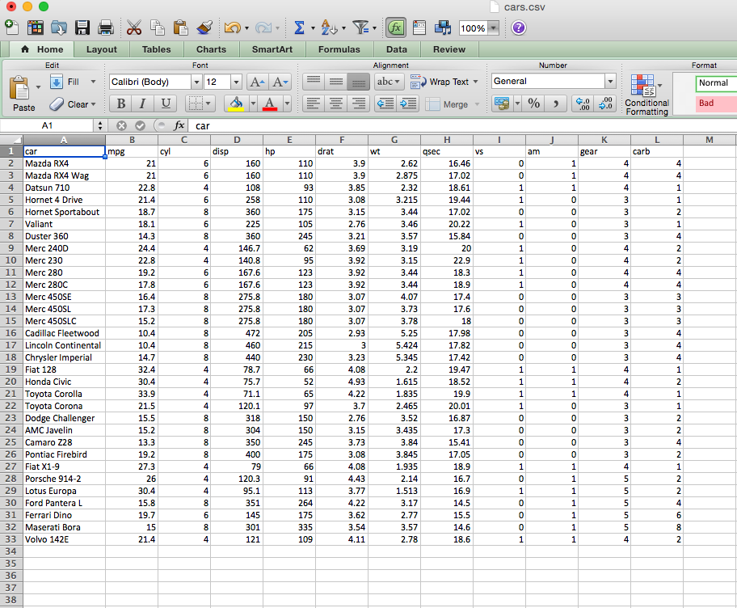
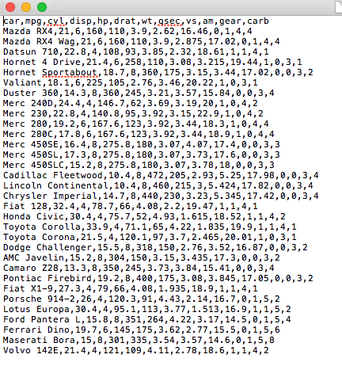
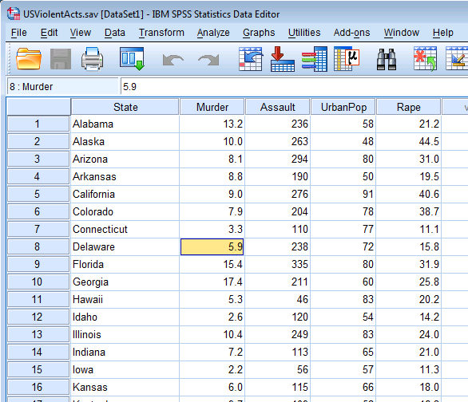
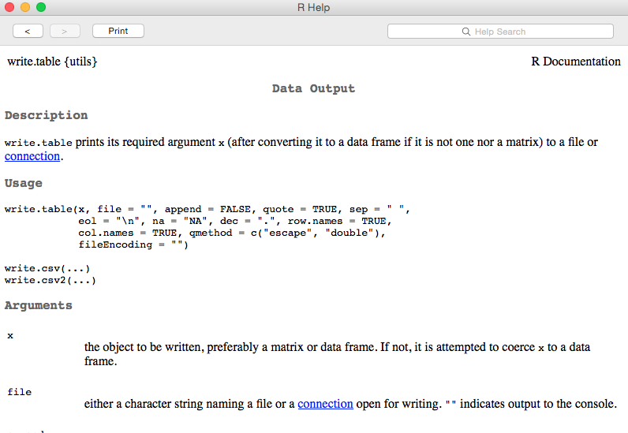
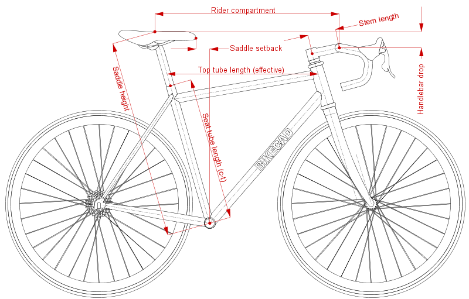

---
title       : "Dynamic Documents: An Introduction"
subtitle	: "Day 1: Morning, Session 2"
author      : Daniel Anderson
job         : "R Training: Florida State University, June 21, 2016"
framework   : io2012    # {io2012, html5slides, shower, dzslides, ...}
highlighter : highlight.js  # {highlight.js, prettify, highlight}
hitheme     : zenburn      # 
widgets     : [mathjax]     # {mathjax, quiz, bootstrap}
mode        : selfcontained # {standalone, draft}
knit        : slidify::knit2slides
--- &twocol
```{r setup, include = FALSE}
knitr::opts_knit$set(root.dir = "/Users/Daniel/Dropbox/Teaching/FSU_June16/")
#knitr::opts_chunk$set(fig.height = 6, fig.width = 13)
```
<style>
em {
  font-style: italic
}
</style>

<style>
strong {
  font-weight: bold;
}
</style>

## Directory Management

What is a working directory?
  * Exactly what it sounds like--the directory from which R will work
  * Read and write files from and to this directory

Identify current working directory

```{r getwd}
getwd()
```

------ 
## Looking into a working directory

What's in this directory? Two ways to find out:
* Navigate to the directory and take a look.
<div align = "left">

</div>

* Have R look for you

```{r listFiles}
list.files()
```
The `list.files()` function shows what R "sees".

------
## Navigating your directory quickly
* Change directory from current location to a nested folder

```{r nestedFolders, eval = FALSE}
setwd("./nested/folders")
```
Here the `.` is essentially a fill-in for `getwd()`. 
* Navigate back one folder

```{r navigateBack1}
setwd("..")
```
* Navigate back two folders

```{r navigateBack2}
setwd("../..")
```

------
## Reading Data into R
To read data into R, you must tell R where the data are located by either 
  changing the working directory, or by providing the full path. For 
  example

```{r readCSV1}
setwd("/Users/Daniel/Dropbox/Teaching/CourseR/data/")
d <- read.csv("cars.csv")
```  
is equivalent to
```{r readCSV2}
d <- read.csv("/Users/Daniel/Dropbox/Teaching/CourseR/data/cars.csv")
```
Also note that the shortcuts for changing directories can be used here too, 
  which can often increase efficiency.

----
## My advice
* Set your working directory to where you want to save all your data files.
* Move the data you are working with to that file, or to a nearby folder 
  e.g.,

```{r moveRaw, results = "hide"}
"(../raw)"
```

----
## What data can be read into R?
* R can read multiple data files
  - text files (csv, tab delimited, pipe delimited, etc)
  - web pages
  - SPSS, SAS, etc. (via the *foreign*, *haven*, or *memisc* packages)
  - Excel (I have not had great success here, and typically just convert it to 
    csv first)
  - relational and non-relational databases (I have no experience here, but I 
    know it is possible)
  - Directly entered data
* Simple text files are typically the most straightforward

<span style="color:green; font-weight:bold">
Fairly good blog post: </span>
http://www.r-bloggers.com/importing-data-into-r-from-different-sources/

----
## Diving deeper into reading data with R
```{r readTable1, eval = FALSE}
?read.table
```
<div align = "left">

</div>

---- &twocol
## Important Arguments
*** =left
* `file`
  - name of file, including extension, in quotes
  - e.g. `"cars.txt"`
* `header` 
  - `read.table` defaults to `FALSE`
  - `read.csv` and others default to `TRUE`

*** =right
* `sep` 
  - `read.table` defaults to `""`
  - `read.csv` defaults to `","`
  - `read.delim` defaults to tab delimiter `"\t"`

* Others
  - `na.strings`
  - `skip`
  - `comment.char`
  - `stringsAsFactors`


---- &twocol
## Examples
*** =left

* Although csv files open in Excel, they are actually just text files

*** =right


----
## Examples

```{r cars1}
getwd()
cars <- read.csv("./data/cars.csv")
```
* Use `head()` `tail()` and `str()` to check that the data were read in properly

```{r headCars}
head(cars)
```

----
```{r tailCars}
tail(cars)
```

---- 

```{r strCars}
str(cars)
```

----
## Learn more with `summary()`

```{r smryCars}
summary(cars)
```

---- &twocol
## A more complicated example
*** =left
* No column names
* pipe-delimited
* `NA` coded as 999
* `read.csv()` won't work here

*** =right
<div align = "left">

</div>


----
* `read.table()`
* Explicit calls to 
  - `sep`, `na`, and `col.names`

```{r trees}
trees <- read.table("./data/trees.txt", sep = "|", na = "999", 
  col.names = c("Girth", "Height", "Volume"))
head(trees)
```
* Note that the column names are defined as a vector, via `c`.

---- 
## Last example: SPSS


----
```{r readSPSS}
library(foreign)
violence <- read.spss("./data/USViolentActs.sav", to.data.frame = TRUE)
head(violence)
```

---- &twocol
## More on reading foreign files

*** =left

* It can be a hassle
* *foreign* package (part of the base distribution)
    + No longer being developed
    + Warnings are (for now) ignorable
    + `to.data.frame = TRUE` is vital
* *Hmisc* package may be a better alternative (I haven't explored it much, and 
  generally try to avoid SPSS files)
* *haven* is probably the best option
    + Written by Hadley Wickham (so, basically, it's trustworthy)
    + New package, actively being developed and maintained
    + Reads SPSS, SAS, and Stata files
    + Defaults lead to data being read in how you expect it to be (generally)
    + Includes preliminary support for *writing* Stat or SPSS files (not SAS,
      yet)


-----
## Example with haven

```{r haven}
# install.packages("haven") # to install the first time
library(haven)
viol <- read_spss("./data/USViolentActs.sav")
head(viol)
```

----
## Your turn

Read in the following files from the *data* folder
* longley.csv
* attitude.txt

<span style="color:gray" > (You can work with a partner) </span>

----
The longley file is a csv, with headers, and can be read in pretty simply:

```{r longley}
longley <- read.csv("./data/longley.csv")
head(longley)
```

----
The attitude file is a bit more tricky. It's tab separated. We can use either
  `read.table()` or `read.delim()`.

```{r attitude}
att <- read.table("./data/attitude.txt", sep = "\t")
att <- read.delim("./data/attitude.txt")
head(att)
```

----
## Subsetting data frames
* Data frames can be subset in numerous ways, including indexing equivalent to 
  matrices

```{r headCars2}
head(cars)
```
* Select the first 10 rows of the 3rd column

```{r carsSubSet1}
cars[1:10,3]
```

----
Select the same elements, but keep the data frame intact

```{r carsSubSet2}
cars[1:10,3, drop = FALSE]
```


----
## `str()` gives us a hint at an alternative subsetting method

```{r strCars2}
str(cars)
```

----
## Selecting columns by name
The `$` operator can also be used to select columns
* Select the `mpg` variable/column

```{r carsMPG}
cars$mpg
```

* Select the `cyl` variable/column

```{r carsCyl}
cars$cyl
```

---- &twocol
## A few more subsetting notes
*** =left
* Names can also be used within the `[]`, as long as they are supplied as a 
  string
* Multiple columns can be selected in this manner if a vector of names is 
  supplied
  - vectors are returned if you are using the `row , column` notation with a 
    single variable and you do not specifiy `drop = FALSE`
  - data frame maintained if only the names are supplied


* The following two lines of code are equivalent

```{r carsMPGCyl, eval = FALSE}
cars[c("mpg","cyl")]
cars[ ,c("mpg","cyl")]
```
*** =right
* As are these

```{r carsMPG1, eval = FALSE}
cars["mpg"]
cars[ ,"mpg", drop = FALSE]
```
* However, these are not

```{r carsMPG2, eval = FALSE}
cars["mpg"]
cars[ ,"mpg"]
```

* The first maintains the data frame, while the second returns a vector

---- &twocol
## Example

*** =left

```{r carsMPG3}
cars["mpg"]
```

*** =right

```{r carsMPG4}
cars[ ,"mpg"]
```

----
## Logical subsetting can also be used with data frames

```{r cars25up}
mpg25up <- cars$mpg > 25
cars[mpg25up, ]
```

```{r cars25gears5}
cars[cars$mpg > 25 & cars$gear == 5, ]
```

----
## How do these logical subsets work?

```{r carsLog}
cars$mpg > 25
cars$mpg > 25 & cars$gear == 5
```

----
## Final note on subsetting 
* The `subset()` function can be very useful for subsetting vectors, matrices, 
  or data frames

```{r subsetFun, eval = FALSE}
?subset
```

<div align = "center">

</div>


---- &twocol
## Examples of `subset`
* `x` = object to subset
* `subset` logical vector
* `select` optionally used to select columns

*** =left

```{r subsetCars1}
subset(cars, 
  subset = mpg > 25, 
  select = c("model", "mpg", "hp"))
```

*** =right

```{r subsetCars2}
subset(cars, hp > 220)
```

----
## Writing Data
* Write text files with essentially the same process, using `write.table()` or
  `write.csv()`



----
## Example
* Write csv file

```{r writeCSV, eval = FALSE}
write.csv(cars, file = "carsData.csv", row.names = FALSE)
```

* Write dat file for mplus

```{r writeTable, eval = FALSE}
write.table(cars, file = "carsData.dat", 
  sep = "\t", 
  col.names = FALSE,
  row.names = FALSE,
  na = "999")
```

----
## Write an R file

```{r writeRDA, eval = FALSE}
save(cars, file = "carsData.Rda")
```

Loading the data is then really easy

```{r loadRDA, eval = FALSE}
load("carsData.Rda")
```

```{r headCarsRDA}
head(cars)
```

----
## A note on writing R files
* When you load the `carsData.Rda` file, the object `cars` is loaded (i.e., it
  is not `carsData`). The reason is the file is `carsData`, but the object saved
  was `cars`. It's often helpful to keep them the same.

```{r fileObjectNameSame, eval = FALSE}
carsData <- cars
save(carsData, file = "carsData.Rda")
```

* Other options (both readable by text editors)
  - `dump()`
  - `dput()` 

For the most part, I'd recommend either writing a text file or an r-specific 
  `.Rda` file.

---- .segue
# Data structures

--- 
## Data structures

```{r dataStructureTable, echo = FALSE}
dim <- c(1, 2, "n")
hom <- c("Atomic Vector", "Matrix", "Array")
het <- c("List", "Data frame", "")
df <- data.frame(Dimensions = dim, Homogenous = hom, Heterogeneous = het)

knitr::kable(df)
```
<br>
* Note: Table taken from Wickham (2015)

----
## Properties of Vectors

# Type 
* Type of elements stored in the vector
    - use `typeof()` or `is.character()`, `is.integer()`, etc.

# Length
* Number of elements in the vector
    - use `length()`

# Attributes
* Arbitrary metadata
    - use `attributes()` and/or `attr()`
* What's metadata
    - data about the data (i.e., information that describes the data)

---- &twocol
## Atomic Vectors vs Lists

*** =left

* Atomic
    - All elements of the same type

* Lists
    - Element types differ

<br>

Lists are incredibly useful, but decidedly more complicated. We'll only touch on them briefly. 

*** =right

```{r atomicLists}
atomic <- c(1, 7, 9, 23, 5)
atomic

lst <- list("a", 2, TRUE)
lst
```

---- &twocol
## Data types

*** =left
* Double
    - numeric with arbitrary precision
* Integer
    - numeric whole number
* Logical
    - true/false
* Character
    - string elements

*** =right

```{r dataTypes}
dbl <- c(1.357, 2, 4.67)
int <- c(2L, 5L, 7L, 1L)
log <- c(TRUE, FALSE, T, F)
chr <- c("a", "b", "c")
```
Note the specific "L" placed after each number on the integer vector to coerce
  the elements to integer, rather than double.

```{r integer}
int
```

---- &twocol
## Determining and Testing Types

*** =left

```{r testType}
typeof(dbl)
is.double(dbl)
is.integer(dbl)
is.atomic(dbl)
```

*** =right
# Be careful of more generic tests

```{r GenericTest}
is.numeric(dbl)
is.numeric(int)
```

----
## Check in
* What data types are the following vectors?

```{r quizType}
w <- c(TRUE, FALSE, FALSE, TRUE)
x <- c(3, 5, 8, 9, 2.5)
y <- c("green", "red", "blue")
z <- c(5L, 7L, 2L, 18L)
```

----
## Coercion

# Take a guess: What will the following vectors produce?

```{r CoercionGuess}
w <- c("1", 2, 3)
x <- c(1, TRUE, FALSE)
y <- c(3.25, 5L, 7L)
z <- c("a", "b", 7, TRUE)
```

---- &twocol

*** =left

```{r CoercisonAnswer1}
c("1", 2, 3); is.character(w)
c(1, TRUE, FALSE); is.double(x)
```

*** =right

```{r CoercisonAnswer2}
c(3.25, 5L, 7L); is.double(y)
c("a", "b", 7, TRUE); is.character(z)
```

----
## Coercion rules
Remember: Atomic vectors must contain data of the same type.

* Most flexible: Character
* Least flexible: Logical

When logical vectors are coerced to be numeric, `TRUE` are coded 1, and `FALSE`
  are coded 0.

Explicitely coerce via `as.___`.

---- &twocol
## Explicit coercion

*** =left

# Override default coercions

```{r overrideDefaulCoercions}
c(FALSE,1,TRUE,0)
as.logical(c(FALSE,1,TRUE,0))
c("1", 2, 3)
as.double(c("1", 2, 3))
```
*** =right

# Convert to specific type

```{r asCharacter}
as.character(1:5)
```
<br>
# Careful with specific coercsions

```{r asInteger}
c("a", "b", 7, "TRUE")
as.integer(c("a", "b", 7, "TRUE"))
```

----
## Check in
* Predict how each vector will be coerced.

```{r predictCoercsions, eval = FALSE}
c(1, FALSE)
c("a", TRUE)
c("b", 1L)
c(1L, 2)
```
----
# Why does this all matter?

----
```{r answerCoercsions}
c(1, FALSE)
c("a", TRUE)
c("b", 1L)
c(1L, 2)
```

---- .segue

# Attributes

----
## Important attributes
* `names()`, `colnames()`, `rownames()`
* Dimensions (used to convert vectors to matrices and arrays)
* Class: points R to correct functions to execute (e.g., `print()`, `plot()`, 
  etc.)

What is an attribute? Metadata (data about the data) for an object.

---- &twocol
# `names()`

*** =left

* Names can be assigned to an object in a couple different ways.

```{r names1}
y <- c("A" = 1, "B" = 2, "C" = 3)
y
names(y)
```

*** =right

```{r names2}
z <- 1:3
z
names(z) <- c("A", "B", "C")
z
names(z)
```

----
## Factors
* Used to store categorical data
* Can only store predefined values
* String variables default to factors when reading in data 

```{r colorFact}
colors <- factor(c("black", "green", "blue", "blue", "black"))
attributes(colors)
str(colors)
```

----
## Adding elements to factors

```{r addFact}
colors[6] <- "blue"
colors
colors[7] <- "purple"
colors
```

---- &twocol
## Benefits of factors
*** =left
* No need for multiple variables to define a categorical variable: internal 
  dummy-coding

```{r contrastsColors}
contrasts(colors)
```
*** =right

* Change the reference group by defining a new contrast matrix. For example, we 
  can set green to the reference group with the following code.

```{r customContrast}
contrasts(colors) <- matrix(
  c(1, 0,
    0, 1,
    0, 0),
byrow = TRUE, ncol = 2)

```

---- &twocol
# Contrast coding (continued)

Alternatively, use some of the built in functions for defining new contrasts 
  matrices 

*** =left

```{r builtInContrasts1}
contr.helmert(3)
contr.sum(3)
```
<br>
(see: http://www.ats.ucla.edu/stat/r/library/contrast_coding.htm)
*** =right

```{r builtInContrasts2}
contrasts(colors) <- contr.helmert(3)
contrasts(colors)
contrasts(colors) <- contr.sum(3)
contrasts(colors)
```

----
## Factors and attributes

* Factors are atomic integer vectors with a "levels" attribute.

```{r factorAttr}
is.atomic(colors)
typeof(colors)
```

Note: Be careful with `is.vector()`. It only returns `TRUE` if the vector has no
  attributes outside of names

```{r isVectorFail}
is.vector(colors)
```

---- &twocol
## Dimension attribute

*** =left

The way we have created matrices in the past in through the `matrix` function

```{r matStandard}
m <- matrix(1:12, ncol = 3)
m
```

*** =right

The object `m` is really just an atomic vector with a dimension attribute

```{r attrMat}
attributes(m)
is.atomic(m)
```

---- &twocol
## Alternative construction of the same matrix

*** =left
# Construct matrix

```{r addDimMat}
m <- 1:12
m
dim(m) <- c(4, 3)
m
```
*** =right

# Add row and column names

```{r rowColNamesMat}
rownames(m) <- c("r1", "r2", "r3", "r4")
m
colnames(m) <- c("c1", "c2", "c3")
m
```

---- &twocol
## Construct matrix, but fill by row

*** =left
# Construct the transpose of the matrix
```{r addDimMatRow}
m <- 1:12
dim(m) <- c(3, 4)
m
```

*** =right
# Transpose the matrix
```{r transposeMat}
m <- t(m)
m
```

---- &twocol
## Arrays: "Layered" Matrices

```{r array1, eval = FALSE}
a <- 1:16
dim(a) <- c(2, 2, 4)
a
```
```{r arrayNames, echo = FALSE}
a <- 1:16
dim(a) <- c(2, 2, 4)
dimnames(a) <- list(c("[1,]", "[2,]"),
                    c("[1,]", "[2,]"),
                    as.character(1:4)
  )
```
This is a 3-dimensional array, but more dimensions are possible
*** =left

```{r array2, echo = FALSE}
a[ , ,1:2]
```

*** =right

```{r array3, echo = FALSE}
a[ , ,3:4]
```

---- &twocol
## When would you use arrays?
# One example: Differential item functioning

*** =left

```{r diff1, echo = FALSE}
items <- function(){
  matrix(round(rnorm(4, 50, 15), 0), 
      ncol = 2
      )
    } 

data <- vector("list", 6)
for(i in 1:6) {
  data[[i]] <- items()  
}

v1 <- c(data[[1]], data[[2]])
for(i in 3:6) {
  v1 <- c(v1, data[[i]])
}

dif <- array(v1, c(2, 2, 6), 
  dimnames = list(c("Incorrect", "Correct"), 
                  c("Male", "Female"), 
                  paste("Score =", as.character(0:5))))
dif[ , , 1:3]
```

*** =right

```{r diff, echo = FALSE}
dif[ , , 4:6]
```

----
## More on the names attributes
For atomic vectors, and specifically matrices, `rownames()` and `colnames()` 
  must be used, rather than `names()`. The `names()` attribute is for individual elements.

```{r nameElements}
names(m)
names(m) <- c("a", "b", "c")
attr(m, "names")
```

---- &twocol
## Names attributes (continued)

*** =left

After row, column, and element names are assigned, they can be used in 
  subsetting

```{r colRowNamesSubset}
m["r1", ]
m["r3","c2"] 
m["b"] 
```

*** =right

You can also specify the row and column names via `dimnames()` and a list of 
  vectors (ordered by row names, then column names, then the 3rd dimension for 
  arrays)

```{r dimnames}
dimnames(m) <- list(
  c("row1", "row2", "row3", "row4"), 
  c("col1", "col2", "col3")
          )
m
```

---- &twocol
## Final notes on attributes

*** =left

When you modify a vector, the attributes are generally lost.

```{r lostAttr}
attributes(sum(m))
```

But in some cases you may want to strip the attributes from an object. You can 
  do this by setting the attributes to `NULL`.

*** =right

To remove the dimension names

```{r removDimNames}
attr(m, "dimnames") <- NULL
m
```

----

To remove all the attributes, and return to a basic vector

```{r removeAttr}
attributes(m) <- NULL
m
```

----
## Let's try

1. Create the following vector
$$
\begin{equation*}
  \textbf{vect} = \qquad 
  \begin{bmatrix}
    23 & 41 & 18 & 27 & 16 & 11 & 72 & 29 & 18 & 51 & 32 & 63
  \end{bmatrix}
\end{equation*}
$$

2. Use attributes to transform it to the following matrix
$$
\begin{equation*}
  \textbf{mat} = \qquad 
  \begin{bmatrix}
    23 & 27 & 72 & 51 \\
    41 & 16 & 29 & 32 \\ 
    18 & 11 & 18 & 63
  \end{bmatrix}
\end{equation*}
$$
3. Provide some arbitrary row and column names
4. Use attributes to transform $\textbf{vect}$ into a $3 * 2 * 2$ array
