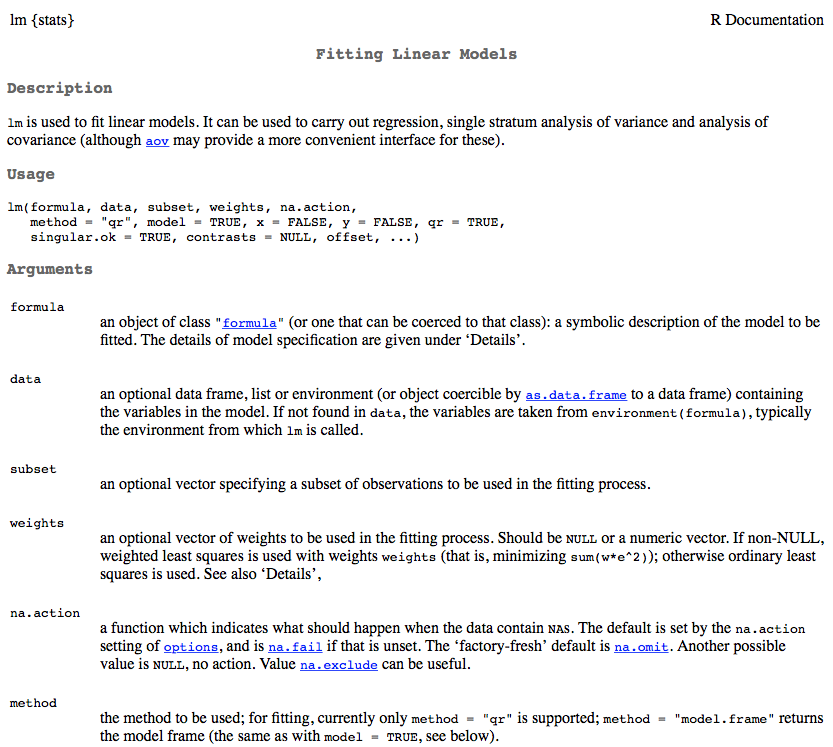

```{r setup, include = FALSE}
knitr::opts_knit$set(root.dir = "/Users/Daniel/Dropbox/Teaching/FSU_June16/")
#knitr::opts_chunk$set(fig.height = 6, fig.width = 13)
```
<style>
em {
  font-style: italic
}
</style>

<style>
strong {
  font-weight: bold;
}
</style>


## Afternoon Agenda

# Plotting basics with Base
* Histograms and density plots
* Scatter plots
    + Controls: 
        - titles
        - line width, color, and type
        - point size, color, and type
        - x and y axis labels
* Some good non-*ggplot2* packages

<span style="color:blue">Break </span>

* Quick note on lists
* Complete applied example

----
## Data: Beer!


----
## Load data

```{r readBeerData}
d <- read.delim("./data/ratebeer_beerjobber.txt")
head(d)
```

---- &twocol
## Histograms
Primary purpose of a histogram: See the distrbution of a variable

*** =left

```{r abvHist, fig.height = 6.5}
hist(d$abv)
```
*** =right

```{r ratingsHist, fig.height = 6.5}
hist(d$ratings)
```

----
## Look at the documentation 

```{r histDoc, eval = FALSE}
?hist
```


---- &twocol
## Change the number of break points

*** =left

```{r histBreaks35}
hist(d$ratings, breaks = 35)
```

*** =right

```{r histBreaks100}
hist(d$ratings, breaks = 100)
```

----
## Alternative: Plot a table of frequencies
# (no binning)

```{r plotTable, fig.height = 6.5, fig.width = 13}
rTbl <- table(d$ratings)
plot(rTbl)
```

---- &twocol
## Smooth the distribution

*** =left
# Standard Histogram
```{r hist}
hist(d$abv)
```

*** =right
# Density Plots
```{r dens1}
dens <- density(d$abv); plot(dens)
```

---- &twocol
## Density binwidth
Change the binwidth to control the smoothing factor. The smaller the binwidth,
  the closer the function will resemble the observed data. The larger the 
  binwidth, the closer the function will resemble a standard normal.

*** =left

```{r dens2, fig.height = 5}
dens1 <- density(d$abv, bw = .001)
plot(dens1)
```

*** =right

```{r dens3, fig.height = 5}
dens2 <- density(d$abv, bw = 100)
plot(dens2)
```

----
## Your turn

* Load the beer dataset
* Produce a histogram
* Produce a density plot
* Change the number of breaks and the binwidth of each
* Try adding the additional argument `probability = TRUE` to a histogram. What
  do you notice?
* After producing a histogram with `probability = TRUE`, try running 
  `lines(dens)` where dens is the density of the vector you produced the histogram from. What do you get?

---- 
## Scatter plots and controlling lines, colors, axes, etc.

```{r scatterBoot, echo = FALSE, fig.height = 8, fig.width = 14}
plot(d$score.by.style, d$score.overall, 
  col = "blue", 
  bg = "green", 
  pch = 21, 
  cex = 3, 
  lwd = 2, 
  xaxt = "n",
  yaxt = "n", 
  bty = "n",
  xlab = "Beer Style Rating",
  ylab = "Overall Beer Rating")

mod <- lm(score.overall ~ score.by.style, data = d)

# Bootstrap regression lines
myboot <- function(x, y) {
  tmpdata <- data.frame(x1 = x, y1 = y)
  thisboot <- sample(1:nrow(tmpdata), size = nrow(tmpdata), replace = TRUE)
  coef(lm(y1 ~ x1, data = tmpdata[thisboot, ]))   
}
bootcoefs <- replicate(2500, myboot(d$score.by.style, d$score.overall))
invisible(apply(bootcoefs, 2, abline, col = rgb(1, 0, 0, 0.01)))
abline(coef(mod)[1], coef(mod)[2], lty = 3, lwd = 4, col = "blue")
title(expression(Score[overall] == hat(beta)[0] + hat(beta)[1]*Score[style] + epsilon[i]))
axis(1, col = "gray")
axis(2, col = "gray")

# Standard Errors
new <- data.frame(score.by.style = seq(
                                      min(d$score.by.style, na.rm = TRUE), 
                                      max(d$score.by.style, na.rm = TRUE), 
                                      length.out = 100))
pred <- predict(mod, newdata = new, se.fit = TRUE, type = "response")
lines(x = new$score.by.style,  y = pred$fit + (1.96 * pred$se.fit), 
        lty = 8, lwd = 2, col = "blue")
lines(x = new$score.by.style, y = pred$fit - (1.96 * pred$se.fit), 
        lty = 8, lwd = 2, col = "blue")

# # Shaded region
# fit <- predict(mod, newdata = data.frame(score.by.style = 0:100), se = TRUE)$fit
# se <- predict(mod, newdata = data.frame(score.by.style = 0:100), se = TRUE)$se
# lcl <- fit - 1.96 * se
# ucl <- fit + 1.96 * se

# x.poly <- c(1:101, 101:1)
# y.poly <- c(lcl[1:101], ucl[101:1])

# polygon( x.poly , y.poly , col = rgb(0, 0, 1, 0.2) , border = NA )

```

----
## The `plot()` function
Generic x-y plotting. Multiple types of plots are possible. From the 
  documentation:


---- &twocol
## Plot types

*** =left

```{r plotTypes1, echo = FALSE}
par(mfrow = c(2,2))
plot(1:5, c(10, 11, 15, 17, 35), xlab = "", ylab = "",
  type = "p", main = "Plot w/type = 'p' ")
plot(1:5, c(10, 11, 15, 17, 35), xlab = "", ylab = "",
  type = "l", main = "Plot w/type = 'l' ")
plot(1:5, c(10, 11, 15, 17, 35), xlab = "", ylab = "",
  type = "b", main = "Plot w/type = 'b' ")
plot(1:5, c(10, 11, 15, 17, 35), xlab = "", ylab = "",
  type = "c", main = "Plot w/type = 'c' ")
```

*** =right

```{r plotTypes2, echo = FALSE}
par(mfrow = c(2,2))
plot(1:5, c(10, 11, 15, 17, 35), xlab = "", ylab = "",
  type = "o", main = "Plot w/type = 'o' ")
plot(1:5, c(10, 11, 15, 17, 35), xlab = "", ylab = "",
  type = "h", main = "Plot w/type = 'h' ")
plot(1:5, c(10, 11, 15, 17, 35), xlab = "", ylab = "",
  type = "s", main = "Plot w/type = 's' ")
plot(1:5, c(10, 11, 15, 17, 35), xlab = "", ylab = "",
  type = "S", main = "Plot w/type = 'S' ")
```

---- &twocol
## Scatter plots

Two specifications

```{r scatterSpec, eval = FALSE}
plot(outcome ~ predictor, data = d) # Just like the lm function
plot(x-variable, y-variable)
```

# Examples

*** =left

```{r scatterEx1, fig.height = 4}
plot(score.overall ~ abv, data = d)
```

*** =right

```{r scatterEx2, fig.height = 4}
plot(d$abv, d$score.overall)
```

----
## Additional arguments

```{r plotArgsTbl, echo = FALSE}
args <- c("main", "sub", "xlab", "ylab", "col", "pch", "xlim", "ylim", "bg", 
          "cex", "cex.SPEC", "col.SPEC" )
desc <- c("Main title of the Plot", "Subtitle, added at the bottom of the plot", 
    "x-axis label", "y-axis lable", 
    "Color (can be multiple things, depending on call)",
    "Point type", "Limits of x-axis (vector of length 2)", 
    "Limits of y-axis (vector of length 2)", 
    "Background color (can be multiple things, depending on call)", 
    "Size of points", 
    "Specific call to axis/lab/main/sub to change size of those SPEC (specifications)",
    "Color specific calls"
    )
knitr::kable(cbind(args, desc), col.names = c("Argument", "Description"))
```

---- &twocol
## Examples: Beer style and overall ratings

*** =left

# Standard Plot

```{r scatterStyleOverall, fig.height = 6.5}
plot(d$score.by.style, d$score.overall)
```

*** =right

# Change axes labels, provide title

```{r axesTitle, fig.height = 5}
plot(d$score.by.style, d$score.overall,
  main = "Relation Between Style Rating and Overall Rating",
  xlab = "Beer Style Rating",
  ylab = "Overall Beer Rating")
```

---- &twocol
## Change point type, color, and size

*** =left

```{r pointCharacteristics1, eval = FALSE}
plot(d$score.by.style, d$score.overall,
  main = "Relation Between Style 
    Rating and Overall Rating",
  xlab = "Beer Style Rating",
  ylab = "Overall Beer Rating",
  pch = 3,
  cex = 2,
  col = "purple")
```

*** =right

```{r pointCharacteristics2, echo = FALSE}
plot(d$score.by.style, d$score.overall,
  main = "Relation Between Style Rating and Overall Rating",
  xlab = "Beer Style Rating",
  ylab = "Overall Beer Rating",
  pch = 3,
  cex = 2,
  col = "purple")
```

---- 
## Colors in R

<div align = "left">

</div>

----
## Some helpful packages
* *RColorBrewer* has some really nice pallets
* *dichromat* is useful for creating color schemes that are color-blind friendly


---- 
## Point Types

```{r pointTypes}
plot(1:20, 1:20, pch = 1:20, cex = 3)
```


----
## Line types

```{r lineTypes, fig.height = 6.5}
plot(1:6, 1:6, type = "n")
for(i in 1:6) abline(i, 0, lty = i, lwd = 3)
```

Change the line type with `lty` and the line width with `lwd`.


----
## Custom line types

```{r customlty}
plot(1:5, 1:5, type = "n")
customTypes <- c("15", "51", "4341", "8138", "925229")
for(i in 1:5) abline(i, 0, lty = customTypes[i], lwd = 2)
```

----
## Add horizontal and vertical reference lines at the mean

```{r refLines1, eval = FALSE}
plot(d$score.by.style, d$score.overall,
  main = "Relation Between Style Rating and Overall Rating",
  xlab = "Beer Style Rating",
  ylab = "Overall Beer Rating",
  pch = 3,
  cex = 2,
  col = "purple")

abline(h = mean(d$score.overall, na.rm = TRUE), col = "red", lty = 2, lwd = 3)
abline(v = mean(d$score.by.style, na.rm = TRUE), col = "red", lty = 2, lwd = 3)
```

Plot on next slide

----
```{r refLines2, echo = FALSE, fig.height = 8, fig.width = 13}
plot(d$score.by.style, d$score.overall,
  main = "Relation Between Style Rating and Overall Rating",
  xlab = "Beer Style Rating",
  ylab = "Overall Beer Rating",
  pch = 3,
  cex = 2,
  col = "purple")

abline(h = mean(d$score.overall, na.rm = TRUE), col = "red", lty = 2, lwd = 3)
abline(v = mean(d$score.by.style, na.rm = TRUE), col = "red", lty = 2, lwd = 3)
```


----
## Quick aside: Fitting linear regression models in R

```{r lmDoc, eval = FALSE}
?lm
```


----
## Formula structure

```{r lmForm1, eval = FALSE}
lm(outcome ~ predictor1 + predictor2 + predictorN)
```
Note that the above has an implicit intercept specification. It can be
  explicit by

```{r lmForm2, eval = FALSE}
lm(outcome ~ 1 + predictor1 + predictor2 + predictorN)
```

You can also suppress the estimation of the intercept

```{r lmForm3, eval = FALSE}
lm(outcome ~ 0 + predictor1 + predictor2 + predictorN)
```

# Important additional arguments
* `data`: What data frame do the vectors come from?
* `subset`: Do you want to analyze only a subset of cases?
* `na.action`: How should missing values be handled?

----
## Modeling the relation between beer style rating and the overall rating

```{r regMod1}
m1 <- lm(score.overall ~ score.by.style, data = d)
summary(m1)
```

----
## Alternative summary
The `arm` package (applied regression modeling) provides a lot of useful 
  functions. One simple one is just a different method for showing the summary 
  of a regression model, using the `display()` function.

```{r installARM, eval = FALSE}
install.packages("arm")
library(arm)
display(m1, detail = TRUE)
```

```{r loadARM, echo = FALSE}
library(arm)
display(m1, detail = TRUE)
```
* Note that significance is not printed by default. Use `detail = TRUE` to get 
  significance test.

----
## Extensions
Use the `coef()` function to extract coefficients

```{r coefExtract}
coef(m1)
```

Use the `predict` function to use the model for predictions with new data

```{r predict1}
predict(m1, newdata = data.frame(score.by.style = seq(80, 100, 1)))
```

---- &twocol
## Plot the relation and the model
* Two step process: First plot the relation, then overlay the regression line.

*** =left

```{r plotRegLines1, eval = FALSE}
plot(d$score.by.style, d$score.overall,
  main = "Relation Between Style 
    Rating and Overall Rating",
  xlab = "Beer Style Rating",
  ylab = "Overall Beer Rating",
  pch = 3,
  cex = 2,
  col = "purple")

abline(m1, 
  lty = 3, 
  lwd = 5, 
  col = "aquamarine3")
```

*** =right

```{r plotRegLines2, echo = FALSE}
plot(d$score.by.style, d$score.overall,
  main = "Relation Between Style 
    Rating and Overall Rating",
  xlab = "Beer Style Rating",
  ylab = "Overall Beer Rating",
  pch = 3,
  cex = 2,
  col = "purple")

abline(m1, 
  lty = 3, 
  lwd = 5, 
  col = "aquamarine3")
```

----
## A note on `abline`
All of the following specifications are identical (see the documentation).

```{r ablineSpecs, eval = FALSE}
abline(m1)
abline(a = coef(m1)[1], b = coef(m1)[2])
abline(coef(m1)["(Intercept)"], coef(m1)["score.by.style"])
abline(coef(m1))
```


----- &twocol
## Fit a nonlinear model
Simulate some data with a nonlinear relation

*** =left

```{r nonlinearSim}
set.seed(100) # for reproducibility
b0 <- 180
b1 <- 2
b2 <- -0.15

x <- sample(seq(0, 8, 0.1), 25)

y <- b0 + b1*x + b2*(x^2) + 
        rnorm(length(x), 0, 1)
```

*** =right

```{r nonLinearSimRelation, fig.height = 6}
plot(x, y)
```

----
## Fit the model

```{r polyReg}
m2a <- lm(y ~ x + I(x^2))

# Equivalent, but with Orthogonal polynomials
m2b <- lm(y ~ poly(x, 2))

# Or, using the poly function with non-orthogonal polynomials (same as m2a)
m2c <- lm(y ~ poly(x, 2, raw = TRUE))
display(m2c)
```

----
## Overlay the regression line

```{r regLineOverlay1, fig.height = 6}
plot(x, y)
xAxis <- seq(-1, 9, 0.1)
preds <- predict(m2c, newdata = data.frame(x = xAxis))
lines(seq(-1, 9, 0.1), preds, col = "blue", lwd = 2)
```

----
## Include the SE

```{r predictions}
preds <- predict(m2c, newdata = data.frame(x = xAxis), se = TRUE)
str(preds)
```

```{r regLineOverlay2, eval = FALSE}
plot(x, y)
lines(xAxis, preds$fit, col = "blue", lwd = 2)
lines(xAxis, preds$fit - 2*preds$se.fit, col = "red", lty = 2, 
    lwd = 2)
lines(xAxis, preds$fit + 2*preds$se.fit, col = "red", lty = 2, 
    lwd = 2)
```

Figure on the next slide

----
```{r regLineOverlay3, echo = FALSE, fig.height = 8, fig.width = 13}
plot(x, y)
lines(xAxis, preds$fit, col = "blue", lwd = 2)
lines(xAxis, preds$fit - 2*preds$se.fit, col = "red", lty = 2, 
    lwd = 2)
lines(xAxis, preds$fit + 2*preds$se.fit, col = "red", lty = 2, 
    lwd = 2)
```

----
## Plot a few different fits

```{r diffRegFits1, eval = FALSE}
lfit025 <- loess(y ~ x, span = 0.25)
lfit050 <- loess(y ~ x, span = 0.50)
lfit075 <- loess(y ~ x, span = 0.75)
lfit100 <- loess(y ~ x, span = 1.00)
plot(y ~ x)
lines(xAxis, predict(lfit025, newdata = data.frame(x = xAxis)), 
  col = "red", lwd = 2)
lines(xAxis, predict(lfit050, newdata = data.frame(x = xAxis)), 
  col = "green", lwd = 2)
lines(xAxis, predict(lfit075, newdata = data.frame(x = xAxis)), 
  col = "blue", lwd = 2)
lines(xAxis, predict(lfit100, newdata = data.frame(x = xAxis)), 
  col = "purple", lwd = 2)
lines(xAxis, preds$fit, lwd = 3, lty = 2)
```

Plot on next slide

----
```{r diffRegFits2, echo = FALSE, fig.height = 8, fig.width = 13}
lfit025 <- loess(y ~ x, span = 0.25)
lfit050 <- loess(y ~ x, span = 0.50)
lfit075 <- loess(y ~ x, span = 0.75)
lfit100 <- loess(y ~ x, span = 1.00)
plot(y ~ x)
lines(xAxis, predict(lfit025, newdata = data.frame(x = xAxis)), 
  col = "red", lwd = 2)
lines(xAxis, predict(lfit050, newdata = data.frame(x = xAxis)), 
  col = "green", lwd = 2)
lines(xAxis, predict(lfit075, newdata = data.frame(x = xAxis)), 
  col = "blue", lwd = 2)
lines(xAxis, predict(lfit100, newdata = data.frame(x = xAxis)), 
  col = "purple", lwd = 2)
lines(xAxis, preds$fit, lwd = 3, lty = 2)
```

-----
## Add a legend

```{r legend1, eval = FALSE}
legend("bottomright", 
  c(paste("Loess Fit", seq(0.25, 1, 0.25)), "Data Generating Line"),
  lty = c(rep(1, 4), 2),
  lwd = c(rep(2, 4), 3),
  col = c("red", "green", "blue", "purple", "black"))
```

```{r legend2, echo = FALSE, fig.height = 5, fig.width = 13}
plot(y ~ x)
lines(xAxis, predict(lfit025, newdata = data.frame(x = xAxis)), 
  col = "red", lwd = 2)
lines(xAxis, predict(lfit050, newdata = data.frame(x = xAxis)), 
  col = "green", lwd = 2)
lines(xAxis, predict(lfit075, newdata = data.frame(x = xAxis)), 
  col = "blue", lwd = 2)
lines(xAxis, predict(lfit100, newdata = data.frame(x = xAxis)), 
  col = "purple", lwd = 2)
lines(xAxis, preds$fit, lwd = 3, lty = 2)
legend("bottomright", 
  c(paste("Loess Fit", seq(0.25, 1, 0.25)), "Data Generating Line"),
  lty = c(rep(1, 4), 2),
  lwd = c(rep(2, 4), 3),
  col = c("red", "green", "blue", "purple", "black"))
```

----
## A few more options
(there are many, many more)

```{r ops1, fig.height = 5, fig.width = 13}
par(mfrow = c(1, 3))
plot(y ~ x, bty = "n", las = 1)
plot(y ~ x, bty = "n", las = 2)
plot(y ~ x, bty = "n", las = 3)
```

----
## Other options to consider
* Manually add axes with `axis()` (surpress with `xaxt = "n"` or `yaxt = "n"`)
* Manually add title (position exactly where you want) with `title()`
* Manipulate margins with `mar` and `oma` from within `par`

----
## Quick example with margins
# Investigate assumptions of the model

```{r regAssum, fig.height = 6, fig.width = 13}
par(mfrow = c(2, 2))
plot(m1)
```

----
```{r margins1, fig.height = 6, fig.width = 13}
par(mfrow = c(2, 2), oma = rep(3, 4), mar = c(1, 1, 3, 2), bty = "n")
plot(m1)
```

----
## Cleaning up our multi-line plot just a bit

# Base
```{r cleanPlot, eval = FALSE}
plot(y ~ x, 
  bty = "n", 
  ylim = c(180, 188), 
  xlim = c(0, 8),
  main = "Simulated data example",
  xlab = "Predictor",
  ylab = "Outcome")
```

----
# Add Lines

```{r addLines, eval = FALSE}
lines(xAxis, predict(lfit025, newdata = data.frame(x = xAxis)), 
  col = "red", lwd = 2)
lines(xAxis, predict(lfit050, newdata = data.frame(x = xAxis)), 
  col = "green", lwd = 2)
lines(xAxis, predict(lfit075, newdata = data.frame(x = xAxis)), 
  col = "blue", lwd = 2)
lines(xAxis, predict(lfit100, newdata = data.frame(x = xAxis)), 
  col = "purple", lwd = 2)
lines(xAxis, preds$fit, lwd = 3, lty = 2)
```

----
# Add Legend

```{r addLegend, eval = FALSE}
legend("bottomright", 
  c(paste("Loess Fit", seq(0.25, 1, 0.25)), "Data Generating Line"),
  lty = c(rep(1, 4), 2),
  lwd = c(rep(2, 4), 3),
  col = c("red", "green", "blue", "purple", "black"),
  box.lty = 0)
```

----
# Final Result

```{r finalResult, echo = FALSE, fig.height = 8, fig.width = 13}
plot(y ~ x, 
  bty = "n", 
  ylim = c(180, 188), 
  xlim = c(0, 8),
  main = "Simulated data example",
  xlab = "Predictor",
  ylab = "Outcome")

lines(xAxis, predict(lfit025, newdata = data.frame(x = xAxis)), 
  col = "red", lwd = 2)
lines(xAxis, predict(lfit050, newdata = data.frame(x = xAxis)), 
  col = "green", lwd = 2)
lines(xAxis, predict(lfit075, newdata = data.frame(x = xAxis)), 
  col = "blue", lwd = 2)
lines(xAxis, predict(lfit100, newdata = data.frame(x = xAxis)), 
  col = "purple", lwd = 2)
lines(xAxis, preds$fit, lwd = 3, lty = 2)

legend("bottomright", 
  c(paste("Loess Fit", seq(0.25, 1, 0.25)), "Data Generating Line"),
  lty = c(rep(1, 4), 2),
  lwd = c(rep(2, 4), 3),
  col = c("red", "green", "blue", "purple", "black"),
  box.lty = 0)
```

----
## If we have time...
Produce the following plot (the colors can be different, but it should not be 
  black)

Note: The relation is linear so you can use `abline`

```{r regPlotPractice, echo = FALSE, fig.height = 6, fig.width = 13}
plot(d$abv, d$score.overall,
  main = "Relation Between Alcohol Content and Overall Rating",
  xlab = "Alcohol By Volumne",
  ylab = "Overall Beer Rating",
  pch = 2,
  col = "cornflowerblue")

mod2 <- lm(score.overall ~ abv, data = d)
abline(coef(mod2)[1], coef(mod2)[2], lwd = 4, lty = 4, col = "chartreuse")
```

----
## `persp`
(I'll be honest, I don't use this much. This example is from the documentation.)

```{r simData, fig.width = 13, fig.height = 4}
x <- seq(-10, 10, length=50)
y <- x
f <- function(x,y) {
    r <- sqrt(x^2+y^2)
    10 * sin(r)/r
}
z <- outer(x, y, f)
```

----

```{r persp, fig.width = 13, fig.height = 7}
persp(x, y, z, theta = 30, phi = 30, expand = 0.5, col = "lightblue",
      xlab = "X", ylab = "Y", zlab = "Z") 
```

----
## image

```{r image1, fig.width = 13, fig.height = 7}
image(x, y, z)
```

----
## Volcano data

```{r volcanoPersp, fig.width = 13, fig.height = 7}
data(volcano)
persp(volcano)
```

----
```{r volcanoImage, fig.width = 13, fig.height = 7}
image(volcano)

```

----
## Overlay a density plot on a histogram, maintain frequency y-axis

```{r histDensity1, echo = FALSE}
hist(d$abv, 
  probability = TRUE, 
  axes = FALSE,
  main = "", 
  xlab = "", 
  ylab = "")

lines(density(d$abv), 
  col = "darkgray", 
  lty = 3, 
  lwd = 3)

par(new = TRUE)
hist(d$abv, 
  main = "Distribution of Beer Alcohol by Volume",
  xlab = "Alcohol by Volume"
  )
```

---- &twocol
## Multi-step process

*** =left

First, plot the histogram, suppressing all axes, labels, and plot border

```{r histDensity2, fig.height = 4.5}
hist(d$abv, 
  probability = TRUE, 
  axes = FALSE,
  main = "", 
  xlab = "", 
  ylab = "")
```

*** =right

Next, use `lines` to add the density line

```{r histDensity3, eval = FALSE}
lines(density(d$abv), 
  col = "darkgray", 
  lty = 3, 
  lwd = 3)
```
<br>
<br>

```{r histDensity4, echo = FALSE, fig.height = 4.5}
hist(d$abv, 
  probability = TRUE, 
  axes = FALSE,
  main = "Distribution of Beer Alcohol by Volume", 
  xlab = "Alcohol by Volume")

lines(density(d$abv), 
  col = "darkgray", 
  lty = 3, 
  lwd = 3)
```

---- &twocol

*** =left

Call a new plot to overlay on the current plot

```{r histDensity5, eval = FALSE}
par(new = TRUE)
```

Plot the histogram again, labeling the axes how you'd like (note, this process 
  is necessary to keep the frequency y-axis)

```{r histDensity6, eval = FALSE}
hist(d$abv, 
  main = "Distribution of Beer Alcohol 
            by Volume",
  xlab = "Alcohol by Volume"
  )
```

*** =right

```{r histDensity7, echo = FALSE}
hist(d$abv, 
  probability = TRUE, 
  axes = FALSE,
  main = "", 
  xlab = "", 
  ylab = "")

lines(density(d$abv), 
  col = "darkgray", 
  lty = 3, 
  lwd = 3)

par(new = TRUE)
hist(d$abv, 
  main = "Distribution of Beer Alcohol by Volume",
  xlab = "Alcohol by Volume"
  )
```

-----
## A few extensions with packages
* *beanplot* package
    + Similar to violin plots, but better (in my opinion)
* *visreg* package
    + Helpful for visualizing the results of fitted regression models
* *car*
    + Further regression diagnostics
* *corrplot*

-----
## beanplot
From the documentation (second legend is cutoff...)

```{r beanplot1, eval = FALSE}
library(beanplot)
par(mfrow = c(1,2))
boxplot(len ~ dose, data = ToothGrowth,
        boxwex = 0.25, at = 1:3 - 0.2,
        subset = supp == "VC", col = "yellow",
        main = "Guinea Pigs  Tooth Growth",
        xlab = "Vitamin C dose mg",
        ylab = "tooth length", ylim = c(-1, 40), yaxs = "i")
boxplot(len ~ dose, data = ToothGrowth, add = TRUE,
        boxwex = 0.25, at = 1:3 + 0.2,
        subset = supp == "OJ", col = "orange")
legend("bottomright", bty="n",c("Ascorbic acid", "Orange juice"),
       fill = c("yellow", "orange"))
beanplot(len ~ reorder(supp, len, mean) * dose, ToothGrowth,
        side = "b", col = list("yellow", "orange"), border = c("yellow2",
            "darkorange"), main = "Guinea Pigs  Tooth Growth",
        xlab = "Vitamin C dose mg", ylab = "tooth length", ylim = c(-1,
            40), yaxs = "i")
legend("bottomright", bty="n",c("Ascorbic acid", "Orange juice"),
       fill = c("yellow", "orange"))
```

----

```{r beanplot2, echo = FALSE, fig.height = 8, fig.width = 13}
library(beanplot)
par(mfrow = c(1,2))
boxplot(len ~ dose, data = ToothGrowth,
        boxwex = 0.25, at = 1:3 - 0.2,
        subset = supp == "VC", col = "yellow",
        main = "Guinea Pigs  Tooth Growth",
        xlab = "Vitamin C dose mg",
        ylab = "tooth length", ylim = c(-1, 40), yaxs = "i")
boxplot(len ~ dose, data = ToothGrowth, add = TRUE,
        boxwex = 0.25, at = 1:3 + 0.2,
        subset = supp == "OJ", col = "orange")
legend("bottomright", bty="n",c("Ascorbic acid", "Orange juice"),
       fill = c("yellow", "orange"))
beanplot(len ~ reorder(supp, len, mean) * dose, ToothGrowth,
        side = "b", col = list("yellow", "orange"), border = c("yellow2",
            "darkorange"), main = "Guinea Pigs  Tooth Growth",
        xlab = "Vitamin C dose mg", ylab = "tooth length", ylim = c(-1,
            40), yaxs = "i")
legend("bottomright", bty="n",c("Ascorbic acid", "Orange juice"),
       fill = c("yellow", "orange"))
```

----
## Another example


----
## visreg

```{r visreg1, fig.height = 5, fig.width = 13}
library(visreg)
mod <- lm(score.overall ~ score.by.style + abv, data = d)

par(mfrow = c(1,2))
visreg(mod)
```

----
```{r visreg2, fig.height = 5, fig.width = 13}
data(airquality)
airquality$Heat <- cut(airquality$Temp, 3, labels=c("Cool", "Mild", "Hot"))

fit.heat <- lm(Ozone ~ Solar.R + Wind + Heat, data = airquality)

par(mfrow = c(1,2))
visreg(fit.heat, "Heat", type = "contrast")
visreg(fit.heat, "Heat", type = "conditional")

```

----

```{r visreg3}
fit <- lm(Ozone ~ Solar.R + Wind + Temp + I(Wind^2) + I(Temp^2) +
    I(Wind*Temp) + I(Wind*Temp^2) + I(Temp*Wind^2) + I(Temp^2*Wind^2),
    data=airquality)

visreg2d(fit,x = "Wind", y = "Temp", plot.type = "persp", 
  col = "cornflowerblue")
```

----
## car

One example on influential cases

```{r carP1, fig.height = 5.5, fig.width = 12, message = FALSE}
library(car)
fit <- lm(mpg ~ disp + hp + wt + drat, data = mtcars)
influencePlot(fit,  id.method = "identify", main = "Influence Plot", 
  sub = "Circle size is proportial to Cook's Distance" )
```

----
## Nonlinearity

```{r carNonLinear, fig.width = 12}
crPlots(fit)
```

---
## corrplot

```{r corrPlotSimD}
simD <- runif(1000)
simD <- (simD*100) + c(1:500, 500:1)
simD <- matrix(simD, ncol=10)
simD <- as.data.frame(simD)
names(simD) <- paste0("v", 1:10)
head(simD)
```
----
# Create correlation matrix

```{r corMat}
cors <- cor(simD)
cors
```

----
# plot cor matrix

```{r corrplot1, fig.width = 13, fig.height = 7, message = FALSE}
library(corrplot)
corrplot(cors, type = "lower")
```

----
```{r corrplot2, fig.width = 13, fig.height = 7}
library(corrplot)
corrplot(cors, type = "upper", addCoef.col="black")
```

----
```{r corrplot3, fig.width = 13, fig.height = 7}
library(corrplot)
corrplot(cors, type = "upper", method = "square")
```

-----
## Analysis-specific plotting

Example with multilevel modeling

```{r lme4Plot, fig.height = 4, fig.width = 10}
data(Orthodont,package="nlme")
library(lme4)
fm1 <- lmer(distance ~ age + (age|Subject), data=Orthodont)

## observed versus fitted values by Subject
plot(fm1, distance ~ fitted(.) | Subject, abline = c(0,1))
```

----
## Practice (and then break)
First, produce the following plots. Again, the colors, line types, etc., can
  be different, but they should not be the default (where the defaults have been changed).

Next, fit a few regression models, and play around with the *visreg* package.

```{r plotPractice, echo = FALSE, fig.height = 6.5, fig.width = 13.5}
par(mfrow = c(1, 3))
hist(d$abv, 
  col = "blue", main = "Distribution of Beer ABV", xlab = "Alcohol by Volume")
plot(density(d$abv), 
  lwd = 5, lty = 5, col = "green", main = "Density Plot of Beer ABV")
plot(score.by.style ~ abv, data = d, pch = 7, cex = 4, col = "red", 
  xlab = "Alcohol by Volume", ylab = "Rating by Beer Category", 
  main = "ABV and Style Rating")

mod3 <- lm(score.by.style ~ abv, data = d)
abline(coef(mod3)[1], coef(mod3)[2], lty = 6, lwd = 5, col = "purple")
```

