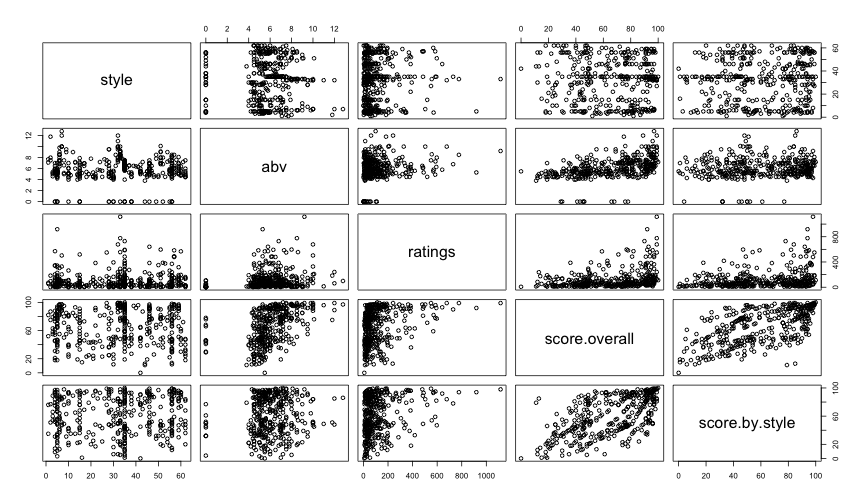
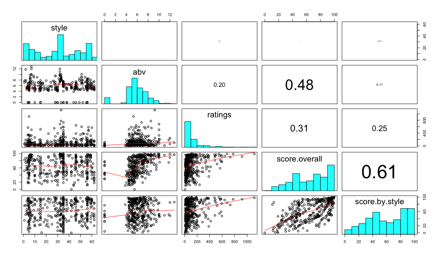
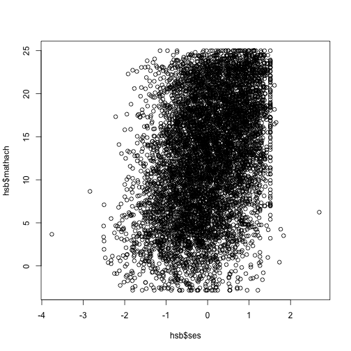
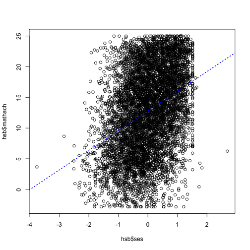
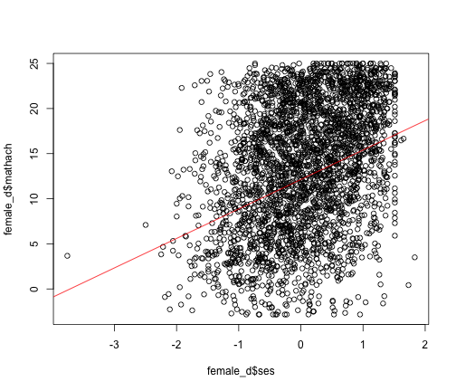
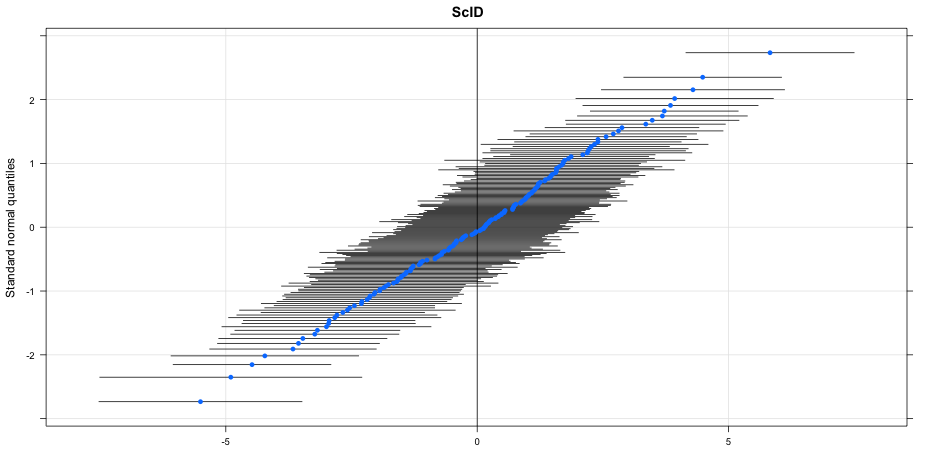
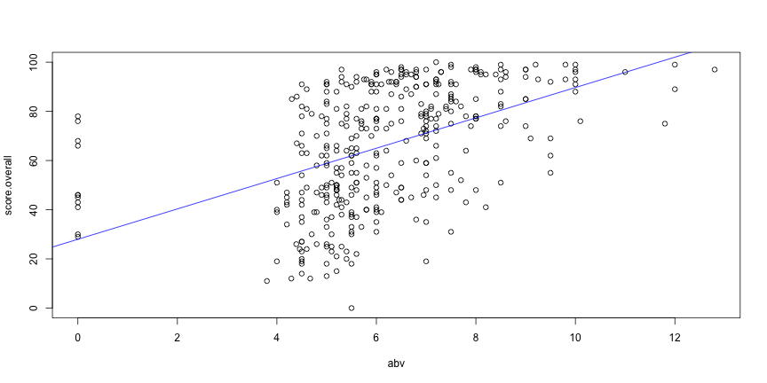

<style>
em {
  font-style: italic
}
</style>

<style>
strong {
  font-weight: bold;
}
</style>


---- &twocol
## Lists
Elements of lists can be of any type, including lists

*** =left


```r
l <- list(
  c("a", "b", "c"),
  1:5,
  rep(c(T,F), 7),
  rnorm(3, 100, 25)
      )
```

*** =right


```r
l
```

```
## [[1]]
## [1] "a" "b" "c"
## 
## [[2]]
## [1] 1 2 3 4 5
## 
## [[3]]
##  [1]  TRUE FALSE  TRUE FALSE  TRUE FALSE  TRUE FALSE  TRUE FALSE  TRUE
## [12] FALSE  TRUE FALSE
## 
## [[4]]
## [1] 126.63506 124.25505  97.45927
```

---- &twocol
## Accessing List Elements
* List elements can be accessed in two methods: Using the `$` with the element 
  names, or through indexing with a double bracket `[[]]`.
* If a single bracket index is used, `[]`, the element will be returned, but of 
  type list.

*** =left


```r
typeof(l)
```

```
## [1] "list"
```

```r
typeof(l[1])
```

```
## [1] "list"
```

```r
typeof(l[[1]])
```

```
## [1] "character"
```

*** =right


```r
l[1]
```

```
## [[1]]
## [1] "a" "b" "c"
```

```r
l[[1]]
```

```
## [1] "a" "b" "c"
```

----
## Access list elements via names

# Provide element names


```r
names(l) <- c("letters", "numbers", "logical", "double")
str(l)
```

```
## List of 4
##  $ letters: chr [1:3] "a" "b" "c"
##  $ numbers: int [1:5] 1 2 3 4 5
##  $ logical: logi [1:14] TRUE FALSE TRUE FALSE TRUE FALSE ...
##  $ double : num [1:3] 126.6 124.3 97.5
```
<br>

# Access element


```r
l$letters
```

```
## [1] "a" "b" "c"
```

---- &twocol
## Naming lists versus vectors

*** =left

# Lists

```r
lst <- list(1:5, letters[1:15])
str(lst)
```

```
## List of 2
##  $ : int [1:5] 1 2 3 4 5
##  $ : chr [1:15] "a" "b" "c" "d" ...
```

```r
names(lst) <- c("Numbers", "Letters")
str(lst)
```

```
## List of 2
##  $ Numbers: int [1:5] 1 2 3 4 5
##  $ Letters: chr [1:15] "a" "b" "c" "d" ...
```

*** =right

# Vectors

```r
v <- lst[[1]]
names(v) <- c("One", "Two", 
  "Three", "Four", "Five")
v
```

```
##   One   Two Three  Four  Five 
##     1     2     3     4     5
```

----

```r
names(lst$Numbers) <- c("One", "Two", "Three", "Four", "Five")
lst
```

```
## $Numbers
##   One   Two Three  Four  Five 
##     1     2     3     4     5 
## 
## $Letters
##  [1] "a" "b" "c" "d" "e" "f" "g" "h" "i" "j" "k" "l" "m" "n" "o"
```
<br>
# Subsetting

```r
lst$Numbers["Three"]
```

```
## Three 
##     3
```

----
## Lists returned by functions
* We'll talk about this more when we get into functions (next week), but many
  functions return a list of objects. For example: `lm`.


```r
mod <- lm(hp ~ mpg, data = mtcars)
str(mod)
```

```
## List of 12
##  $ coefficients : Named num [1:2] 324.08 -8.83
##   ..- attr(*, "names")= chr [1:2] "(Intercept)" "mpg"
##  $ residuals    : Named num [1:32] -28.7 -28.7 -29.8 -25.1 16 ...
##   ..- attr(*, "names")= chr [1:32] "Mazda RX4" "Mazda RX4 Wag" "Datsun 710" "Hornet 4 Drive" ...
##  $ effects      : Named num [1:32] -829.8 296.3 -23.6 -20 19.3 ...
##   ..- attr(*, "names")= chr [1:32] "(Intercept)" "mpg" "" "" ...
##  $ rank         : int 2
##  $ fitted.values: Named num [1:32] 139 139 123 135 159 ...
##   ..- attr(*, "names")= chr [1:32] "Mazda RX4" "Mazda RX4 Wag" "Datsun 710" "Hornet 4 Drive" ...
##  $ assign       : int [1:2] 0 1
##  $ qr           :List of 5
##   ..$ qr   : num [1:32, 1:2] -5.657 0.177 0.177 0.177 0.177 ...
##   .. ..- attr(*, "dimnames")=List of 2
##   .. .. ..$ : chr [1:32] "Mazda RX4" "Mazda RX4 Wag" "Datsun 710" "Hornet 4 Drive" ...
##   .. .. ..$ : chr [1:2] "(Intercept)" "mpg"
##   .. ..- attr(*, "assign")= int [1:2] 0 1
##   ..$ qraux: num [1:2] 1.18 1.02
##   ..$ pivot: int [1:2] 1 2
##   ..$ tol  : num 1e-07
##   ..$ rank : int 2
##   ..- attr(*, "class")= chr "qr"
##  $ df.residual  : int 30
##  $ xlevels      : Named list()
##  $ call         : language lm(formula = hp ~ mpg, data = mtcars)
##  $ terms        :Classes 'terms', 'formula'  language hp ~ mpg
##   .. ..- attr(*, "variables")= language list(hp, mpg)
##   .. ..- attr(*, "factors")= int [1:2, 1] 0 1
##   .. .. ..- attr(*, "dimnames")=List of 2
##   .. .. .. ..$ : chr [1:2] "hp" "mpg"
##   .. .. .. ..$ : chr "mpg"
##   .. ..- attr(*, "term.labels")= chr "mpg"
##   .. ..- attr(*, "order")= int 1
##   .. ..- attr(*, "intercept")= int 1
##   .. ..- attr(*, "response")= int 1
##   .. ..- attr(*, ".Environment")=<environment: R_GlobalEnv> 
##   .. ..- attr(*, "predvars")= language list(hp, mpg)
##   .. ..- attr(*, "dataClasses")= Named chr [1:2] "numeric" "numeric"
##   .. .. ..- attr(*, "names")= chr [1:2] "hp" "mpg"
##  $ model        :'data.frame':	32 obs. of  2 variables:
##   ..$ hp : num [1:32] 110 110 93 110 175 105 245 62 95 123 ...
##   ..$ mpg: num [1:32] 21 21 22.8 21.4 18.7 18.1 14.3 24.4 22.8 19.2 ...
##   ..- attr(*, "terms")=Classes 'terms', 'formula'  language hp ~ mpg
##   .. .. ..- attr(*, "variables")= language list(hp, mpg)
##   .. .. ..- attr(*, "factors")= int [1:2, 1] 0 1
##   .. .. .. ..- attr(*, "dimnames")=List of 2
##   .. .. .. .. ..$ : chr [1:2] "hp" "mpg"
##   .. .. .. .. ..$ : chr "mpg"
##   .. .. ..- attr(*, "term.labels")= chr "mpg"
##   .. .. ..- attr(*, "order")= int 1
##   .. .. ..- attr(*, "intercept")= int 1
##   .. .. ..- attr(*, "response")= int 1
##   .. .. ..- attr(*, ".Environment")=<environment: R_GlobalEnv> 
##   .. .. ..- attr(*, "predvars")= language list(hp, mpg)
##   .. .. ..- attr(*, "dataClasses")= Named chr [1:2] "numeric" "numeric"
##   .. .. .. ..- attr(*, "names")= chr [1:2] "hp" "mpg"
##  - attr(*, "class")= chr "lm"
```

----
You can access the elements through the list


```r
mod$coefficients
```

```
## (Intercept)         mpg 
##  324.082314   -8.829731
```

Note that some times there are more efficient methods


```r
coef(mod)
```

```
## (Intercept)         mpg 
##  324.082314   -8.829731
```
In this case the methods are roughly equivalent, but sometimes it can make a
  difference (IRT)

----
## Other functions will transform data into lists


```r
cyls <- split(mtcars, mtcars$cyl)
str(cyls)
```

```
## List of 3
##  $ 4:'data.frame':	11 obs. of  11 variables:
##   ..$ mpg : num [1:11] 22.8 24.4 22.8 32.4 30.4 33.9 21.5 27.3 26 30.4 ...
##   ..$ cyl : num [1:11] 4 4 4 4 4 4 4 4 4 4 ...
##   ..$ disp: num [1:11] 108 146.7 140.8 78.7 75.7 ...
##   ..$ hp  : num [1:11] 93 62 95 66 52 65 97 66 91 113 ...
##   ..$ drat: num [1:11] 3.85 3.69 3.92 4.08 4.93 4.22 3.7 4.08 4.43 3.77 ...
##   ..$ wt  : num [1:11] 2.32 3.19 3.15 2.2 1.61 ...
##   ..$ qsec: num [1:11] 18.6 20 22.9 19.5 18.5 ...
##   ..$ vs  : num [1:11] 1 1 1 1 1 1 1 1 0 1 ...
##   ..$ am  : num [1:11] 1 0 0 1 1 1 0 1 1 1 ...
##   ..$ gear: num [1:11] 4 4 4 4 4 4 3 4 5 5 ...
##   ..$ carb: num [1:11] 1 2 2 1 2 1 1 1 2 2 ...
##  $ 6:'data.frame':	7 obs. of  11 variables:
##   ..$ mpg : num [1:7] 21 21 21.4 18.1 19.2 17.8 19.7
##   ..$ cyl : num [1:7] 6 6 6 6 6 6 6
##   ..$ disp: num [1:7] 160 160 258 225 168 ...
##   ..$ hp  : num [1:7] 110 110 110 105 123 123 175
##   ..$ drat: num [1:7] 3.9 3.9 3.08 2.76 3.92 3.92 3.62
##   ..$ wt  : num [1:7] 2.62 2.88 3.21 3.46 3.44 ...
##   ..$ qsec: num [1:7] 16.5 17 19.4 20.2 18.3 ...
##   ..$ vs  : num [1:7] 0 0 1 1 1 1 0
##   ..$ am  : num [1:7] 1 1 0 0 0 0 1
##   ..$ gear: num [1:7] 4 4 3 3 4 4 5
##   ..$ carb: num [1:7] 4 4 1 1 4 4 6
##  $ 8:'data.frame':	14 obs. of  11 variables:
##   ..$ mpg : num [1:14] 18.7 14.3 16.4 17.3 15.2 10.4 10.4 14.7 15.5 15.2 ...
##   ..$ cyl : num [1:14] 8 8 8 8 8 8 8 8 8 8 ...
##   ..$ disp: num [1:14] 360 360 276 276 276 ...
##   ..$ hp  : num [1:14] 175 245 180 180 180 205 215 230 150 150 ...
##   ..$ drat: num [1:14] 3.15 3.21 3.07 3.07 3.07 2.93 3 3.23 2.76 3.15 ...
##   ..$ wt  : num [1:14] 3.44 3.57 4.07 3.73 3.78 ...
##   ..$ qsec: num [1:14] 17 15.8 17.4 17.6 18 ...
##   ..$ vs  : num [1:14] 0 0 0 0 0 0 0 0 0 0 ...
##   ..$ am  : num [1:14] 0 0 0 0 0 0 0 0 0 0 ...
##   ..$ gear: num [1:14] 3 3 3 3 3 3 3 3 3 3 ...
##   ..$ carb: num [1:14] 2 4 3 3 3 4 4 4 2 2 ...
```

----
## More on lists
* Note that previously slide looked like a nested list (list inside a list).
  This is because data frames are lists, where each element of the list is a
  vector of the same length.
* lists are tremendously useful and flexible, but essentially require at least
  a basic understanding of functions and/or loops.
    + Functions because lists are often used to return output from a function
      (as discussed previously).
    + Loops because you often want to loop through a list and apply a function
      to each element of the list.

For example: 


```r
sapply(cyls, function(x) cor(x$mpg, x$hp))
```

```
##          4          6          8 
## -0.5235034 -0.1270678 -0.2836357
```
(Note `tapply` is a more efficient method for doing the same thing as above 
  without splitting the data frame first)

---- &twocol
# Lists and data frames

*** =left


```r
l <- list(
  lets = letters[1:5],
  ints = 9:5,
  dbl = rnorm(5, 12, 0.75)
  )
str(l)
```

```
## List of 3
##  $ lets: chr [1:5] "a" "b" "c" "d" ...
##  $ ints: int [1:5] 9 8 7 6 5
##  $ dbl : num [1:5] 13.1 10.7 12.5 11.6 13
```

```r
as.data.frame(l)
```

```
##   lets ints      dbl
## 1    a    9 13.05240
## 2    b    8 10.66742
## 3    c    7 12.46715
## 4    d    6 11.60829
## 5    e    5 12.99167
```

*** =right

Or equivalently


```r
dframe <- data.frame(
  lets = letters[1:5],
  ints = 9:5,
  dbl = rnorm(5, 12, 0.75)
  )
dframe
```

```
##   lets ints      dbl
## 1    a    9 11.72742
## 2    b    8 12.98930
## 3    c    7 12.03283
## 4    d    6 10.59101
## 5    e    5 11.66470
```

----
## More on data frames
Because data frames are actually lists, you can use the same subsetting 
  procedures you can with lists. 


```r
dframe[2]
```

```
##   ints
## 1    9
## 2    8
## 3    7
## 4    6
## 5    5
```

```r
dframe[[2]]
```

```
## [1] 9 8 7 6 5
```

---- .segue
# Complete applied (but very simple) example

----
## Goals
Come up from the weeds a bit 
* Go through a complete (basic) example
  + process, plot, analyze, plot
* Look at correlations
* Explore linear regression and multilevel modeling (briefly)

----
## Load Data
High School and Beyond


```r
library(haven)
hsb <- read_spss("./data/HSB.sav")
head(hsb)
```

```
##     id minority female    ses mathach
## 1 1224        0      1 -1.528   5.876
## 2 1224        0      1 -0.588  19.708
## 3 1224        0      0 -0.528  20.349
## 4 1224        0      0 -0.668   8.781
## 5 1224        0      0 -0.158  17.898
## 6 1224        0      0  0.022   4.583
```

----
## About the HSB data

<span style="color:gray" > 
Our data file is a subsample from the 1982 High School and Beyond Survey and is
  used extensively in Hierarchical Linear Models by Raudenbush and Bryk. The
  data file, called hsb, consists of 7185 students nested in 160 schools. The
  outcome variable of interest is the student-level (level 1) math achievement
  score (mathach). The variable ses is the socio-economic status of a student
  and therefore is at the student level. The variable meanses is the group-mean
  centered version of ses and therefore is at the school level (level 2). The
  variable sector is an indicator variable indicating if a school is public or
  catholic and is therefore a school-level variable. There are 90 public
  schools (sector=0) and 70 catholic schools (sector=1) in the sample.


Description from <br>
http://www.ats.ucla.edu/stat/hlm/seminars/hlm_mlm/608/mlm_hlm_seminar_v608.htm
 </span>


----
## Check out the data a bit


```r
summary(hsb)
```

```
##       id               minority          female            ses           
##  Length:7185        Min.   :0.0000   Min.   :0.0000   Min.   :-3.758000  
##  Class :character   1st Qu.:0.0000   1st Qu.:0.0000   1st Qu.:-0.538000  
##  Mode  :character   Median :0.0000   Median :1.0000   Median : 0.002000  
##                     Mean   :0.2747   Mean   :0.5282   Mean   : 0.000143  
##                     3rd Qu.:1.0000   3rd Qu.:1.0000   3rd Qu.: 0.602000  
##                     Max.   :1.0000   Max.   :1.0000   Max.   : 2.692000  
##     mathach      
##  Min.   :-2.832  
##  1st Qu.: 7.275  
##  Median :13.131  
##  Mean   :12.748  
##  3rd Qu.:18.317  
##  Max.   :24.993
```

----
## Evaluate the structure of the data


```r
str(hsb)
```

```
## Classes 'tbl_df', 'tbl' and 'data.frame':	7185 obs. of  5 variables:
##  $ id      : chr  "1224" "1224" "1224" "1224" ...
##  $ minority: num  0 0 0 0 0 0 0 0 0 0 ...
##  $ female  : num  1 1 0 0 0 0 1 0 1 0 ...
##  $ ses     : num  -1.528 -0.588 -0.528 -0.668 -0.158 ...
##  $ mathach : num  5.88 19.71 20.35 8.78 17.9 ...
```

----
## What is this ses variable?
"a standardized scale constructed from variables measuring parental education,
occupation, and income" (http://www.upa.pdx.edu/IOA/newsom/mlrclass/ho_hsb.pdf)

<br>
So why doesn't it have a sd of 1?


```r
sd(hsb$ses)
```

```
## [1] 0.7793552
```

Our dataset is a sample from the full dataset. So you can still interpret a 1
  unit change in the `ses` variable as a one standard deviation increase in the
  population.

----
## Evaluate `id`


```r
table(hsb$id)
```

```
## 
## 1224 1288 1296 1308 1317 1358 1374 1433 1436 1461 1462 1477 1499 1637 1906 
##   47   25   48   20   48   30   28   35   44   33   57   62   53   27   53 
## 1909 1942 1946 2030 2208 2277 2305 2336 2458 2467 2526 2626 2629 2639 2651 
##   28   29   39   47   60   61   67   47   57   52   57   38   57   42   38 
## 2655 2658 2755 2768 2771 2818 2917 2990 2995 3013 3020 3039 3088 3152 3332 
##   52   45   47   25   55   42   43   48   46   53   59   21   39   52   38 
## 3351 3377 3427 3498 3499 3533 3610 3657 3688 3705 3716 3838 3881 3967 3992 
##   39   45   49   53   38   48   64   51   43   45   41   54   41   52   53 
## 3999 4042 4173 4223 4253 4292 4325 4350 4383 4410 4420 4458 4511 4523 4530 
##   46   64   44   45   58   65   53   33   25   41   32   48   58   47   63 
## 4642 4868 4931 5192 5404 5619 5640 5650 5667 5720 5761 5762 5783 5815 5819 
##   61   34   58   28   57   66   57   45   61   53   52   37   29   25   50 
## 5838 5937 6074 6089 6144 6170 6291 6366 6397 6415 6443 6464 6469 6484 6578 
##   31   29   56   33   43   21   35   58   60   54   30   29   57   35   56 
## 6600 6808 6816 6897 6990 7011 7101 7172 7232 7276 7332 7341 7342 7345 7364 
##   56   44   55   49   53   33   28   44   52   53   48   51   58   56   44 
## 7635 7688 7697 7734 7890 7919 8009 8150 8165 8175 8188 8193 8202 8357 8367 
##   51   54   32   22   51   37   47   44   49   33   30   43   35   27   14 
## 8477 8531 8627 8628 8707 8775 8800 8854 8857 8874 8946 8983 9021 9104 9158 
##   37   41   53   61   48   48   32   32   64   36   58   51   56   55   53 
## 9198 9225 9292 9340 9347 9359 9397 9508 9550 9586 
##   31   36   19   29   57   53   47   35   29   59
```

---- &twocol
## Create new Student ID
*** =left
# Method 1
Use the rownames


```r
hsb$SID <- rownames(hsb)
head(hsb)
```

```
##     id minority female    ses mathach SID
## 1 1224        0      1 -1.528   5.876   1
## 2 1224        0      1 -0.588  19.708   2
## 3 1224        0      0 -0.528  20.349   3
## 4 1224        0      0 -0.668   8.781   4
## 5 1224        0      0 -0.158  17.898   5
## 6 1224        0      0  0.022   4.583   6
```
*** =right
# Method 2
Use some other arbitrary index


```r
hsb$SID <- seq(from = 100, 
  length.out = nrow(hsb), by = 8)
head(hsb)
```

```
##     id minority female    ses mathach SID
## 1 1224        0      1 -1.528   5.876 100
## 2 1224        0      1 -0.588  19.708 108
## 3 1224        0      0 -0.528  20.349 116
## 4 1224        0      0 -0.668   8.781 124
## 5 1224        0      0 -0.158  17.898 132
## 6 1224        0      0  0.022   4.583 140
```

----
## Rename `id` variable to `ScID`


```r
names(hsb)
```

```
## [1] "id"       "minority" "female"   "ses"      "mathach"  "SID"
```

```r
names(hsb)[1] <- "ScID"
head(hsb)
```

```
##   ScID minority female    ses mathach SID
## 1 1224        0      1 -1.528   5.876 100
## 2 1224        0      1 -0.588  19.708 108
## 3 1224        0      0 -0.528  20.349 116
## 4 1224        0      0 -0.668   8.781 124
## 5 1224        0      0 -0.158  17.898 132
## 6 1224        0      0  0.022   4.583 140
```

----
## Reorder variables (house cleaning)


```r
hsb <- hsb[ ,c("SID", "ScID", "minority", "female", "ses", "mathach")]
head(hsb)
```

```
##   SID ScID minority female    ses mathach
## 1 100 1224        0      1 -1.528   5.876
## 2 108 1224        0      1 -0.588  19.708
## 3 116 1224        0      0 -0.528  20.349
## 4 124 1224        0      0 -0.668   8.781
## 5 132 1224        0      0 -0.158  17.898
## 6 140 1224        0      0  0.022   4.583
```
Alternatively, by index


```r
d <- d[ ,c(ncol(d), 1:(ncol(d) - 1))]
```

```r
c(ncol(d), 1:(ncol(d) - 1))
```

```
## [1] 7 1 2 3 4 5 6
```

----
## Visualize relation among all variables


```r
pairs(d[ ,-c(1:2)])
```



----
## Get a better pairs plot
Look at the documentation for `pairs()` (then scroll down)


```r
?pairs
```


---- 
## Fancy pairs plot

# Run the functions from the documentation file


```r
panel.hist <- function(x, ...) {
    usr <- par("usr"); on.exit(par(usr))
    par(usr = c(usr[1:2], 0, 1.5) )
    h <- hist(x, plot = FALSE)
    breaks <- h$breaks; nB <- length(breaks)
    y <- h$counts; y <- y/max(y)
    rect(breaks[-nB], 0, breaks[-1], y, col = "cyan", ...)
}

panel.cor <- function(x, y, digits = 2, prefix = "", cex.cor, ...) {
    usr <- par("usr"); on.exit(par(usr))
    par(usr = c(0, 1, 0, 1))
    r <- abs(cor(x, y, use = "complete.obs")) # I added the use part
    txt <- format(c(r, 0.123456789), digits = digits)[1]
    txt <- paste0(prefix, txt)
    if(missing(cex.cor)) cex.cor <- 0.8/strwidth(txt)
    text(0.5, 0.5, txt, cex = cex.cor * r)
}
```

----


```r
pairs(d[ ,-c(1:2)], 
  lower.panel = panel.smooth, 
  diag.panel = panel.hist, 
  upper.panel = panel.cor)
```



---- .segue

# Exploring the relation between SES and Math Achievement


---- &twocol
## Individual Plots

*** =left


```r
hist(hsb$mathach)
```


```r
hist(hsb$ses)
```


*** =right


```r
plot(hsb$ses, hsb$mathach)
```



---- &twocol
## Correlation

*** =left

Use the `cor()` function


```r
cor(hsb$ses, hsb$mathach)
```

```
## [1] 0.3607556
```
<br>
And, as always, take a look at the documentation for `cor()`

*** =right


---- &twocol
## Missing data
For illustration purposes, lets randomly make some cases missing, and then try
  to estimate the relation between the variables again

*** =left
# Randomly 10% of assign cases to missing


```r
set.seed(1000) # For reproducibility
summary(hsb$ses)
```

```
##      Min.   1st Qu.    Median      Mean   3rd Qu.      Max. 
## -3.758000 -0.538000  0.002000  0.000143  0.602000  2.692000
```

```r
samp <- sample(c(0, 1), nrow(hsb), replace = TRUE, prob = c(.9, .1))
table(samp) / nrow(hsb)
```

```
## samp
##          0          1 
## 0.90480167 0.09519833
```

```r
hsb$ses[samp == 1] <- NA
summary(hsb$ses)
```

```
##    Min. 1st Qu.  Median    Mean 3rd Qu.    Max.    NA's 
## -3.7580 -0.5380  0.0020  0.0001  0.5920  2.6920     684
```

---- &twocol
## Correlation

*** =left


```r
cor(hsb$ses, hsb$mathach)
```

```
## [1] NA
```
This fails, because R doesn't know what to do with the missing data. Exclude
  those cases, and let's try again.


```r
temp <- na.omit(hsb)
head(temp)
```

```
##   SID ScID minority female    ses mathach
## 1 100 1224        0      1 -1.528   5.876
## 2 108 1224        0      1 -0.588  19.708
## 3 116 1224        0      0 -0.528  20.349
## 4 124 1224        0      0 -0.668   8.781
## 5 132 1224        0      0 -0.158  17.898
## 6 140 1224        0      0  0.022   4.583
```

*** =right


```r
cor(temp$ses, temp$mathach)
```

```
## [1] 0.3608712
```
Alternatively, use the optional `use` argument


```r
cor(hsb$ses, hsb$mathach, 
  use = "complete.obs")
```

```
## [1] 0.3608712
```

----
## Modeling the relation between SES and Math


```r
mHSB <- lm(mathach ~ ses, data = hsb)
display(mHSB, detail = TRUE)
```

```
## lm(formula = mathach ~ ses, data = hsb)
##             coef.est coef.se t value Pr(>|t|)
## (Intercept)  12.79     0.08  160.77    0.00  
## ses           3.21     0.10   31.19    0.00  
## ---
## n = 6501, k = 2
## residual sd = 6.42, R-Squared = 0.13
```

---- &twocol
## Plot the relation and the model

*** =left


```r
# Plot the relation
plot(hsb$ses, hsb$mathach)

# Overlay the regression line
abline(mHSB, col = "blue", lty = 3, lwd = 2)
```

*** =right



---- &twocol
## Fit the model for females and males separately

*** =left


```r
males <- lm(mathach ~ ses, 
  data = hsb, subset = female == 0)
display(males)
```

```
## lm(formula = mathach ~ ses, data = hsb, subset = female == 0)
##             coef.est coef.se
## (Intercept) 13.55     0.12  
## ses          3.01     0.16  
## ---
## n = 3078, k = 2
## residual sd = 6.60, R-Squared = 0.11
```
<br>
Note the differences between the parameter estimates. Might we want to consider
  an interaction?

*** =right


```r
females <- lm(mathach ~ ses, 
  data = hsb, subset = female == 1)
display(females)
```

```
## lm(formula = mathach ~ ses, data = hsb, subset = female == 1)
##             coef.est coef.se
## (Intercept) 12.13     0.11  
## ses          3.27     0.14  
## ---
## n = 3423, k = 2
## residual sd = 6.18, R-Squared = 0.14
```

---- &twocol
## Plotting male and female models

*** =left


```r
male_d <- subset(hsb, female == 0)
plot(male_d$ses, male_d$mathach)
abline(males, col = "blue")
```


*** =right


```r
female_d <- subset(hsb, female == 0)
plot(female_d$ses, female_d$mathach)
abline(females, col = "red")
```



----
## Model the interaction
Change *female* to a factor to help with plotting interpretability later


```r
hsb$female <- factor(hsb$female, levels = c(0, 1), labels = c("Male", "Female"))
head(hsb)
```

```
##   SID ScID minority female    ses mathach
## 1 100 1224        0 Female -1.528   5.876
## 2 108 1224        0 Female -0.588  19.708
## 3 116 1224        0   Male -0.528  20.349
## 4 124 1224        0   Male -0.668   8.781
## 5 132 1224        0   Male -0.158  17.898
## 6 140 1224        0   Male  0.022   4.583
```

----
## Model the interaction

Shortcuts:


```r
int <- lm(mathach ~ ses*female, data = hsb)
```

expands to 


```r
int <- lm(mathach ~ ses + female + ses:female, data = hsb)
```

Note the importance of distinguishing between `*` and `:`.


---- &twocol
## Visualize the interaction

*** =left


```r
visreg(int, "ses", by = "female", 
  overlay = TRUE, partial = FALSE)
```


*** =right


```r
visreg(int, "ses", by = "female")
```


---
## Evaluate coefficients


```r
display(int, detail = TRUE)
```

```
## lm(formula = mathach ~ ses * female, data = hsb)
##                  coef.est coef.se t value Pr(>|t|)
## (Intercept)       13.55     0.12  117.58    0.00  
## ses                3.01     0.15   20.10    0.00  
## femaleFemale      -1.42     0.16   -8.95    0.00  
## ses:femaleFemale   0.25     0.21    1.23    0.22  
## ---
## n = 6501, k = 4
## residual sd = 6.38, R-Squared = 0.14
```

----
## Intercept variance between schools


```r
library(lme4)
mlHSB <- lmer(mathach ~ ses + (1|ScID), data = hsb)
display(mlHSB)
```

```
## lmer(formula = mathach ~ ses + (1 | ScID), data = hsb)
##             coef.est coef.se
## (Intercept) 12.71     0.19  
## ses          2.44     0.11  
## 
## Error terms:
##  Groups   Name        Std.Dev.
##  ScID     (Intercept) 2.15    
##  Residual             6.09    
## ---
## number of obs: 6501, groups: ScID, 160
## AIC = 42242.8, DIC = 42226.7
## deviance = 42230.8
```

----
## How did the results change?


```r
coef(mHSB)
```

```
## (Intercept)         ses 
##   12.794598    3.207653
```

```r
fixef(mlHSB)
```

```
## (Intercept)         ses 
##   12.709981    2.436065
```

----
## Caterpillar plot


```r
library(lattice)
qqmath(ranef(mlHSB, condVar = TRUE), strip = FALSE)$ScID
```



----
## SES variability?


```r
mlHSB2 <- lmer(mathach ~ ses + (ses|ScID), data = hsb)
display(mlHSB2)
```

```
## lmer(formula = mathach ~ ses + (ses | ScID), data = hsb)
##             coef.est coef.se
## (Intercept) 12.72     0.19  
## ses          2.44     0.12  
## 
## Error terms:
##  Groups   Name        Std.Dev. Corr  
##  ScID     (Intercept) 2.16           
##           ses         0.56     -0.14 
##  Residual             6.08           
## ---
## number of obs: 6501, groups: ScID, 160
## AIC = 42244.3, DIC = 42224.5
## deviance = 42228.4
```

-----
## Compare competing models


```r
anova(mlHSB, mlHSB2)
```

```
## refitting model(s) with ML (instead of REML)
```

```
## Data: hsb
## Models:
## mlHSB: mathach ~ ses + (1 | ScID)
## mlHSB2: mathach ~ ses + (ses | ScID)
##        Df   AIC   BIC logLik deviance  Chisq Chi Df Pr(>Chisq)
## mlHSB   4 42239 42266 -21115    42231                         
## mlHSB2  6 42240 42281 -21114    42228 2.3919      2     0.3024
```

----

```r
qqmath(ranef(mlHSB2, condVar = TRUE))$ScID
```


----
## Practice

* Read in the data file *ratebeer_beerjobber.txt*
* Plot the relation between *abv* (x-axis) and *score.overall* (y-axis)
* Find the correlation between *abv* and *score.overall*
* Fit a simple linear regression model, with *abv* predicting *score.overall*
* Plot the relation between *abv* (x-axis) and *score.overall* (y-axis)
* Overlay the regression line on the scatterplot
* Fit a multilevel model with the intercept varying by brewer

----
## Answers
Read in the data file `ratebeer_beerjobber.txt`


```r
d <- read.delim("./data/ratebeer_beerjobber.txt")
head(d)
```

```
##                                  name                 brewer
## 1                     Abbey Monks Ale Abbey Beverage Company
## 2                  Abbey Monks Tripel Abbey Beverage Company
## 3                     Abbey Monks Wit Abbey Beverage Company
## 4 Alameda Barn Owl Imperial Brown Ale    Alameda Brewing Co.
## 5         Alameda Black Bear XX Stout    Alameda Brewing Co.
## 6       Alameda El Torero Organic IPA    Alameda Brewing Co.
##                     style abv ratings score.overall score.by.style
## 1             Belgian Ale 5.2      96            50             49
## 2            Abbey Tripel 8.0       3            NA             NA
## 3 Belgian White (Witbier) 5.1      46            23             19
## 4               Brown Ale 7.9      13            74             81
## 5           Foreign Stout 6.8     172            94             76
## 6    India Pale Ale (IPA) 7.2      56            74             43
```

----
## Answers
Plot the relation between `abv` (x-axis) and `score.overall` (y-axis)


```r
plot(score.overall ~ abv, data = d)
```


----
## Answers (continued)
Find the correlation between `abv` and `score.overall`


```r
cor(d$abv, d$score.overall, use = "complete.obs")
```

```
## [1] 0.4758994
```
Fit a simple linear regression model, with `abv` predicting `score.overall`


```r
m2 <- lm(score.overall ~ abv, data = d)
display(m2)
```

```
## lm(formula = score.overall ~ abv, data = d)
##             coef.est coef.se
## (Intercept) 27.97     3.83  
## abv          6.17     0.60  
## ---
## n = 367, k = 2
## residual sd = 21.33, R-Squared = 0.23
```

----
## Answers (continued)
Overlay the regression line


```r
plot(score.overall ~ abv, data = d)
abline(a = 27.97, b = 6.17, col = "blue")
```



----
## Multilevel model


```r
byBrewer <- lmer(score.overall ~ abv + (1|brewer), data = d)
display(byBrewer)
```

```
## lmer(formula = score.overall ~ abv + (1 | brewer), data = d)
##             coef.est coef.se
## (Intercept) 32.28     3.81  
## abv          5.27     0.54  
## 
## Error terms:
##  Groups   Name        Std.Dev.
##  brewer   (Intercept) 13.41   
##  Residual             17.43   
## ---
## number of obs: 367, groups: brewer, 67
## AIC = 3230.9, DIC = 3230.4
## deviance = 3226.6
```


