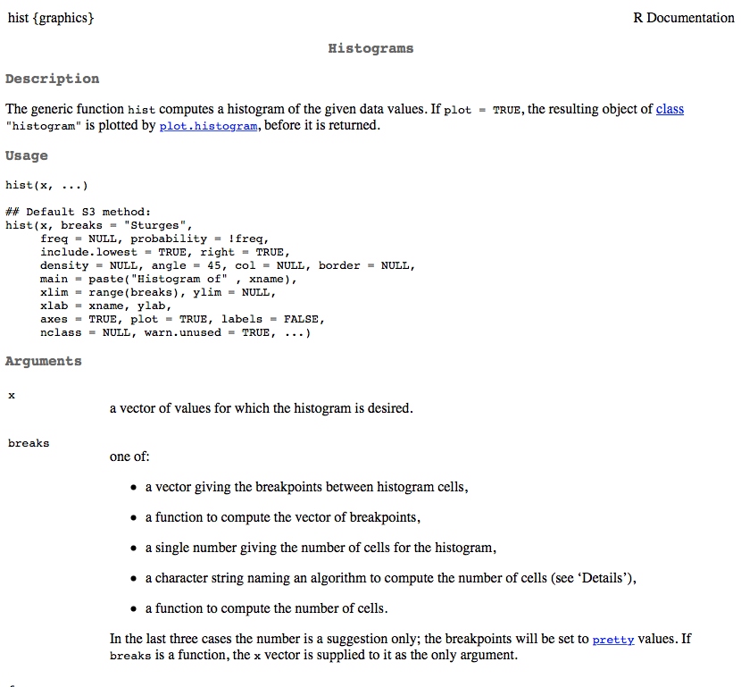
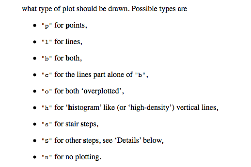
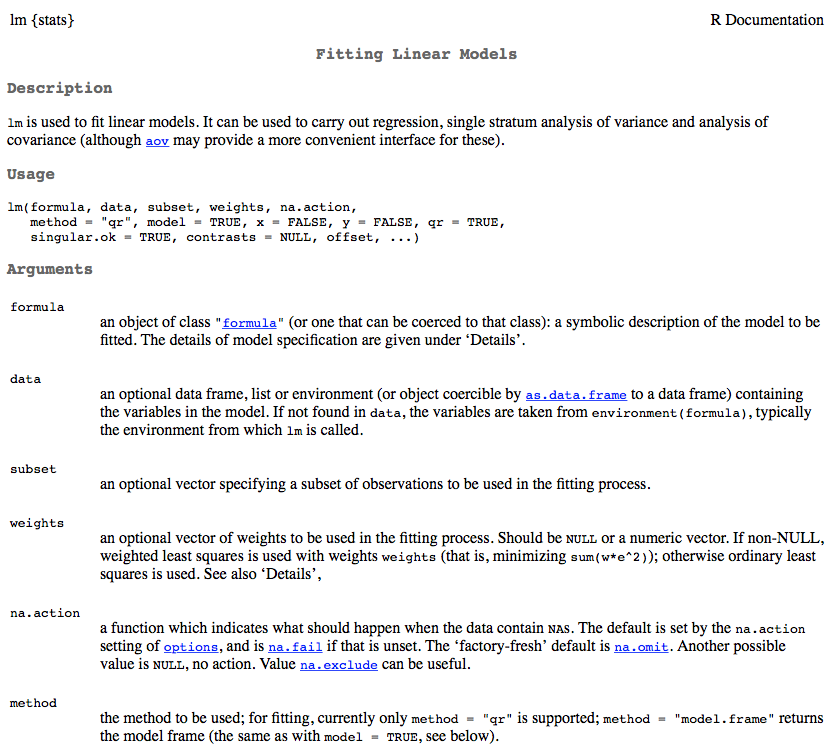
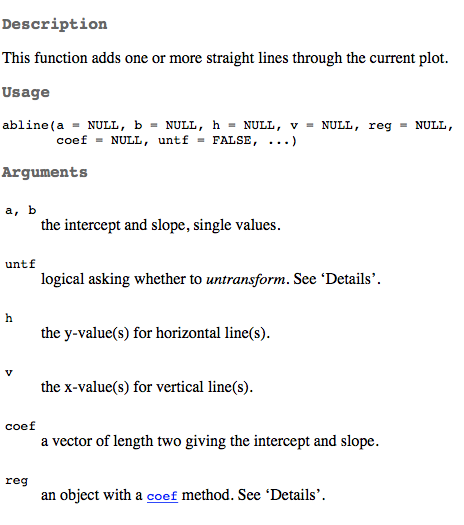
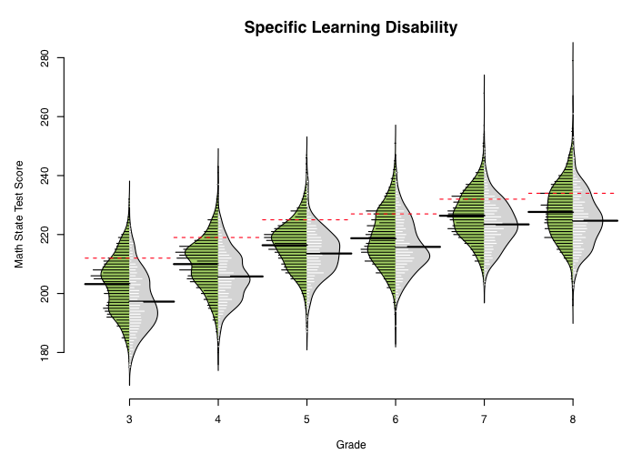
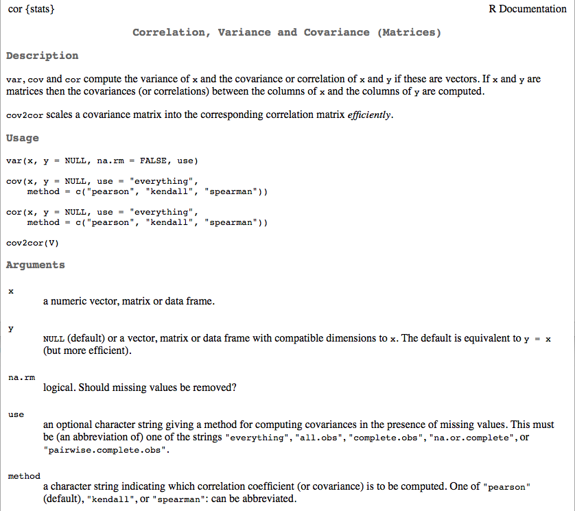

```{r setup, include = FALSE}
knitr::opts_knit$set(root.dir = "/Users/Daniel/Dropbox/Teaching/FSU_June16/")
#knitr::opts_chunk$set(fig.height = 6, fig.width = 13)
```
<style>
em {
  font-style: italic
}
</style>

<style>
strong {
  font-weight: bold;
}
</style>


## Afternoon Agenda

# Plotting basics with Base
* Histograms and density plots
* Scatter plots
    + Controls: 
        - titles
        - line width, color, and type
        - point size, color, and type
        - x and y axis labels
* Some good non-*ggplot2* packages

<span style="color:blue">Break </span>

* Quick note on lists
* Complete applied example

----
## Data: Beer!


----
## Load data

```{r readBeerData}
d <- read.delim("./data/ratebeer_beerjobber.txt")
head(d)
```

---- &twocol
## Histograms
Primary purpose of a histogram: See the distrbution of a variable

*** =left

```{r abvHist, fig.height = 6.5}
hist(d$abv)
```
*** =right

```{r ratingsHist, fig.height = 6.5}
hist(d$ratings)
```

----
## Look at the documentation 

```{r histDoc, eval = FALSE}
?hist
```


---- &twocol
## Change the number of break points

*** =left

```{r histBreaks35}
hist(d$ratings, breaks = 35)
```

*** =right

```{r histBreaks100}
hist(d$ratings, breaks = 100)
```

----
## Alternative: Plot a table of frequencies
# (no binning)

```{r plotTable, fig.height = 6.5, fig.width = 13}
rTbl <- table(d$ratings)
plot(rTbl)
```

---- &twocol
## Smooth the distribution

*** =left
# Standard Histogram
```{r hist}
hist(d$abv)
```

*** =right
# Density Plots
```{r dens1}
dens <- density(d$abv); plot(dens)
```

---- &twocol
## Density binwidth
Change the binwidth to control the smoothing factor. The smaller the binwidth,
  the closer the function will resemble the observed data. The larger the 
  binwidth, the closer the function will resemble a standard normal.

*** =left

```{r dens2, fig.height = 5}
dens1 <- density(d$abv, bw = .001)
plot(dens1)
```

*** =right

```{r dens3, fig.height = 5}
dens2 <- density(d$abv, bw = 100)
plot(dens2)
```

----
## Your turn

* Load the beer dataset
* Produce a histogram
* Produce a density plot
* Change the number of breaks and the binwidth of each
* Try adding the additional argument `probability = TRUE` to a histogram. What
  do you notice?
* After producing a histogram with `probability = TRUE`, try running 
  `lines(dens)` where dens is the density of the vector you produced the histogram from. What do you get?

---- 
## Scatter plots and controlling lines, colors, axes, etc.

```{r scatterBoot, echo = FALSE, fig.height = 8, fig.width = 14}
plot(d$score.by.style, d$score.overall, 
  col = "blue", 
  bg = "green", 
  pch = 21, 
  cex = 3, 
  lwd = 2, 
  xaxt = "n",
  yaxt = "n", 
  bty = "n",
  xlab = "Beer Style Rating",
  ylab = "Overall Beer Rating")

mod <- lm(score.overall ~ score.by.style, data = d)

# Bootstrap regression lines
myboot <- function(x, y) {
  tmpdata <- data.frame(x1 = x, y1 = y)
  thisboot <- sample(1:nrow(tmpdata), size = nrow(tmpdata), replace = TRUE)
  coef(lm(y1 ~ x1, data = tmpdata[thisboot, ]))   
}
bootcoefs <- replicate(2500, myboot(d$score.by.style, d$score.overall))
invisible(apply(bootcoefs, 2, abline, col = rgb(1, 0, 0, 0.01)))
abline(coef(mod)[1], coef(mod)[2], lty = 3, lwd = 4, col = "blue")
title(expression(Score[overall] == hat(beta)[0] + hat(beta)[1]*Score[style] + epsilon[i]))
axis(1, col = "gray")
axis(2, col = "gray")

# Standard Errors
new <- data.frame(score.by.style = seq(
                                      min(d$score.by.style, na.rm = TRUE), 
                                      max(d$score.by.style, na.rm = TRUE), 
                                      length.out = 100))
pred <- predict(mod, newdata = new, se.fit = TRUE, type = "response")
lines(x = new$score.by.style,  y = pred$fit + (1.96 * pred$se.fit), 
        lty = 8, lwd = 2, col = "blue")
lines(x = new$score.by.style, y = pred$fit - (1.96 * pred$se.fit), 
        lty = 8, lwd = 2, col = "blue")

# # Shaded region
# fit <- predict(mod, newdata = data.frame(score.by.style = 0:100), se = TRUE)$fit
# se <- predict(mod, newdata = data.frame(score.by.style = 0:100), se = TRUE)$se
# lcl <- fit - 1.96 * se
# ucl <- fit + 1.96 * se

# x.poly <- c(1:101, 101:1)
# y.poly <- c(lcl[1:101], ucl[101:1])

# polygon( x.poly , y.poly , col = rgb(0, 0, 1, 0.2) , border = NA )

```

----
## The `plot()` function
Generic x-y plotting. Multiple types of plots are possible. From the 
  documentation:


---- &twocol
## Plot types

*** =left

```{r plotTypes1, echo = FALSE}
par(mfrow = c(2,2))
plot(1:5, c(10, 11, 15, 17, 35), xlab = "", ylab = "",
  type = "p", main = "Plot w/type = 'p' ")
plot(1:5, c(10, 11, 15, 17, 35), xlab = "", ylab = "",
  type = "l", main = "Plot w/type = 'l' ")
plot(1:5, c(10, 11, 15, 17, 35), xlab = "", ylab = "",
  type = "b", main = "Plot w/type = 'b' ")
plot(1:5, c(10, 11, 15, 17, 35), xlab = "", ylab = "",
  type = "c", main = "Plot w/type = 'c' ")
```

*** =right

```{r plotTypes2, echo = FALSE}
par(mfrow = c(2,2))
plot(1:5, c(10, 11, 15, 17, 35), xlab = "", ylab = "",
  type = "o", main = "Plot w/type = 'o' ")
plot(1:5, c(10, 11, 15, 17, 35), xlab = "", ylab = "",
  type = "h", main = "Plot w/type = 'h' ")
plot(1:5, c(10, 11, 15, 17, 35), xlab = "", ylab = "",
  type = "s", main = "Plot w/type = 's' ")
plot(1:5, c(10, 11, 15, 17, 35), xlab = "", ylab = "",
  type = "S", main = "Plot w/type = 'S' ")
```

---- &twocol
## Scatter plots

Two specifications

```{r scatterSpec, eval = FALSE}
plot(outcome ~ predictor, data = d) # Just like the lm function
plot(x-variable, y-variable)
```

# Examples

*** =left

```{r scatterEx1, fig.height = 4}
plot(score.overall ~ abv, data = d)
```

*** =right

```{r scatterEx2, fig.height = 4}
plot(d$abv, d$score.overall)
```

----
## Additional arguments

```{r plotArgsTbl, echo = FALSE}
args <- c("main", "sub", "xlab", "ylab", "col", "pch", "xlim", "ylim", "bg", 
          "cex", "cex.SPEC", "col.SPEC" )
desc <- c("Main title of the Plot", "Subtitle, added at the bottom of the plot", 
    "x-axis label", "y-axis lable", 
    "Color (can be multiple things, depending on call)",
    "Point type", "Limits of x-axis (vector of length 2)", 
    "Limits of y-axis (vector of length 2)", 
    "Background color (can be multiple things, depending on call)", 
    "Size of points", 
    "Specific call to axis/lab/main/sub to change size of those SPEC (specifications)",
    "Color specific calls"
    )
knitr::kable(cbind(args, desc), col.names = c("Argument", "Description"))
```

---- &twocol
## Examples: Beer style and overall ratings

*** =left

# Standard Plot

```{r scatterStyleOverall, fig.height = 6.5}
plot(d$score.by.style, d$score.overall)
```

*** =right

# Change axes labels, provide title

```{r axesTitle, fig.height = 5}
plot(d$score.by.style, d$score.overall,
  main = "Relation Between Style Rating and Overall Rating",
  xlab = "Beer Style Rating",
  ylab = "Overall Beer Rating")
```

---- &twocol
## Change point type, color, and size

*** =left

```{r pointCharacteristics1, eval = FALSE}
plot(d$score.by.style, d$score.overall,
  main = "Relation Between Style 
    Rating and Overall Rating",
  xlab = "Beer Style Rating",
  ylab = "Overall Beer Rating",
  pch = 3,
  cex = 2,
  col = "purple")
```

*** =right

```{r pointCharacteristics2, echo = FALSE}
plot(d$score.by.style, d$score.overall,
  main = "Relation Between Style Rating and Overall Rating",
  xlab = "Beer Style Rating",
  ylab = "Overall Beer Rating",
  pch = 3,
  cex = 2,
  col = "purple")
```

---- 
## Colors in R

<div align = "left">

</div>

---- 
## Point Types

```{r pointTypes}
plot(1:20, 1:20, pch = 1:20, cex = 3)
```


----
## Line types

```{r lineTypes, fig.height = 6.5}
plot(1:6, 1:6, type = "n")
for(i in 1:6) abline(i, 0, lty = i, lwd = 3)
```

Change the line type with `lty` and the line width with `lwd`.

----
## Add horizontal and vertical reference lines at the mean

```{r refLines1, eval = FALSE}
plot(d$score.by.style, d$score.overall,
  main = "Relation Between Style Rating and Overall Rating",
  xlab = "Beer Style Rating",
  ylab = "Overall Beer Rating",
  pch = 3,
  cex = 2,
  col = "purple")

abline(h = mean(d$score.overall, na.rm = TRUE), col = "red", lty = 2, lwd = 3)
abline(v = mean(d$score.by.style, na.rm = TRUE), col = "red", lty = 2, lwd = 3)
```

Plot on next slide

----
```{r refLines2, echo = FALSE, fig.height = 8, fig.width = 13}
plot(d$score.by.style, d$score.overall,
  main = "Relation Between Style Rating and Overall Rating",
  xlab = "Beer Style Rating",
  ylab = "Overall Beer Rating",
  pch = 3,
  cex = 2,
  col = "purple")

abline(h = mean(d$score.overall, na.rm = TRUE), col = "red", lty = 2, lwd = 3)
abline(v = mean(d$score.by.style, na.rm = TRUE), col = "red", lty = 2, lwd = 3)
```


----
## Quick aside: Fitting linear regression models in R

```{r lmDoc, eval = FALSE}
?lm
```


----
## Formula structure

```{r lmForm1, eval = FALSE}
lm(outcome ~ predictor1 + predictor2 + predictorN)
```
Note that the above has an implicit intercept specification. It can be
  explicit by

```{r lmForm2, eval = FALSE}
lm(outcome ~ 1 + predictor1 + predictor2 + predictorN)
```

You can also suppress the estimation of the intercept

```{r lmForm3, eval = FALSE}
lm(outcome ~ 0 + predictor1 + predictor2 + predictorN)
```

# Important additional arguments
* `data`: What data frame do the vectors come from?
* `subset`: Do you want to analyze only a subset of cases?
* `na.action`: How should missing values be handled?

----
## Modeling the relation between beer style rating and the overall rating

```{r regMod1}
m1 <- lm(score.overall ~ score.by.style, data = d)
summary(m1)
```

----
## Alternative summary
The `arm` package (applied regression modeling) provides a lot of useful 
  functions. One simple one is just a different method for showing the summary 
  of a regression model, using the `display()` function.

```{r installARM, eval = FALSE}
install.packages("arm")
library(arm)
display(m1, detail = TRUE)
```

```{r loadARM, echo = FALSE}
library(arm)
display(m1, detail = TRUE)
```
* Note that significance is not printed by default. Use `detail = TRUE` to get 
  significance test.

----
## Extensions
Use the `coef()` function to extract coefficients

```{r coefExtract}
coef(m1)
```

Use the `predict` function to use the model for predictions with new data

```{r predict1}
predict(m1, newdata = data.frame(score.by.style = seq(80, 100, 1)))
```

---- &twocol
## Plot the relation and the model
* Two step process: First plot the relation, then overlay the regression line.

*** =left

```{r plotRegLines1, eval = FALSE}
plot(d$score.by.style, d$score.overall,
  main = "Relation Between Style 
    Rating and Overall Rating",
  xlab = "Beer Style Rating",
  ylab = "Overall Beer Rating",
  pch = 3,
  cex = 2,
  col = "purple")

abline(m1, 
  lty = 3, 
  lwd = 5, 
  col = "aquamarine3")
```

*** =right

```{r plotRegLines2, echo = FALSE}
plot(d$score.by.style, d$score.overall,
  main = "Relation Between Style 
    Rating and Overall Rating",
  xlab = "Beer Style Rating",
  ylab = "Overall Beer Rating",
  pch = 3,
  cex = 2,
  col = "purple")

abline(m1, 
  lty = 3, 
  lwd = 5, 
  col = "aquamarine3")
```

----
## A note on `abline`
All of the following specifications are identical (see the documentation).

```{r ablineSpecs, eval = FALSE}
abline(m1)
abline(a = coef(m1)[1], b = coef(m1)[2])
abline(coef(m1)["(Intercept)"], coef(m1)["score.by.style"])
abline(coef(m1))
```



----- &twocol
## Fit a nonlinear model
Simulate some data with a nonlinear relation

*** =left

```{r nonlinearSim}
set.seed(100) # for reproducibility
b0 <- 180
b1 <- 2
b2 <- -0.15

x <- sample(seq(0, 8, 0.1), 25)

y <- b0 + b1*x + b2*(x^2) + 
        rnorm(length(x), 0, 1)
```

*** =right

```{r nonLinearSimRelation, fig.height = 6}
plot(x, y)
```

----
## Fit the model

```{r polyReg}
m2a <- lm(y ~ x + I(x^2))

# Equivalent, but with Orthogonal polynomials
m2b <- lm(y ~ poly(x, 2))

# Or, using the poly function with non-orthogonal polynomials (same as m2a)
m2c <- lm(y ~ poly(x, 2, raw = TRUE))
display(m2c)
```

----
## Overlay the regression line

```{r regLineOverlay1, fig.height = 6}
plot(x, y)
preds <- predict(m2c, newdata = data.frame(x = seq(-1, 9, 0.1)))
lines(seq(-1, 9, 0.1), preds, col = "blue", lwd = 2)
```

----
## Include the SE

```{r predictions}
preds <- predict(m2c, newdata = data.frame(x = seq(-1, 9, 0.1)), se = TRUE)
str(preds)
```

```{r regLineOverlay2, eval = FALSE}
plot(x, y)
lines(seq(-1, 9, 0.1), preds$fit, col = "blue", lwd = 2)
lines(seq(-1, 9, 0.1), preds$fit - 2*preds$se.fit, col = "red", lty = 2, 
    lwd = 2)
lines(seq(-1, 9, 0.1), preds$fit + 2*preds$se.fit, col = "red", lty = 2, 
    lwd = 2)
```

Figure on the next slide

----
```{r regLineOverlay3, echo = FALSE, fig.height = 8, fig.width = 13}
plot(x, y)
lines(seq(-1, 9, 0.1), preds$fit, col = "blue", lwd = 2)
lines(seq(-1, 9, 0.1), preds$fit - 2*preds$se.fit, col = "red", lty = 2, 
    lwd = 2)
lines(seq(-1, 9, 0.1), preds$fit + 2*preds$se.fit, col = "red", lty = 2, 
    lwd = 2)
```

----
## Investigate assumptions of the model

```{r regAssum, fig.height = 6, fig.width = 13}
par(mfrow = c(2, 2))
plot(m1)
```

----
## If we have time...
Produce the following plot (the colors can be different, but it should not be 
  black)

Note: The relation is linear so you can use `abline`

```{r regPlotPractice, echo = FALSE, fig.height = 6, fig.width = 13}
plot(d$abv, d$score.overall,
  main = "Relation Between Alcohol Content and Overall Rating",
  xlab = "Alcohol By Volumne",
  ylab = "Overall Beer Rating",
  pch = 2,
  col = "cornflowerblue")

mod2 <- lm(score.overall ~ abv, data = d)
abline(coef(mod2)[1], coef(mod2)[2], lwd = 4, lty = 4, col = "chartreuse")
```


----
## Overlay a density plot on a histogram, maintain frequency y-axis

```{r histDensity1, echo = FALSE}
hist(d$abv, 
  probability = TRUE, 
  axes = FALSE,
  main = "", 
  xlab = "", 
  ylab = "")

lines(density(d$abv), 
  col = "darkgray", 
  lty = 3, 
  lwd = 3)

par(new = TRUE)
hist(d$abv, 
  main = "Distribution of Beer Alcohol by Volume",
  xlab = "Alcohol by Volume"
  )
```

---- &twocol
## Multi-step process

*** =left

First, plot the histogram, suppressing all axes, labels, and plot border

```{r histDensity2, fig.height = 4.5}
hist(d$abv, 
  probability = TRUE, 
  axes = FALSE,
  main = "", 
  xlab = "", 
  ylab = "")
```

*** =right

Next, use `lines` to add the density line

```{r histDensity3, eval = FALSE}
lines(density(d$abv), 
  col = "darkgray", 
  lty = 3, 
  lwd = 3)
```
<br>
<br>

```{r histDensity4, echo = FALSE, fig.height = 4.5}
hist(d$abv, 
  probability = TRUE, 
  axes = FALSE,
  main = "Distribution of Beer Alcohol by Volume", 
  xlab = "Alcohol by Volume")

lines(density(d$abv), 
  col = "darkgray", 
  lty = 3, 
  lwd = 3)
```

---- &twocol

*** =left

Call a new plot to overlay on the current plot

```{r histDensity5, eval = FALSE}
par(new = TRUE)
```

Plot the histogram again, labeling the axes how you'd like (note, this process 
  is necessary to keep the frequency y-axis)

```{r histDensity6, eval = FALSE}
hist(d$abv, 
  main = "Distribution of Beer Alcohol 
            by Volume",
  xlab = "Alcohol by Volume"
  )
```

*** =right

```{r histDensity7, echo = FALSE}
hist(d$abv, 
  probability = TRUE, 
  axes = FALSE,
  main = "", 
  xlab = "", 
  ylab = "")

lines(density(d$abv), 
  col = "darkgray", 
  lty = 3, 
  lwd = 3)

par(new = TRUE)
hist(d$abv, 
  main = "Distribution of Beer Alcohol by Volume",
  xlab = "Alcohol by Volume"
  )
```

-----
## A few extensions with packages
* *beanplot* package
    + Similar to violin plots, but better (in my opinion)
* *visreg* package
    + Helpful for visualizing the results of fitted regression models
* *car*
    + Further regression diagnostics

-----
## beanplot
From the documentation (second legend is cutoff...)

```{r beanplot1, eval = FALSE}
library(beanplot)
par(mfrow = c(1,2))
boxplot(len ~ dose, data = ToothGrowth,
        boxwex = 0.25, at = 1:3 - 0.2,
        subset = supp == "VC", col = "yellow",
        main = "Guinea Pigs  Tooth Growth",
        xlab = "Vitamin C dose mg",
        ylab = "tooth length", ylim = c(-1, 40), yaxs = "i")
boxplot(len ~ dose, data = ToothGrowth, add = TRUE,
        boxwex = 0.25, at = 1:3 + 0.2,
        subset = supp == "OJ", col = "orange")
legend("bottomright", bty="n",c("Ascorbic acid", "Orange juice"),
       fill = c("yellow", "orange"))
beanplot(len ~ reorder(supp, len, mean) * dose, ToothGrowth,
        side = "b", col = list("yellow", "orange"), border = c("yellow2",
            "darkorange"), main = "Guinea Pigs  Tooth Growth",
        xlab = "Vitamin C dose mg", ylab = "tooth length", ylim = c(-1,
            40), yaxs = "i")
legend("bottomright", bty="n",c("Ascorbic acid", "Orange juice"),
       fill = c("yellow", "orange"))
```

----

```{r beanplot2, echo = FALSE, fig.height = 8, fig.width = 13}
library(beanplot)
par(mfrow = c(1,2))
boxplot(len ~ dose, data = ToothGrowth,
        boxwex = 0.25, at = 1:3 - 0.2,
        subset = supp == "VC", col = "yellow",
        main = "Guinea Pigs  Tooth Growth",
        xlab = "Vitamin C dose mg",
        ylab = "tooth length", ylim = c(-1, 40), yaxs = "i")
boxplot(len ~ dose, data = ToothGrowth, add = TRUE,
        boxwex = 0.25, at = 1:3 + 0.2,
        subset = supp == "OJ", col = "orange")
legend("bottomright", bty="n",c("Ascorbic acid", "Orange juice"),
       fill = c("yellow", "orange"))
beanplot(len ~ reorder(supp, len, mean) * dose, ToothGrowth,
        side = "b", col = list("yellow", "orange"), border = c("yellow2",
            "darkorange"), main = "Guinea Pigs  Tooth Growth",
        xlab = "Vitamin C dose mg", ylab = "tooth length", ylim = c(-1,
            40), yaxs = "i")
legend("bottomright", bty="n",c("Ascorbic acid", "Orange juice"),
       fill = c("yellow", "orange"))
```

----
## Another example



----
## visreg

```{r visreg1, fig.height = 5, fig.width = 13}
library(visreg)
mod <- lm(score.overall ~ score.by.style + abv, data = d)

par(mfrow = c(1,2))
visreg(mod)
```

----
```{r visreg2, fig.height = 5, fig.width = 13}
data(airquality)
airquality$Heat <- cut(airquality$Temp, 3, labels=c("Cool", "Mild", "Hot"))

fit.heat <- lm(Ozone ~ Solar.R + Wind + Heat, data = airquality)

par(mfrow = c(1,2))
visreg(fit.heat, "Heat", type = "contrast")
visreg(fit.heat, "Heat", type = "conditional")

```

----

```{r visreg3}
fit <- lm(Ozone ~ Solar.R + Wind + Temp + I(Wind^2) + I(Temp^2) +
    I(Wind*Temp)+I(Wind*Temp^2) + I(Temp*Wind^2) + I(Temp^2*Wind^2),
    data=airquality)

visreg2d(fit,x="Wind",y="Temp",plot.type="persp", col = "cornflowerblue")
```

----
## car

One example on influential cases

```{r carP1, fig.height = 5.5, fig.width = 12}
library(car)
fit <- lm(mpg~disp+hp+wt+drat, data=mtcars)
influencePlot(fit,  id.method="identify", main="Influence Plot", sub="Circle size is proportial to Cook's Distance" )
```

----
## Nonlinearity

```{r carNonLinear, fig.width = 12}
crPlots(fit)
```

-----
## Analysis-specific plotting

Example with multilevel modeling

```{r lme4Plot, fig.height = 4, fig.width = 10}
data(Orthodont,package="nlme")
library(lme4)
fm1 <- lmer(distance ~ age + (age|Subject), data=Orthodont)

## observed versus fitted values by Subject
plot(fm1, distance ~ fitted(.) | Subject, abline = c(0,1))
```

----
## Practice (and then break)
First, produce the following plots. Again, the colors, line types, etc., can
  be different, but they should not be the default (where the defaults have been changed).

Next, fit a few regression models, and play around with the *visreg* package.

```{r plotPractice, echo = FALSE, fig.height = 6.5, fig.width = 13.5}
par(mfrow = c(1, 3))
hist(d$abv, 
  col = "blue", main = "Distribution of Beer ABV", xlab = "Alcohol by Volume")
plot(density(d$abv), 
  lwd = 5, lty = 5, col = "green", main = "Density Plot of Beer ABV")
plot(score.by.style ~ abv, data = d, pch = 7, cex = 4, col = "red", 
  xlab = "Alcohol by Volume", ylab = "Rating by Beer Category", 
  main = "ABV and Style Rating")

mod3 <- lm(score.by.style ~ abv, data = d)
abline(coef(mod3)[1], coef(mod3)[2], lty = 6, lwd = 5, col = "purple")
```

---- .segue
# Lists 

---- &twocol
## Lists
Elements of lists can be of any type, including lists

*** =left

```{r list1}
l <- list(
  c("a", "b", "c"),
  1:5,
  rep(c(T,F), 7),
  rnorm(3, 100, 25)
      )
```

*** =right

```{r printlist1}
l
```

---- &twocol
## Accessing List Elements
* List elements can be accessed in two methods: Using the `$` with the element 
  names, or through indexing with a double bracket `[[]]`.
* If a single bracket index is used, `[]`, the element will be returned, but of 
  type list.

*** =left

```{r listTypeOf}
typeof(l)
typeof(l[1])
typeof(l[[1]])
```

*** =right

```{r printListSubset}
l[1]
l[[1]]
```

----
## Access list elements via names

# Provide element names

```{r listNames}
names(l) <- c("letters", "numbers", "logical", "double")
str(l)
```
<br>

# Access element

```{r listNameAccess1}
l$letters
```

---- &twocol
## Naming lists versus vectors

*** =left

# Lists
```{r namingLists1}
lst <- list(1:5, letters[1:15])
str(lst)
names(lst) <- c("Numbers", "Letters")
str(lst)
```

*** =right

# Vectors
```{r namingVectors}
v <- lst[[1]]
names(v) <- c("One", "Two", 
  "Three", "Four", "Five")
v
```

----
```{r namingLists2}
names(lst$Numbers) <- c("One", "Two", "Three", "Four", "Five")
lst
```
<br>
# Subsetting
```{r listNameAccess2}
lst$Numbers["Three"]
```

----
## Lists returned by functions
* We'll talk about this more when we get into functions (next week), but many
  functions return a list of objects. For example: `lm`.

```{r funReturnList}
mod <- lm(hp ~ mpg, data = mtcars)
str(mod)
```

----
You can access the elements through the list

```{r listNameAccess3}
mod$coefficients
```

Note that some times there are more efficient methods

```{r funAccessListElement}
coef(mod)
```
In this case the methods are roughly equivalent, but sometimes it can make a
  difference (IRT)

----
## Other functions will transform data into lists

```{r transformList}
cyls <- split(mtcars, mtcars$cyl)
str(cyls)
```

----
## More on lists
* Note that previously slide looked like a nested list (list inside a list).
  This is because data frames are lists, where each element of the list is a
  vector of the same length.
* lists are tremendously useful and flexible, but essentially require at least
  a basic understanding of functions and/or loops.
    + Functions because lists are often used to return output from a function
      (as discussed previously).
    + Loops because you often want to loop through a list and apply a function
      to each element of the list.

For example: 

```{r sapplySplit}
sapply(cyls, function(x) cor(x$mpg, x$hp))
```
(Note `tapply` is a more efficient method for doing the same thing as above 
  without splitting the data frame first)

---- &twocol
# Lists and data frames

*** =left

```{r listdf1}
l <- list(
  lets = letters[1:5],
  ints = 9:5,
  dbl = rnorm(5, 12, 0.75)
  )
str(l)
as.data.frame(l)
```

*** =right

Or equivalently

```{r listdf2}
dframe <- data.frame(
  lets = letters[1:5],
  ints = 9:5,
  dbl = rnorm(5, 12, 0.75)
  )
dframe
```

----
## More on data frames
Because data frames are actually lists, you can use the same subsetting 
  procedures you can with lists. 

```{r listdf3}
dframe[2]
dframe[[2]]
```

---- .segue
# Complete applied (but very simple) example

----
## Goals
Come up from the weeds a bit 
* Go through a complete (basic) example
  + process, plot, analyze, plot
* Look at correlations
* Explore linear regression and multilevel modeling (briefly)

----
## Load Data
High School and Beyond

```{r loadHSB}
library(haven)
hsb <- read_spss("./data/HSB.sav")
head(hsb)
```

----
## About the HSB data

<span style="color:gray" > 
Our data file is a subsample from the 1982 High School and Beyond Survey and is
  used extensively in Hierarchical Linear Models by Raudenbush and Bryk. The
  data file, called hsb, consists of 7185 students nested in 160 schools. The
  outcome variable of interest is the student-level (level 1) math achievement
  score (mathach). The variable ses is the socio-economic status of a student
  and therefore is at the student level. The variable meanses is the group-mean
  centered version of ses and therefore is at the school level (level 2). The
  variable sector is an indicator variable indicating if a school is public or
  catholic and is therefore a school-level variable. There are 90 public
  schools (sector=0) and 70 catholic schools (sector=1) in the sample.


Description from <br>
http://www.ats.ucla.edu/stat/hlm/seminars/hlm_mlm/608/mlm_hlm_seminar_v608.htm
 </span>


----
## Check out the data a bit

```{r summaryHSB}
summary(hsb)
```

----
## Evaluate the structure of the data

```{r strHSB}
str(hsb)
```

----
## What is this ses variable?
"a standardized scale constructed from variables measuring parental education,
occupation, and income" (http://www.upa.pdx.edu/IOA/newsom/mlrclass/ho_hsb.pdf)

<br>
So why doesn't it have a sd of 1?

```{r sdSES}
sd(hsb$ses)
```

Our dataset is a sample from the full dataset. So you can still interpret a 1
  unit change in the `ses` variable as a one standard deviation increase in the
  population.

----
## Evaluate `id`

```{r tableID}
table(hsb$id)
```

---- &twocol
## Create new Student ID
*** =left
# Method 1
Use the rownames

```{r assignID1}
hsb$SID <- rownames(hsb)
head(hsb)
```
*** =right
# Method 2
Use some other arbitrary index

```{r assignID2}
hsb$SID <- seq(from = 100, 
  length.out = nrow(hsb), by = 8)
head(hsb)
```

----
## Rename `id` variable to `ScID`

```{r renameID}
names(hsb)
names(hsb)[1] <- "ScID"
head(hsb)
```

----
## Reorder variables (house cleaning)

```{r reorderVars1}
hsb <- hsb[ ,c("SID", "ScID", "minority", "female", "ses", "mathach")]
head(hsb)
```
Alternatively, by index

```{r reorderVars2, eval = FALSE}
d <- d[ ,c(ncol(d), 1:(ncol(d) - 1))]
```
```{r reorderIndex}
c(ncol(d), 1:(ncol(d) - 1))
```

----
## Visualize relation among all variables

```{r pairsPlot1, fig.width = 12}
pairs(d[ ,-c(1:2)])
```

----
## Get a better pairs plot
Look at the documentation for `pairs()` (then scroll down)

```{r pairsDoc, eval = FALSE}
?pairs
```


---- 
## Fancy pairs plot

# Run the functions from the documentation file

```{r pairsFunsDoc}
panel.hist <- function(x, ...) {
    usr <- par("usr"); on.exit(par(usr))
    par(usr = c(usr[1:2], 0, 1.5) )
    h <- hist(x, plot = FALSE)
    breaks <- h$breaks; nB <- length(breaks)
    y <- h$counts; y <- y/max(y)
    rect(breaks[-nB], 0, breaks[-1], y, col = "cyan", ...)
}

panel.cor <- function(x, y, digits = 2, prefix = "", cex.cor, ...) {
    usr <- par("usr"); on.exit(par(usr))
    par(usr = c(0, 1, 0, 1))
    r <- abs(cor(x, y, use = "complete.obs")) # I added the use part
    txt <- format(c(r, 0.123456789), digits = digits)[1]
    txt <- paste0(prefix, txt)
    if(missing(cex.cor)) cex.cor <- 0.8/strwidth(txt)
    text(0.5, 0.5, txt, cex = cex.cor * r)
}
```

----

```{r pairsPlot2, fig.width = 12}
pairs(d[ ,-c(1:2)], 
  lower.panel = panel.smooth, 
  diag.panel = panel.hist, 
  upper.panel = panel.cor)
```

---- .segue

# Exploring the relation between SES and Math Achievement


---- &twocol
## Individual Plots

*** =left

```{r hsbHists, fig.width = 6, fig.height = 2.8}
hist(hsb$mathach)
hist(hsb$ses)
```

*** =right

```{r hsbScatter}
plot(hsb$ses, hsb$mathach)
```

---- &twocol
## Correlation

*** =left

Use the `cor()` function

```{r hsbCor}
cor(hsb$ses, hsb$mathach)
```
<br>
And, as always, take a look at the documentation for `cor()`

*** =right


---- &twocol
## Missing data
For illustration purposes, lets randomly make some cases missing, and then try
  to estimate the relation between the variables again

*** =left
# Randomly 10% of assign cases to missing

```{r setSESMissing}
set.seed(1000) # For reproducibility
summary(hsb$ses)

samp <- sample(c(0, 1), nrow(hsb), replace = TRUE, prob = c(.9, .1))
table(samp) / nrow(hsb)

hsb$ses[samp == 1] <- NA
summary(hsb$ses)
```

---- &twocol
## Correlation

*** =left

```{r hsbCorMiss}
cor(hsb$ses, hsb$mathach)
```
This fails, because R doesn't know what to do with the missing data. Exclude
  those cases, and let's try again.

```{r naOmit}
temp <- na.omit(hsb)
head(temp)
```

*** =right

```{r hsbCorNAOmit}
cor(temp$ses, temp$mathach)
```
Alternatively, use the optional `use` argument

```{r hsbCorUse}
cor(hsb$ses, hsb$mathach, 
  use = "complete.obs")
```

----
## Modeling the relation between SES and Math

```{r hsbRegMod1}
mHSB <- lm(mathach ~ ses, data = hsb)
display(mHSB, detail = TRUE)
```

---- &twocol
## Plot the relation and the model

*** =left

```{r hsbScatterReg1, eval = FALSE}
# Plot the relation
plot(hsb$ses, hsb$mathach)

# Overlay the regression line
abline(mHSB, col = "blue", lty = 3, lwd = 2)
```

*** =right

```{r hsbScatterReg2, echo = FALSE}
# Plot the relation
plot(hsb$ses, hsb$mathach)

# Overlay the regression line
abline(mHSB, col = "blue", lty = 3, lwd = 2)
```

---- &twocol
## Fit the model for females and males separately

*** =left

```{r maleMod}
males <- lm(mathach ~ ses, 
  data = hsb, subset = female == 0)
display(males)
```
<br>
Note the differences between the parameter estimates. Might we want to consider
  an interaction?

*** =right

```{r femaleMod}
females <- lm(mathach ~ ses, 
  data = hsb, subset = female == 1)
display(females)
```

---- &twocol
## Plotting male and female models

*** =left

```{r malePlot, fig.height = 6}
male_d <- subset(hsb, female == 0)
plot(male_d$ses, male_d$mathach)
abline(males, col = "blue")
```

*** =right

```{r femalePlot, fig.height = 6}
female_d <- subset(hsb, female == 0)
plot(female_d$ses, female_d$mathach)
abline(females, col = "red")
```

----
## Model the interaction
Change *female* to a factor to help with plotting interpretability later

```{r femaleFactor}
hsb$female <- factor(hsb$female, levels = c(0, 1), labels = c("Male", "Female"))
head(hsb)
```

----
## Model the interaction

Shortcuts:

```{r interactionMod1}
int <- lm(mathach ~ ses*female, data = hsb)
```

expands to 

```{r interactionMod2, eval = FALSE}
int <- lm(mathach ~ ses + female + ses:female, data = hsb)
```

Note the importance of distinguishing between `*` and `:`.


---- &twocol
## Visualize the interaction

*** =left

```{r visInteraction1, fig.height = 6.5}
visreg(int, "ses", by = "female", 
  overlay = TRUE, partial = FALSE)
```

*** =right

```{r visInteraction2}
visreg(int, "ses", by = "female")
```

---
## Evaluate coefficients

```{r interactionCoefs}
display(int, detail = TRUE)
```

----
## Intercept variance between schools

```{r lmer1}
library(lme4)
mlHSB <- lmer(mathach ~ ses + (1|ScID), data = hsb)
display(mlHSB)
```

----
## How did the results change?

```{r coefsMLM}
coef(mHSB)
fixef(mlHSB)
```

----
## Caterpillar plot

```{r catterPlot, fig.height = 6.5, fig.width = 13}
library(lattice)
qqmath(ranef(mlHSB, condVar = TRUE), strip = FALSE)$ScID
```

----
## SES variability?

```{r lmer2}
mlHSB2 <- lmer(mathach ~ ses + (ses|ScID), data = hsb)
display(mlHSB2)
```

-----
## Compare competing models

```{r lmerCompare}
anova(mlHSB, mlHSB2)
```

----
```{r catterPlot2, fig.height = 7, fig.width = 13}
qqmath(ranef(mlHSB2, condVar = TRUE))$ScID
```

----
## Practice

* Read in the data file *ratebeer_beerjobber.txt*
* Plot the relation between *abv* (x-axis) and *score.overall* (y-axis)
* Find the correlation between *abv* and *score.overall*
* Fit a simple linear regression model, with *abv* predicting *score.overall*
* Plot the relation between *abv* (x-axis) and *score.overall* (y-axis)
* Overlay the regression line on the scatterplot
* Fit a multilevel model with the intercept varying by brewer

----
## Answers
Read in the data file `ratebeer_beerjobber.txt`

```{r practice1}
d <- read.delim("./data/ratebeer_beerjobber.txt")
head(d)
```

----
## Answers
Plot the relation between `abv` (x-axis) and `score.overall` (y-axis)

```{r practice2, fig.width = 12, fig.height = 6}
plot(score.overall ~ abv, data = d)
```

----
## Answers (continued)
Find the correlation between `abv` and `score.overall`

```{r practice3}
cor(d$abv, d$score.overall, use = "complete.obs")
```
Fit a simple linear regression model, with `abv` predicting `score.overall`

```{r practice4}
m2 <- lm(score.overall ~ abv, data = d)
display(m2)
```

----
## Answers (continued)
Overlay the regression line

```{r practice5, fig.width = 12, fig.height = 6}
plot(score.overall ~ abv, data = d)
abline(a = 27.97, b = 6.17, col = "blue")
```

----
## Multilevel model

```{r practice6, beerMLM}
byBrewer <- lmer(score.overall ~ abv + (1|brewer), data = d)
display(byBrewer)
```


