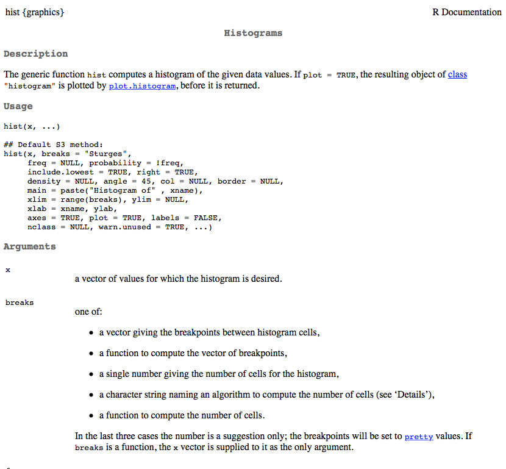
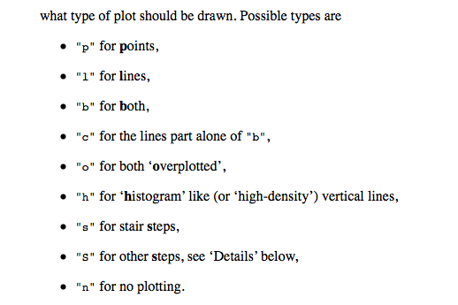

<style>
em {
  font-style: italic
}
</style>

<style>
strong {
  font-weight: bold;
}
</style>


## Afternoon Agenda

# Plotting basics with Base
* Histograms and density plots
* Scatter plots
    + Controls: 
        - titles
        - line width, color, and type
        - point size, color, and type
        - x and y axis labels
* Some good non-*ggplot2* packages

<span style="color:blue">Break </span>

* Quick note on lists
* Complete applied example

----
## Data: Beer!


----
## Load data


```r
d <- read.delim("./data/ratebeer_beerjobber.txt")
head(d)
```

```
##                                  name                 brewer
## 1                     Abbey Monks Ale Abbey Beverage Company
## 2                  Abbey Monks Tripel Abbey Beverage Company
## 3                     Abbey Monks Wit Abbey Beverage Company
## 4 Alameda Barn Owl Imperial Brown Ale    Alameda Brewing Co.
## 5         Alameda Black Bear XX Stout    Alameda Brewing Co.
## 6       Alameda El Torero Organic IPA    Alameda Brewing Co.
##                     style abv ratings score.overall score.by.style
## 1             Belgian Ale 5.2      96            50             49
## 2            Abbey Tripel 8.0       3            NA             NA
## 3 Belgian White (Witbier) 5.1      46            23             19
## 4               Brown Ale 7.9      13            74             81
## 5           Foreign Stout 6.8     172            94             76
## 6    India Pale Ale (IPA) 7.2      56            74             43
```

---- &twocol
## Histograms
Primary purpose of a histogram: See the distrbution of a variable

*** =left


```r
hist(d$abv)
```


*** =right


```r
hist(d$ratings)
```


----
## Look at the documentation 


```r
?hist
```


---- &twocol
## Change the number of break points

*** =left


```r
hist(d$ratings, breaks = 35)
```


*** =right


```r
hist(d$ratings, breaks = 100)
```


----
## Alternative: Plot a table of frequencies
# (no binning)


```r
rTbl <- table(d$ratings)
plot(rTbl)
```


---- &twocol
## Smooth the distribution

*** =left
# Standard Histogram

```r
hist(d$abv)
```


*** =right
# Density Plots

```r
dens <- density(d$abv); plot(dens)
```


---- &twocol
## Density binwidth
Change the binwidth to control the smoothing factor. The smaller the binwidth,
  the closer the function will resemble the observed data. The larger the 
  binwidth, the closer the function will resemble a standard normal.

*** =left


```r
dens1 <- density(d$abv, bw = .001)
plot(dens1)
```


*** =right


```r
dens2 <- density(d$abv, bw = 100)
plot(dens2)
```


----
## Your turn

* Load the beer dataset
* Produce a histogram
* Produce a density plot
* Change the number of breaks and the binwidth of each
* Try adding the additional argument `probability = TRUE` to a histogram. What
  do you notice?
* After producing a histogram with `probability = TRUE`, try running 
  `lines(dens)` where dens is the density of the vector you produced the histogram from. What do you get?

---- 
## Scatter plots and controlling lines, colors, axes, etc.


----
## The `plot()` function
Generic x-y plotting. Multiple types of plots are possible. From the 
  documentation:


---- &twocol
## Plot types

*** =left


*** =right


---- &twocol
## Scatter plots

Two specifications


```r
plot(outcome ~ predictor, data = d) # Just like the lm function
plot(x-variable, y-variable)
```

# Examples

*** =left


```r
plot(score.overall ~ abv, data = d)
```


*** =right


```r
plot(d$abv, d$score.overall)
```


----
## Additional arguments


|Argument |Description                                                                      |
|:--------|:--------------------------------------------------------------------------------|
|main     |Main title of the Plot                                                           |
|sub      |Subtitle, added at the bottom of the plot                                        |
|xlab     |x-axis label                                                                     |
|ylab     |y-axis lable                                                                     |
|col      |Color (can be multiple things, depending on call)                                |
|pch      |Point type                                                                       |
|xlim     |Limits of x-axis (vector of length 2)                                            |
|ylim     |Limits of y-axis (vector of length 2)                                            |
|bg       |Background color (can be multiple things, depending on call)                     |
|cex      |Size of points                                                                   |
|cex.SPEC |Specific call to axis/lab/main/sub to change size of those SPEC (specifications) |
|col.SPEC |Color specific calls                                                             |

---- &twocol
## Examples: Beer style and overall ratings

*** =left

# Standard Plot


```r
plot(d$score.by.style, d$score.overall)
```


*** =right

# Change axes labels, provide title


```r
plot(d$score.by.style, d$score.overall,
  main = "Relation Between Style Rating and Overall Rating",
  xlab = "Beer Style Rating",
  ylab = "Overall Beer Rating")
```


---- &twocol
## Change point type, color, and size

*** =left


```r
plot(d$score.by.style, d$score.overall,
  main = "Relation Between Style 
    Rating and Overall Rating",
  xlab = "Beer Style Rating",
  ylab = "Overall Beer Rating",
  pch = 3,
  cex = 2,
  col = "purple")
```

*** =right


---- 
## Colors in R

<div align = "left">

</div>

---- 
## Point Types


```r
plot(1:20, 1:20, pch = 1:20, cex = 3)
```


----
## Line types


```r
plot(1:6, 1:6, type = "n")
for(i in 1:6) abline(i, 0, lty = i, lwd = 3)
```


Change the line type with `lty` and the line width with `lwd`.

----
## Add horizontal and vertical reference lines at the mean


```r
plot(d$score.by.style, d$score.overall,
  main = "Relation Between Style Rating and Overall Rating",
  xlab = "Beer Style Rating",
  ylab = "Overall Beer Rating",
  pch = 3,
  cex = 2,
  col = "purple")

abline(h = mean(d$score.overall, na.rm = TRUE), col = "red", lty = 2, lwd = 3)
abline(v = mean(d$score.by.style, na.rm = TRUE), col = "red", lty = 2, lwd = 3)
```

Plot on next slide

----


----
## Quick aside: Fitting linear regression models in R


```r
?lm
```


----
## Formula structure


```r
lm(outcome ~ predictor1 + predictor2 + predictorN)
```
Note that the above has an implicit intercept specification. It can be
  explicit by


```r
lm(outcome ~ 1 + predictor1 + predictor2 + predictorN)
```

You can also suppress the estimation of the intercept


```r
lm(outcome ~ 0 + predictor1 + predictor2 + predictorN)
```

# Important additional arguments
* `data`: What data frame do the vectors come from?
* `subset`: Do you want to analyze only a subset of cases?
* `na.action`: How should missing values be handled?

----
## Modeling the relation between beer style rating and the overall rating


```r
m1 <- lm(score.overall ~ score.by.style, data = d)
summary(m1)
```

```
## 
## Call:
## lm(formula = score.overall ~ score.by.style, data = d)
## 
## Residuals:
##    Min     1Q Median     3Q    Max 
## -66.04 -16.12   3.77  14.14  40.84 
## 
## Coefficients:
##                Estimate Std. Error t value Pr(>|t|)    
## (Intercept)     32.5671     2.4949   13.05   <2e-16 ***
## score.by.style   0.5468     0.0375   14.58   <2e-16 ***
## ---
## Signif. codes:  0 '***' 0.001 '**' 0.01 '*' 0.05 '.' 0.1 ' ' 1
## 
## Residual standard error: 19.28 on 365 degrees of freedom
##   (33 observations deleted due to missingness)
## Multiple R-squared:  0.368,	Adjusted R-squared:  0.3663 
## F-statistic: 212.6 on 1 and 365 DF,  p-value: < 2.2e-16
```

----
## Alternative summary
The `arm` package (applied regression modeling) provides a lot of useful 
  functions. One simple one is just a different method for showing the summary 
  of a regression model, using the `display()` function.


```r
install.packages("arm")
library(arm)
display(m1, detail = TRUE)
```


```
## lm(formula = score.overall ~ score.by.style, data = d)
##                coef.est coef.se t value Pr(>|t|)
## (Intercept)    32.57     2.49   13.05    0.00   
## score.by.style  0.55     0.04   14.58    0.00   
## ---
## n = 367, k = 2
## residual sd = 19.28, R-Squared = 0.37
```
* Note that significance is not printed by default. Use `detail = TRUE` to get 
  significance test.

----
## Extensions
Use the `coef()` function to extract coefficients


```r
coef(m1)
```

```
##    (Intercept) score.by.style 
##     32.5670460      0.5467723
```

Use the `predict` function to use the model for predictions with new data


```r
predict(m1, newdata = data.frame(score.by.style = seq(80, 100, 1)))
```

```
##        1        2        3        4        5        6        7        8 
## 76.30883 76.85561 77.40238 77.94915 78.49592 79.04270 79.58947 80.13624 
##        9       10       11       12       13       14       15       16 
## 80.68301 81.22978 81.77656 82.32333 82.87010 83.41687 83.96365 84.51042 
##       17       18       19       20       21 
## 85.05719 85.60396 86.15074 86.69751 87.24428
```

---- &twocol
## Plot the relation and the model
* Two step process: First plot the relation, then overlay the regression line.

*** =left


```r
plot(d$score.by.style, d$score.overall,
  main = "Relation Between Style 
    Rating and Overall Rating",
  xlab = "Beer Style Rating",
  ylab = "Overall Beer Rating",
  pch = 3,
  cex = 2,
  col = "purple")

abline(m1, 
  lty = 3, 
  lwd = 5, 
  col = "aquamarine3")
```

*** =right


----
## A note on `abline`
All of the following specifications are identical (see the documentation).


```r
abline(m1)
abline(a = coef(m1)[1], b = coef(m1)[2])
abline(coef(m1)["(Intercept)"], coef(m1)["score.by.style"])
abline(coef(m1))
```


----- &twocol
## Fit a nonlinear model
Simulate some data with a nonlinear relation

*** =left


```r
set.seed(100) # for reproducibility
b0 <- 180
b1 <- 2
b2 <- -0.15

x <- sample(seq(0, 8, 0.1), 25)

y <- b0 + b1*x + b2*(x^2) + 
        rnorm(length(x), 0, 1)
```

*** =right


```r
plot(x, y)
```


----
## Fit the model


```r
m2a <- lm(y ~ x + I(x^2))

# Equivalent, but with Orthogonal polynomials
m2b <- lm(y ~ poly(x, 2))

# Or, using the poly function with non-orthogonal polynomials (same as m2a)
m2c <- lm(y ~ poly(x, 2, raw = TRUE))
display(m2c)
```

```
## lm(formula = y ~ poly(x, 2, raw = TRUE))
##                         coef.est coef.se
## (Intercept)             180.61     0.76 
## poly(x, 2, raw = TRUE)1   1.82     0.41 
## poly(x, 2, raw = TRUE)2  -0.14     0.05 
## ---
## n = 25, k = 3
## residual sd = 0.96, R-Squared = 0.74
```

----
## Overlay the regression line


```r
plot(x, y)
preds <- predict(m2c, newdata = data.frame(x = seq(-1, 9, 0.1)))
lines(seq(-1, 9, 0.1), preds, col = "blue", lwd = 2)
```


----
## Include the SE


```r
preds <- predict(m2c, newdata = data.frame(x = seq(-1, 9, 0.1)), se = TRUE)
str(preds)
```

```
## List of 4
##  $ fit           : Named num [1:101] 179 179 179 179 179 ...
##   ..- attr(*, "names")= chr [1:101] "1" "2" "3" "4" ...
##  $ se.fit        : Named num [1:101] 1.19 1.14 1.1 1.05 1.01 ...
##   ..- attr(*, "names")= chr [1:101] "1" "2" "3" "4" ...
##  $ df            : int 22
##  $ residual.scale: num 0.955
```


```r
plot(x, y)
lines(seq(-1, 9, 0.1), preds$fit, col = "blue", lwd = 2)
lines(seq(-1, 9, 0.1), preds$fit - 2*preds$se.fit, col = "red", lty = 2, 
    lwd = 2)
lines(seq(-1, 9, 0.1), preds$fit + 2*preds$se.fit, col = "red", lty = 2, 
    lwd = 2)
```

Figure on the next slide

----


----
## Investigate assumptions of the model


```r
par(mfrow = c(2, 2))
plot(m1)
```


----
## If we have time...
Produce the following plot (the colors can be different, but it should not be 
  black)

Note: The relation is linear so you can use `abline`


----
## Overlay a density plot on a histogram, maintain frequency y-axis


---- &twocol
## Multi-step process

*** =left

First, plot the histogram, suppressing all axes, labels, and plot border


```r
hist(d$abv, 
  probability = TRUE, 
  axes = FALSE,
  main = "", 
  xlab = "", 
  ylab = "")
```


*** =right

Next, use `lines` to add the density line


```r
lines(density(d$abv), 
  col = "darkgray", 
  lty = 3, 
  lwd = 3)
```
<br>
<br>


---- &twocol

*** =left

Call a new plot to overlay on the current plot


```r
par(new = TRUE)
```

Plot the histogram again, labeling the axes how you'd like (note, this process 
  is necessary to keep the frequency y-axis)


```r
hist(d$abv, 
  main = "Distribution of Beer Alcohol 
            by Volume",
  xlab = "Alcohol by Volume"
  )
```

*** =right


-----
## A few extensions with packages
* *beanplot* package
    + Similar to violin plots, but better (in my opinion)
* *visreg* package
    + Helpful for visualizing the results of fitted regression models
* *car*
    + Further regression diagnostics

-----
## beanplot
From the documentation


```r
library(beanplot)
par(mfrow = c(1,2))
boxplot(len ~ dose, data = ToothGrowth,
        boxwex = 0.25, at = 1:3 - 0.2,
        subset = supp == "VC", col = "yellow",
        main = "Guinea Pigs  Tooth Growth",
        xlab = "Vitamin C dose mg",
        ylab = "tooth length", ylim = c(-1, 40), yaxs = "i")
boxplot(len ~ dose, data = ToothGrowth, add = TRUE,
        boxwex = 0.25, at = 1:3 + 0.2,
        subset = supp == "OJ", col = "orange")
legend("bottomright", bty="n",c("Ascorbic acid", "Orange juice"),
       fill = c("yellow", "orange"))
beanplot(len ~ reorder(supp, len, mean) * dose, ToothGrowth,
        side = "b", col = list("yellow", "orange"), border = c("yellow2",
            "darkorange"), main = "Guinea Pigs  Tooth Growth",
        xlab = "Vitamin C dose mg", ylab = "tooth length", ylim = c(-1,
            40), yaxs = "i")
legend("bottomright", bty="n",c("Ascorbic acid", "Orange juice"),
       fill = c("yellow", "orange"))
```

----


----
## Another example


----
## visreg


```r
library(visreg)
mod <- lm(score.overall ~ score.by.style + abv, data = d)

par(mfrow = c(1,2))
visreg(mod)
```


----

```r
airquality$Heat <- cut(airquality$Temp, 3, labels=c("Cool", "Mild", "Hot"))

fit.heat <- lm(Ozone ~ Solar.R + Wind + Heat, data = airquality)

par(mfrow = c(1,2))
visreg(fit.heat, "Heat", type = "contrast")
visreg(fit.heat, "Heat", type = "conditional")
```


----


```r
fit <- lm(Ozone ~ Solar.R + Wind + Temp + I(Wind^2) + I(Temp^2) +
    I(Wind*Temp)+I(Wind*Temp^2) + I(Temp*Wind^2) + I(Temp^2*Wind^2),
    data=airquality)

visreg2d(fit,x="Wind",y="Temp",plot.type="persp", col = "cornflowerblue")
```


----
## car

One example on influential cases


```r
library(car)
fit <- lm(mpg~disp+hp+wt+drat, data=mtcars)
influencePlot(fit,  id.method="identify", main="Influence Plot", sub="Circle size is proportial to Cook's Distance" )
```


----
## Nonlinearity


```r
crPlots(fit)
```


-----
## Analysis-specific plotting

Example with multilevel modeling


```r
data(Orthodont,package="nlme")
library(lme4)
fm1 <- lmer(distance ~ age + (age|Subject), data=Orthodont)

## observed versus fitted values by Subject
plot(fm1, distance ~ fitted(.) | Subject, abline = c(0,1))
```


----
## Practice
Produce the following plots. Again, the colors, line types, etc., can be 
  different, but they should not be the default (where the defaults have been 
  changed).


