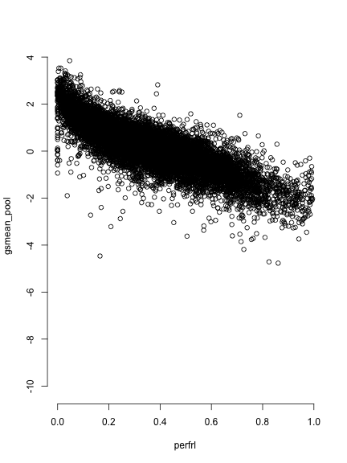
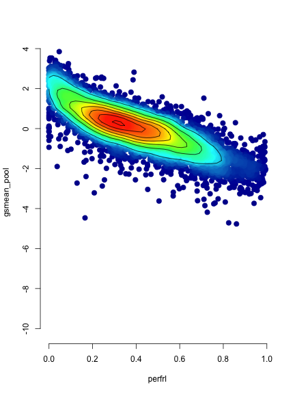
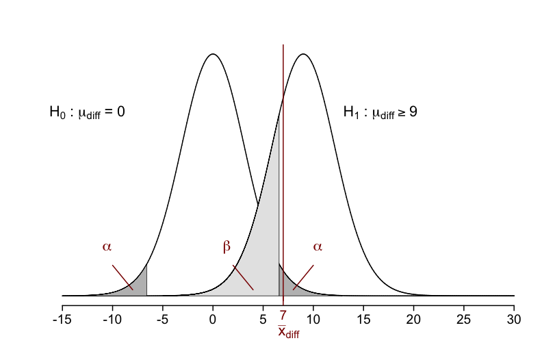
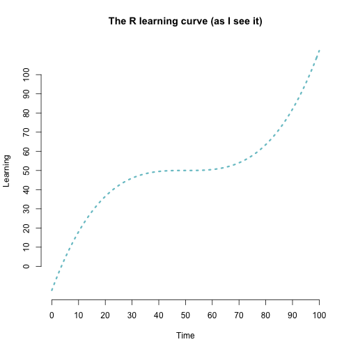
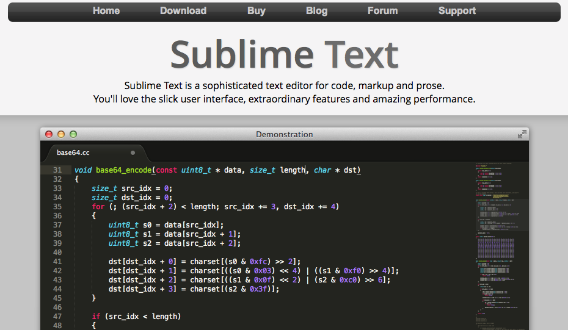
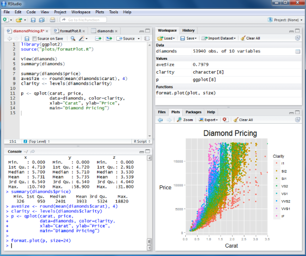
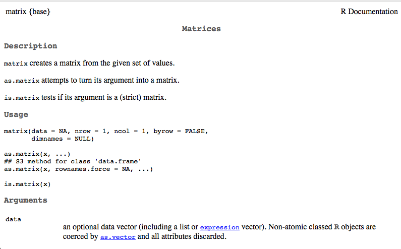

---
title       : Welcome to R
subtitle    : "Day 1: Introduction"
author      : Daniel Anderson
job         : "R Training: Florida State University, June 21, 2016"
framework   : io2012    # {io2012, html5slides, shower, dzslides, ...}
highlighter : highlight.js  # {highlight.js, prettify, highlight}
hitheme     : zenburn      # 
widgets     : [mathjax]     # {mathjax, quiz, bootstrap}
mode        : selfcontained # {standalone, draft}
knit        : slidify::knit2slides
--- &twocol

<style>
em {
  font-style: italic
}
</style>

<style>
strong {
  font-weight: bold;
}
</style>

## Hi!

*** =left

# Who am I?
Daniel Anderson 
* IES post-doc at UO <span style="color:green; font-size:8pt;"> (Go Ducks!) </span>
* Dad (two daughters: 4 and 2)
* Quantitative educational researcher who **loves** R
* Primary areas of interest
  + R, big data, "educational data science"
  + Growth modeling (primarily through multilevel models)
  + Bayesian estimation (still learning, always learning)
  + Systems-level processes (specifically teachers)

*** =right

<div align = "center">

</div>

----
## My jump to R
* Began in earnest about 3 years ago
* Time consuming
* Very frustrating at times 
* One of the most professionally rewarding things I've done
* I'm still learning more every day

----
## Exciting parts of R (to me)
* Dynamic document generation
* Incredible graphing power (which is expanding all the time)
* Extremely flexible
* Substantial gains in efficiency
* Lots of really smart people working hard every day to make R better

---- &twocol
# Dynamic document generation

*** =left
<div align = "right">

</div>

*** =right
<div align = "left">

</div>

---- &twocol
# More advanced dynamic documents

*** =left
<div align = "right">

</div>

*** =right
<div align = "left">

</div>


---- &twocol
# Incredible graphing power

High density scatterplot


*** =left



*** =right




----
## Flexible, clean, displays



<span style="color:gray; font-size:10pt;">Credit: Mijke Rhemtulla 
 (http://shinyapps.org/apps/RGraphCompendium/index.php#densities) </span>

----
# Other exciting aspects
* Flexibility comes from ability to write custom functions (which we'll discuss)
  + Essentially nothing is out of the question ("the question is not if, but how") 
* Efficiency
  + Batch processing
  + Loops
* Extensions of R
  + RStudio people
      - Hadley Wickham
      - Yihui Xie
  + *lme4* team
      - Douglas Bates
      - Martin Mächler
      - Ben Bolker
  + Many, many others


--- &twocol
*** =left
## Welcome to R



*** =right
* Moving from point-and-click interfaces to R is a substantial shift 
* It will take time to get used to a code-based interface 
* It will take time to shift the way you think about data 
* Be patient with yourself.

---- &twocol
## Overview of this training
*** =left
### Basic philosophy
* Part art, part science, part technical details
  - Analogy to songwriting: tools vs process
* The only way to **truly** become proficient at the art, is through doing.
  - you learn from me, I learn from you
* This course is about jumping into a whole new framework for the processing,
  analysis, and visualization of data. We'll start from the foundation.
* It's meant to be hard. It hopefully will also be rewarding.

*** =right

<div align = "center">

</div>

---- &twocol
## Overview of this morning

*** =left
* House cleaning
  + Text editors/R environments
* Very basics of R
  + Object assignment
  + Vectors and matrices
  	  - subsetting
* <span style="color:blue">Break </span>
  + Directory management
  + Reading and writing data
  + Data frames
  	  - subsetting

*** =right
This morning will be mostly about the nuts and bolts. The afternoon will start with some more fun things (plotting) and end with a complete, applied example (with little bit of nuts and bolts in-between).

<br>

Also, note that I had to make some sacrifices in the content coverage, because time is limited. There's a lot more to R than what I will be able to present in these two days. I'm happy to talk with any of individually (or perhaps collectively) about other topics of interest.

----- &twocol
## Logistics: Enviornment
Find an environment that works for you  

*** =left


*** =right



----
## A note on syntax
* Just like there are rules of writing, there are generally accepted guidelines
  for writing code to make it more readable. For example


```r
matRow <- matrix(c(
           10, 11, 12, 13, 
           20, 21, 22, 23,
           30, 31, 32, 33
          ), 
  nrow = 3, ncol = 4, byrow = TRUE)
```
Is more readable, and easy to understand than


```r
matRow<-matrix(c(10,11,12,13,20,21,22,23,30,31,32,33),nrow=3,ncol=4,byrow=TRUE)
```

----
## The grammar of syntax

* Proper spacing and indentation is *critical* for code to be easily 
  interpretable.
* After you get used to applying the rules, poorly formatted code is like nails
  on a chalkboard


---- &twocol
## Style guide
**Please** review a style guide, and follow those protocols religiously

*** =left

* I recommend starting with Wickham's http://adv-r.had.co.nz/Style.html 
    + It's short (will take < 20 minutes to go through)

* Will make you look better if you ever end up posting on online forums
* Your coding friends will thank you 

*** =right

<div align = "center">

</div>


------
## Onto R
R as a big calculator


```r
3 + 2
```

```
## [1] 5
```


```r
(1/-(3/2)^2) / 2^-1/9
```

```
## [1] -0.09876543
```

------ &twocol

*** =left

# Object Assignment


```r
a <- 3
b <- 2
a + b
```

```
## [1] 5
```

```r
a / (a + b)
```

```
## [1] 0.6
```

*** =right

# Object re-assignment


```r
a <- 3
a
```

```
## [1] 3
```

```r
a <- 7
a
```

```
## [1] 7
```

------ &twocol
## Object Assignment (continued)
*** =left
Objects can be of a variety of types, which we'll talk about 
  much more after the break. But here are just a few


```r
string <- "Hello world!"
logical <- TRUE
double <- 3.2587021
Integer <- 6
```
*** =right
In this case, we can't exactly do arithmetic with all of these. 
  For example


```r
string + double
```

```
## Error in string + double: non-numeric argument to binary operator
```
But, these objects can be extremely useful in programming, as we
  will see.


------
## Playing a trick on a colleague
Object assignment can be helpful to play a trick on somebody (this is one I 
  actually did with a friend from Ohio, who loves the Buckeyes).
  

```r
Ducks <- 2
Buckeyes <- 1
```
Then clear the console, so they can't see the code you've previously written.

------ bg:url(/Users/Daniel/Dropbox/Teaching/CourseR/Weeks/Week1p1/assets/img/fightingduck.jpg)


```r
Ducks > Buckeyes
```

```
## [1] TRUE
```

```r
Ducks < Buckeyes
```

```
## [1] FALSE
```

```r
Buckeyes > Ducks
```

```
## [1] FALSE
```

---- &twocol
## R Environment

*** =left

# R functions
* Anything that carries out an operation in R is a function, even `+`. 
* Functions (outside of infix functions) are preceded by `()`
    + e.g., `sum()`, `lm()`

*** =right

# Getting help
* `?` is your best friend 
    + e.g., `?lm` will tell you all the arguments for the `lm` function
* Google is your other best friend
    + If the documentation from `?` is too confusing (often the case), try 
      google.
* Other good websites
    + http://stackoverflow.com
    + Resource list: 
          - http://www.ats.ucla.edu/stat/r/
    + Mailing lists: 
          - https://stat.ethz.ch/mailman/listinfo/r-help
    

---- &twocol
## R Packages
An R package is a suite of functions generally organized around a common theme.

*** =left

* Examples
    + `stringr`
        - Functions to make working with string variables more 
          simplistic and potentially efficient
    + `lme4`
        - Functions for Linear Mixed Effects Regression modeling 
    +  `ggplot2`
        - Wrapper functions for grid graphics to quickly produce complex 
          plots

*** =right

* As of this writing (06/09/16), there are 8,557 packages available 
  through CRAN (up from 7,239 in early October!).
    + These can all be installed via `install.packages("packageName")`

* Countless other packages on github, personal websites, etc. Often come with 
  installation instructions.
    + My `r2Winsteps` and `sundry` packages

* We will be using packages throughout the training (although most of the 
  training will be focused on base operations)

---- &twocol
## Vectors

# Two global rules for R: 

1. Anything that carries out an operation is a function, even `+`. 
2. Essentially every object in R is stored as a vector or a list (e.g., data
   frames, matrices).

*** =left


```r
is.vector(Ducks)
```

```
## [1] TRUE
```
* The object `Ducks` is a vector, of length one
* So what is a vector?
  - essentially equivalent to the math definition
* <span style="color:blue" > A vector of dimension **n** is an ordered 
  collection of *n* elements, which are called components. </span>
  [math.com](http://www.math.com/tables/oddsends/vectordefs.htm)

*** =right
# Column Vector
$$
\begin{equation*}
 \qquad \begin{bmatrix}
    p_{1} \\\
    p_{2} \\\
    \vdots \\\
    p_{n}
  \end{bmatrix}
\end{equation*}
$$

# Row Vector

$$
\begin{equation*}
 \qquad \begin{bmatrix}
    p_{1} & p_{2} & \ldots & p_{n}
  \end{bmatrix}
\end{equation*}
$$

* Note that a vector of length one is typically referred to as a **scalar**,
  but in R it is still a vector of length 1.

----
## Creating vectors
$$
\begin{equation*}
 \qquad \begin{bmatrix}
    1 & 2 & 3
  \end{bmatrix}
\end{equation*}
$$


```r
numVec <- c(1, 2, 3)
numVec
```

```
## [1] 1 2 3
```

$$
\begin{equation*}
 \qquad \begin{bmatrix}
    A & B & C
  \end{bmatrix}
\end{equation*}
$$


```r
letVec <- c("A", "B", "C")
letVec
```

```
## [1] "A" "B" "C"
```
* `c()` function, which stands for **concatenate** or **combine**. 
* Perhaps the most common function in all of R

---- &twocol
## Matrices
*** =left
* Technically - a vector with a dimension attribute
* Conceptually - vectors of the same length bound together

$$
\begin{equation*}
  \textbf{M} = \qquad 
  \begin{bmatrix}
    p_{11} & p_{12} & \ldots
    & p_{1n} \\
    p_{21} & p_{22} & \ldots
    & p_{2n} \\
    \vdots & \vdots & \ddots
    & \vdots \\
    p_{m1} & p_{m2} & \ldots
    & p_{mn}
  \end{bmatrix}
\end{equation*}
$$


*** =right
* Matrices can be constructed by the conceptual method


```r
v1 <- c(10, 11, 12, 13)
v2 <- c(20, 21, 22, 23)
v3 <- c(30, 31, 32, 33)

mat <- matrix(c(v1, v2, v3), 
	nrow = 3, ncol = 4, byrow = TRUE)
mat
```

```
##      [,1] [,2] [,3] [,4]
## [1,]   10   11   12   13
## [2,]   20   21   22   23
## [3,]   30   31   32   33
```

----
## More on constructing matrices


```r
?matrix
```


---- &twocol
## `byrow` or `bycol`?
*** =left


```r
matRow <- matrix(c(v1, v2, v3), 
	nrow = 3, ncol = 4, byrow = TRUE)
matRow
```

```
##      [,1] [,2] [,3] [,4]
## [1,]   10   11   12   13
## [2,]   20   21   22   23
## [3,]   30   31   32   33
```

```r
matCol <- matrix(c(v1, v2, v3), 
	nrow = 3, ncol = 4, byrow = FALSE)
matCol
```

```
##      [,1] [,2] [,3] [,4]
## [1,]   10   13   22   31
## [2,]   11   20   23   32
## [3,]   12   21   30   33
```
*** =right


```r
v1 <- c(10, 11, 12, 13)
v2 <- c(20, 21, 22, 23)
v3 <- c(30, 31, 32, 33)
```

---- &twocol
## One final note (for now)

*** =left
* Vectors can be entered directly into the matrix function, but they still need
  to be entered as a vector or group of vectors


```r
matRow <- matrix(c(
		c(10, 11, 12, 13), 
		c(20, 21, 22, 23),
		c(30, 31, 32, 33)
		), 
	nrow = 3, ncol = 4, byrow = TRUE)
matRow
```

```
##      [,1] [,2] [,3] [,4]
## [1,]   10   11   12   13
## [2,]   20   21   22   23
## [3,]   30   31   32   33
```
*** =right


```r
matRow <- matrix(c(
                   10, 11, 12, 13, 
				   20, 21, 22, 23,
				   30, 31, 32, 33
					), 
	nrow = 3, ncol = 4, byrow = TRUE)
matRow
```

```
##      [,1] [,2] [,3] [,4]
## [1,]   10   11   12   13
## [2,]   20   21   22   23
## [3,]   30   31   32   33
```
* Note again, the importance of the `byrow` argument

---- &twocol
## Check-in

*** =left

Which snippets of code will produce the matrix below

$$
\begin{equation*}
  \textbf{mat} = \qquad 
  \begin{bmatrix}
    23 & 41 & 18 & 27 \\
    16 & 11 & 72 & 29 \\
    18 & 51 & 32 & 63 \\
  \end{bmatrix}
\end{equation*}
$$

*** =right


```r
A <- matrix(c(
           23, 41, 18, 27, 
           16, 11, 72, 29,
           18, 51, 32, 63), 
  nrow = 3, ncol = 4)

B <- matrix(c(
           c(23, 41, 18, 27), 
           c(16, 11, 72, 29),
           c(18, 51, 32, 63)
           ), 
  nrow = 3, ncol = 4, byrow = TRUE)

C <- matrix(c(
          c(23, 16, 18), 
          c(41, 11, 51),
          c(18, 72, 32),
          c(27, 29, 63)
          ), 
  nrow = 3, ncol = 4)
```

----
## Your turn
Produce the following matrix and vector. 
$$
\begin{equation*}
  \textbf{m} = \qquad 
  \begin{bmatrix}
    67 & 11 & 10 \\
    44 & 22 & 33 \\
    39 & 94 & 85 \\
    49 & 6 & 12 \\
    22 & 86 & 61 \\
  \end{bmatrix}
\end{equation*}
$$

$$
\begin{equation*}
  \textbf{v} = \qquad 
  \begin{bmatrix}
    11 & 22 & 33 & 44 & 55 \\
  \end{bmatrix}
\end{equation*}
$$

<br>
Try adding them together. What do you get?

<span style="color:gray" > (You can work with a partner) </span>


----

```r
c1 <- c(67, 44, 39, 49, 22)
c2 <- c(11, 22, 94, 6, 86)
c3 <- c(10, 33, 85, 12, 61)

m <- matrix(c(c1, c2, c3), ncol = 3)
v <- c(11, 22, 33, 44, 55)

v + m
```

```
##      [,1] [,2] [,3]
## [1,]   78   22   21
## [2,]   66   44   55
## [3,]   72  127  118
## [4,]   93   50   56
## [5,]   77  141  116
```

---- .segue
# Subsetting Vectors and Matrices

---- &twocol
## Subsetting vectors
*** =left


```r
v1 <- c(11, 12, 13, 14, 15,
	    16, 17, 18, 19, 20)
```
* Indexing
  - select the fifth element 


```r
v1[5]
```

```
## [1] 15
```
* Exclude the fifth element


```r
v1[-5]
```

```
## [1] 11 12 13 14 16 17 18 19 20
```

*** =right
* select the 7th - 10th elements


```r
sevenToTen <- 7:10
sevenToTen
```

```
## [1]  7  8  9 10
```

```r
v1[sevenToTen]
```

```
## [1] 17 18 19 20
```

```r
v1[7:10]
```

```
## [1] 17 18 19 20
```

---- 
## Subsetting vectors (continued)


```r
v1 <- c(11, 12, 13, 14, 15, 16, 17, 18, 19, 20)
```
* Logical
  - select elements greater than 13


```r
gt13 <- v1 > 13
gt13
```

```
##  [1] FALSE FALSE FALSE  TRUE  TRUE  TRUE  TRUE  TRUE  TRUE  TRUE
```

```r
v1[gt13]
```

```
## [1] 14 15 16 17 18 19 20
```

---- &twocol
## Subsetting vectors (continued)


```r
v1 <- c(11, 12, 13, 14, 15, 16, 17, 18, 19, 20)
```
*** =left
* Logical
  - select odd elements


```r
v1 %% 2
```

```
##  [1] 1 0 1 0 1 0 1 0 1 0
```

```r
oddDummy <- v1 %% 2
oddDummy > 0
```

```
##  [1]  TRUE FALSE  TRUE FALSE  TRUE FALSE  TRUE FALSE  TRUE FALSE
```
Actually could coerce directly to logical (but we haven't talked about coercions yet, and this works just as well)

*** =right


```r
v1[oddDummy > 0]
```

```
## [1] 11 13 15 17 19
```

----
## Your turn

* Create the following vector

$$
\begin{equation*}
  \textbf{v} = \qquad 
  \begin{bmatrix}
    18 & 16 & 13 & 35 & 2 & 17 & 92 & 4 \\
  \end{bmatrix}
\end{equation*}
$$

Subset the vector by:
* Selecting the first 3 values
* Removing the last two values (somewhat tricky)
* Keeping all values greater than 15

----

```r
v <- c(18, 16, 13, 35, 2, 17, 92, 4)
```
Selecting the first 3 values


```r
v[1:3]
```

```
## [1] 18 16 13
```

Removing the last two values


```r
v[-c(7:8)]
v[-7:-8]
```

```
## [1] 18 16 13 35  2 17
```

Values greater than 15


```r
v[v > 15]
```

```
## [1] 18 16 35 17 92
```

---- &twocol
## Subsetting Matrices

*** =left


* indexing
  - Matrices can be subset by using `[]` with the same conventions as 
    mathematical matrices, i.e., `[row , column]`.

    *** 

$$
\begin{equation*}
  \textbf{mat} = \qquad 
  \begin{bmatrix}
    10 & 11 & 12 & 13 \\
    20 & 21 & 22 & 23 \\
    30 & 31 & 32 & 33 \\
  \end{bmatrix}
\end{equation*}
$$


*** =right

* Select the third element of the second column


```r
mat[3,2]
```

```
## [1] 31
```

* Select the second element of the fourth column


```r
mat[2,4]
```

```
## [1] 23
```

---- &twocol
## Subsetting Matrices (continued)
*** =left
#### Select an entire row: Leave the column indicator blank

* Select the entire second row


```r
mat[2, ]
```

```
## [1] 20 21 22 23
```
$$
\begin{equation*}
  \textbf{mat} = \qquad 
  \begin{bmatrix}
    10 & 11 & 12 & 13 \\
    20 & 21 & 22 & 23 \\
    30 & 31 & 32 & 33 \\
  \end{bmatrix}
\end{equation*}
$$

*** =right
#### Select an entire column: Leave the row indicator blank

* Select the entire third column


```r
mat[ ,3]
```

```
## [1] 12 22 32
```

---- &twocol
## Subsetting Matrices (continued)
*** =left
* The return from subsetting a matrix is a vector, which can also be
  subset.


```r
column3 <- mat[ ,3]
column3
```

```
## [1] 12 22 32
```
* select the second element of the new vector


```r
column3[2]
```

```
## [1] 22
```
*** =right

* Alternatively


```r
mat[ ,3][2]
```

```
## [1] 22
```
... which is the same as


```r
mat[2,3]
```

```
## [1] 22
```

$$
\begin{equation*}
  \textbf{mat} = \qquad 
  \begin{bmatrix}
    10 & 11 & 12 & 13 \\
    20 & 21 & 22 & 23 \\
    30 & 31 & 32 & 33 \\
  \end{bmatrix}
\end{equation*}
$$


----
## Additional arguments

* You can avoid data being reduced to vectors by using the options `drop = FALSE`
  argument


```r
mat[ ,2, drop = FALSE]
```

```
##      [,1]
## [1,]   11
## [2,]   21
## [3,]   31
```

* Use a vector to select multiple rows/columns


```r
col1_3 <- c(1,3)
mat[ ,col1_3]
```

```
##      [,1] [,2]
## [1,]   10   12
## [2,]   20   22
## [3,]   30   32
```

---- &twocol
## Subsetting Matrices (continued)
### Logical

*** =left


```r
log1 <- mat > 13 & mat < 23
log1
```

```
##       [,1]  [,2]  [,3]  [,4]
## [1,] FALSE FALSE FALSE FALSE
## [2,]  TRUE  TRUE  TRUE FALSE
## [3,] FALSE FALSE FALSE FALSE
```

```r
mat[log1]
```

```
## [1] 20 21 22
```
$$
\begin{equation*}
  \textbf{mat} = \qquad 
  \begin{bmatrix}
    10 & 11 & 12 & 13 \\
    20 & 21 & 22 & 23 \\
    30 & 31 & 32 & 33 \\
  \end{bmatrix}
\end{equation*}
$$

*** =right


```r
log2 <- (mat > 13 & mat < 23) | 
	 	(mat > 30 & mat < 33)
log2
```

```
##       [,1]  [,2]  [,3]  [,4]
## [1,] FALSE FALSE FALSE FALSE
## [2,]  TRUE  TRUE  TRUE FALSE
## [3,] FALSE  TRUE  TRUE FALSE
```

```r
mat[log2]
```

```
## [1] 20 21 31 22 32
```
Note the odd order, because the subsetting is occuring by column, rather than
  row.


----
## Brief practice
# We'll go directly to break from here, and review the answers when you get back at 10:45

<br>

Create the following matrix:

$$
\begin{equation*}
  \textbf{m} = \qquad 
  \begin{bmatrix}
    18 & 32 & 11 & 41 & 73 \\
    61 & 47 & 22 & 87 & 63 \\
    44 & 52 & 23 & 42 & 77 \\
    23 & 17 & 5 & 72 & 83 \\
  \end{bmatrix}
\end{equation*}
$$

Subset the matrix by:

* Selecting the third column
* Excluding the second column
* Selecting the third and fifth elements from the second row (somewhat tricky)
* Selecting values greater than 25
* Create a vector that is the sum of the first and fourth rows

----

```r
m <- matrix(c(
    18, 32, 11, 41, 73,
    61, 47, 22, 87, 63,
    44, 52, 23, 42, 77,
    23, 17, 5, 72, 83
    ), 
  byrow = TRUE, ncol = 5
)
```
Select the third column


```r
m[ ,3]
```

```
## [1] 11 22 23  5
```

Exclude the second column


```r
m[ ,-2]
```

```
##      [,1] [,2] [,3] [,4]
## [1,]   18   11   41   73
## [2,]   61   22   87   63
## [3,]   44   23   42   77
## [4,]   23    5   72   83
```

----

Select third and fifth elements from the second row


```r
m[2,c(3,5)]
```

```
## [1] 22 63
```

Select values greater than 25


```r
m[m > 25]
```

```
##  [1] 61 44 32 47 52 41 87 42 72 73 63 77 83
```

Create a vector that is the sum of the first and fourth rows


```r
m[1, ] + m[4, ]
```

```
## [1]  41  49  16 113 156
```

---- .segue
# Directory management, reading/writing data, data structures

----
## Directory Management

What is a working directory?
  * Exactly what it sounds like--the directory from which R will work
  * Read and write files from and to this directory

Identify current working directory


```r
getwd()
```

```
## [1] "/Users/Daniel/Dropbox/Teaching/FSU_June16/day1"
```

------ 
## Looking into a working directory

What's in this directory? Two ways to find out:
* Navigate to the directory and take a look.
<div align = "left">

</div>

* Have R look for you


```r
list.files()
```

```
## [1] "afternoon.html" "afternoon.md"   "afternoon.Rmd"  "assets"        
## [5] "libraries"      "morning.Rmd"
```
The `list.files()` function shows what R "sees".

------
## Navigating your directory quickly
* Change directory from current location to a nested folder


```r
setwd("./nested/folders")
```
Here the `.` is essentially a fill-in for `getwd()`. 
* Navigate back one folder


```r
setwd("..")
```
* Navigate back two folders


```r
setwd("../..")
```

------
## Reading Data into R
To read data into R, you must tell R where the data are located by either 
  changing the working directory, or by providing the full path. For 
  example


```r
setwd("/Users/Daniel/Dropbox/Teaching/CourseR/data/")
d <- read.csv("cars.csv")
```
is equivalent to

```r
d <- read.csv("/Users/Daniel/Dropbox/Teaching/CourseR/data/cars.csv")
```
Also note that the shortcuts for changing directories can be used here too, 
  which can often increase efficiency.

----
## My advice
* Set your working directory to where you want to save all your data files.
* Move the data you are working with to that file, or to a nearby folder 
  e.g.,


```r
"(../raw)"
```

----
## What data can be read into R?
* R can read multiple data files
  - text files (csv, tab delimited, pipe delimited, etc)
  - web pages
  - SPSS, SAS, etc. (via the *foreign*, *haven*, or *memisc* packages)
  - Excel (I have not had great success here, and typically just convert it to 
    csv first)
  - relational and non-relational databases (I have no experience here, but I 
    know it is possible)
  - Directly entered data
* Simple text files are typically the most straightforward

<span style="color:green; font-weight:bold">
Fairly good blog post: </span>
http://www.r-bloggers.com/importing-data-into-r-from-different-sources/

----
## Diving deeper into reading data with R

```r
?read.table
```
<div align = "left">

</div>

---- &twocol
## Important Arguments
*** =left
* `file`
  - name of file, including extension, in quotes
  - e.g. `"cars.txt"`
* `header` 
  - `read.table` defaults to `FALSE`
  - `read.csv` and others default to `TRUE`

*** =right
* `sep` 
  - `read.table` defaults to `""`
  - `read.csv` defaults to `","`
  - `read.delim` defaults to tab delimiter `"\t"`

* Others
  - `na.strings`
  - `skip`
  - `comment.char`
  - `stringsAsFactors`


---- &twocol
## Examples
*** =left

* Although csv files open in Excel, they are actually just text files

*** =right


----
## Examples


```r
getwd()
```

```
## [1] "/Users/Daniel/Dropbox/Teaching/FSU_June16/day1"
```

```r
cars <- read.csv("./data/cars.csv")
```

```
## Warning in file(file, "rt"): cannot open file './data/cars.csv': No such
## file or directory
```

```
## Error in file(file, "rt"): cannot open the connection
```
* Use `head()` `tail()` and `str()` to check that the data were read in properly


```r
head(cars)
```

```
##               model  mpg cyl disp  hp drat    wt  qsec vs am gear carb
## 1         Mazda RX4 21.0   6  160 110 3.90 2.620 16.46  0  1    4    4
## 2     Mazda RX4 Wag 21.0   6  160 110 3.90 2.875 17.02  0  1    4    4
## 3        Datsun 710 22.8   4  108  93 3.85 2.320 18.61  1  1    4    1
## 4    Hornet 4 Drive 21.4   6  258 110 3.08 3.215 19.44  1  0    3    1
## 5 Hornet Sportabout 18.7   8  360 175 3.15 3.440 17.02  0  0    3    2
## 6           Valiant 18.1   6  225 105 2.76 3.460 20.22  1  0    3    1
```

----

```r
tail(cars)
```

```
##             model  mpg cyl  disp  hp drat    wt qsec vs am gear carb
## 27  Porsche 914-2 26.0   4 120.3  91 4.43 2.140 16.7  0  1    5    2
## 28   Lotus Europa 30.4   4  95.1 113 3.77 1.513 16.9  1  1    5    2
## 29 Ford Pantera L 15.8   8 351.0 264 4.22 3.170 14.5  0  1    5    4
## 30   Ferrari Dino 19.7   6 145.0 175 3.62 2.770 15.5  0  1    5    6
## 31  Maserati Bora 15.0   8 301.0 335 3.54 3.570 14.6  0  1    5    8
## 32     Volvo 142E 21.4   4 121.0 109 4.11 2.780 18.6  1  1    4    2
```

---- 


```r
str(cars)
```

```
## 'data.frame':	32 obs. of  12 variables:
##  $ model: Factor w/ 32 levels "AMC Javelin",..: 18 19 5 13 14 31 7 21 20 22 ...
##  $ mpg  : num  21 21 22.8 21.4 18.7 18.1 14.3 24.4 22.8 19.2 ...
##  $ cyl  : int  6 6 4 6 8 6 8 4 4 6 ...
##  $ disp : num  160 160 108 258 360 ...
##  $ hp   : int  110 110 93 110 175 105 245 62 95 123 ...
##  $ drat : num  3.9 3.9 3.85 3.08 3.15 2.76 3.21 3.69 3.92 3.92 ...
##  $ wt   : num  2.62 2.88 2.32 3.21 3.44 ...
##  $ qsec : num  16.5 17 18.6 19.4 17 ...
##  $ vs   : int  0 0 1 1 0 1 0 1 1 1 ...
##  $ am   : int  1 1 1 0 0 0 0 0 0 0 ...
##  $ gear : int  4 4 4 3 3 3 3 4 4 4 ...
##  $ carb : int  4 4 1 1 2 1 4 2 2 4 ...
```

----
## Learn more with `summary()`


```r
summary(cars)
```

```
##                 model         mpg             cyl             disp      
##  AMC Javelin       : 1   Min.   :10.40   Min.   :4.000   Min.   : 71.1  
##  Cadillac Fleetwood: 1   1st Qu.:15.43   1st Qu.:4.000   1st Qu.:120.8  
##  Camaro Z28        : 1   Median :19.20   Median :6.000   Median :196.3  
##  Chrysler Imperial : 1   Mean   :20.09   Mean   :6.188   Mean   :230.7  
##  Datsun 710        : 1   3rd Qu.:22.80   3rd Qu.:8.000   3rd Qu.:326.0  
##  Dodge Challenger  : 1   Max.   :33.90   Max.   :8.000   Max.   :472.0  
##  (Other)           :26                                                  
##        hp             drat             wt             qsec      
##  Min.   : 52.0   Min.   :2.760   Min.   :1.513   Min.   :14.50  
##  1st Qu.: 96.5   1st Qu.:3.080   1st Qu.:2.581   1st Qu.:16.89  
##  Median :123.0   Median :3.695   Median :3.325   Median :17.71  
##  Mean   :146.7   Mean   :3.597   Mean   :3.217   Mean   :17.85  
##  3rd Qu.:180.0   3rd Qu.:3.920   3rd Qu.:3.610   3rd Qu.:18.90  
##  Max.   :335.0   Max.   :4.930   Max.   :5.424   Max.   :22.90  
##                                                                 
##        vs               am              gear            carb      
##  Min.   :0.0000   Min.   :0.0000   Min.   :3.000   Min.   :1.000  
##  1st Qu.:0.0000   1st Qu.:0.0000   1st Qu.:3.000   1st Qu.:2.000  
##  Median :0.0000   Median :0.0000   Median :4.000   Median :2.000  
##  Mean   :0.4375   Mean   :0.4062   Mean   :3.688   Mean   :2.812  
##  3rd Qu.:1.0000   3rd Qu.:1.0000   3rd Qu.:4.000   3rd Qu.:4.000  
##  Max.   :1.0000   Max.   :1.0000   Max.   :5.000   Max.   :8.000  
## 
```

---- &twocol
## A more complicated example
*** =left
* No column names
* pipe-delimited
* `NA` coded as 999
* `read.csv()` won't work here

*** =right
<div align = "left">

</div>


----
* `read.table()`
* Explicit calls to 
  - `sep`, `na`, and `col.names`


```r
trees <- read.table("./data/trees.txt", sep = "|", na = "999", 
  col.names = c("Girth", "Height", "Volume"))
```

```
## Warning in file(file, "rt"): cannot open file './data/trees.txt': No such
## file or directory
```

```
## Error in file(file, "rt"): cannot open the connection
```

```r
head(trees)
```

```
##   Girth Height Volume
## 1   8.3     NA     NA
## 2    NA     65   10.3
## 3    NA     63     NA
## 4  10.5     72   16.4
## 5  10.7     NA     NA
## 6  10.8     NA   19.7
```
* Note that the column names are defined as a vector, via `c`.

---- 
## Last example: SPSS


----

```r
library(foreign)
violence <- read.spss("./data/USViolentActs.sav", to.data.frame = TRUE)
```

```
## Error in read.spss("./data/USViolentActs.sav", to.data.frame = TRUE): unable to open file: 'No such file or directory'
```

```r
head(violence)
```

```
##            State Murder Assault UrbanPop Rape
## 1 Alabama          13.2     236       58 21.2
## 2 Alaska           10.0     263       48 44.5
## 3 Arizona           8.1     294       80 31.0
## 4 Arkansas          8.8     190       50 19.5
## 5 California        9.0     276       91 40.6
## 6 Colorado          7.9     204       78 38.7
```

---- &twocol
## More on reading foreign files

*** =left

* It can be a hassle
* *foreign* package (part of the base distribution)
    + No longer being developed
    + Warnings are (for now) ignorable
    + `to.data.frame = TRUE` is vital
* *Hmisc* package may be a better alternative (I haven't explored it much, and 
  generally try to avoid SPSS files)
* *haven* is probably the best option
    + Written by Hadley Wickham (so, basically, it's trustworthy)
    + New package, actively being developed and maintained
    + Reads SPSS, SAS, and Stata files
    + Defaults lead to data being read in how you expect it to be (generally)
    + Includes preliminary support for *writing* Stat or SPSS files (not SAS,
      yet)

----
## Your turn
In the repository you cloned earlier in class, there is a folder called "data".
Read in the following files
* longley.csv
* attitude.txt

<span style="color:gray" > (You can work with a partner) </span>

----
The longley file is a csv, with headers, and can be read in pretty simply:


```r
longley <- read.csv("./data/longley.csv")
head(longley)
```

```
##   Year GNP.deflator     GNP Unemployed Armed.Forces Population Year.1
## 1 1947         83.0 234.289      235.6        159.0    107.608   1947
## 2 1948         88.5 259.426      232.5        145.6    108.632   1948
## 3 1949         88.2 258.054      368.2        161.6    109.773   1949
## 4 1950         89.5 284.599      335.1        165.0    110.929   1950
## 5 1951         96.2 328.975      209.9        309.9    112.075   1951
## 6 1952         98.1 346.999      193.2        359.4    113.270   1952
##   Employed
## 1   60.323
## 2   61.122
## 3   60.171
## 4   61.187
## 5   63.221
## 6   63.639
```

----
The attitude file is a bit more tricky. It's tab separated. We can use either
  `read.table()` or `read.delim()`.


```r
att <- read.table("./data/attitude.txt", sep = "\t")
att <- read.delim("./data/attitude.txt")
head(att)
```

```
##   rating complaints privileges learning raises critical advance
## 1     43         51         30       39     61       92      45
## 2     63         64         51       54     63       73      47
## 3     71         70         68       69     76       86      48
## 4     61         63         45       47     54       84      35
## 5     81         78         56       66     71       83      47
## 6     43         55         49       44     54       49      34
```

----
## Subsetting data frames
* Data frames can be subset in numerous ways, including indexing equivalent to 
  matrices


```r
head(cars)
```

```
##               model  mpg cyl disp  hp drat    wt  qsec vs am gear carb
## 1         Mazda RX4 21.0   6  160 110 3.90 2.620 16.46  0  1    4    4
## 2     Mazda RX4 Wag 21.0   6  160 110 3.90 2.875 17.02  0  1    4    4
## 3        Datsun 710 22.8   4  108  93 3.85 2.320 18.61  1  1    4    1
## 4    Hornet 4 Drive 21.4   6  258 110 3.08 3.215 19.44  1  0    3    1
## 5 Hornet Sportabout 18.7   8  360 175 3.15 3.440 17.02  0  0    3    2
## 6           Valiant 18.1   6  225 105 2.76 3.460 20.22  1  0    3    1
```
* Select the first 10 rows of the 3rd column


```r
cars[1:10,3]
```

```
##  [1] 6 6 4 6 8 6 8 4 4 6
```

----
Select the same elements, but keep the data frame intact


```r
cars[1:10,3, drop = FALSE]
```

```
##    cyl
## 1    6
## 2    6
## 3    4
## 4    6
## 5    8
## 6    6
## 7    8
## 8    4
## 9    4
## 10   6
```


----
## `str()` gives us a hint at an alternative subsetting method


```r
str(cars)
```

```
## 'data.frame':	32 obs. of  12 variables:
##  $ model: Factor w/ 32 levels "AMC Javelin",..: 18 19 5 13 14 31 7 21 20 22 ...
##  $ mpg  : num  21 21 22.8 21.4 18.7 18.1 14.3 24.4 22.8 19.2 ...
##  $ cyl  : int  6 6 4 6 8 6 8 4 4 6 ...
##  $ disp : num  160 160 108 258 360 ...
##  $ hp   : int  110 110 93 110 175 105 245 62 95 123 ...
##  $ drat : num  3.9 3.9 3.85 3.08 3.15 2.76 3.21 3.69 3.92 3.92 ...
##  $ wt   : num  2.62 2.88 2.32 3.21 3.44 ...
##  $ qsec : num  16.5 17 18.6 19.4 17 ...
##  $ vs   : int  0 0 1 1 0 1 0 1 1 1 ...
##  $ am   : int  1 1 1 0 0 0 0 0 0 0 ...
##  $ gear : int  4 4 4 3 3 3 3 4 4 4 ...
##  $ carb : int  4 4 1 1 2 1 4 2 2 4 ...
```

----
## Selecting columns by name
The `$` operator can also be used to select columns
* Select the `mpg` variable/column


```r
cars$mpg
```

```
##  [1] 21.0 21.0 22.8 21.4 18.7 18.1 14.3 24.4 22.8 19.2 17.8 16.4 17.3 15.2
## [15] 10.4 10.4 14.7 32.4 30.4 33.9 21.5 15.5 15.2 13.3 19.2 27.3 26.0 30.4
## [29] 15.8 19.7 15.0 21.4
```

* Select the `cyl` variable/column


```r
cars$cyl
```

```
##  [1] 6 6 4 6 8 6 8 4 4 6 6 8 8 8 8 8 8 4 4 4 4 8 8 8 8 4 4 4 8 6 8 4
```

---- &twocol
## A few more subsetting notes
*** =left
* Names can also be used within the `[]`, as long as they are supplied as a 
  string
* Multiple columns can be selected in this manner if a vector of names is 
  supplied
  - vectors are returned if you are using the `row , column` notation with a 
    single variable and you do not specifiy `drop = FALSE`
  - data frame maintained if only the names are supplied


* The following two lines of code are equivalent


```r
cars[c("mpg","cyl")]
cars[ ,c("mpg","cyl")]
```
*** =right
* As are these


```r
cars["mpg"]
cars[ ,"mpg", drop = FALSE]
```
* However, these are not


```r
cars["mpg"]
cars[ ,"mpg"]
```

* The first maintains the data frame, while the second returns a vector

---- &twocol
## Example

*** =left


```r
cars["mpg"]
```

```
##     mpg
## 1  21.0
## 2  21.0
## 3  22.8
## 4  21.4
## 5  18.7
## 6  18.1
## 7  14.3
## 8  24.4
## 9  22.8
## 10 19.2
## 11 17.8
## 12 16.4
## 13 17.3
## 14 15.2
## 15 10.4
## 16 10.4
## 17 14.7
## 18 32.4
## 19 30.4
## 20 33.9
## 21 21.5
## 22 15.5
## 23 15.2
## 24 13.3
## 25 19.2
## 26 27.3
## 27 26.0
## 28 30.4
## 29 15.8
## 30 19.7
## 31 15.0
## 32 21.4
```

*** =right


```r
cars[ ,"mpg"]
```

```
##  [1] 21.0 21.0 22.8 21.4 18.7 18.1 14.3 24.4 22.8 19.2 17.8 16.4 17.3 15.2
## [15] 10.4 10.4 14.7 32.4 30.4 33.9 21.5 15.5 15.2 13.3 19.2 27.3 26.0 30.4
## [29] 15.8 19.7 15.0 21.4
```

----
## Logical subsetting can also be used with data frames


```r
mpg25up <- cars$mpg > 25
cars[mpg25up, ]
```

```
##             model  mpg cyl  disp  hp drat    wt  qsec vs am gear carb
## 18       Fiat 128 32.4   4  78.7  66 4.08 2.200 19.47  1  1    4    1
## 19    Honda Civic 30.4   4  75.7  52 4.93 1.615 18.52  1  1    4    2
## 20 Toyota Corolla 33.9   4  71.1  65 4.22 1.835 19.90  1  1    4    1
## 26      Fiat X1-9 27.3   4  79.0  66 4.08 1.935 18.90  1  1    4    1
## 27  Porsche 914-2 26.0   4 120.3  91 4.43 2.140 16.70  0  1    5    2
## 28   Lotus Europa 30.4   4  95.1 113 3.77 1.513 16.90  1  1    5    2
```


```r
cars[cars$mpg > 25 & cars$gear == 5, ]
```

```
##            model  mpg cyl  disp  hp drat    wt qsec vs am gear carb
## 27 Porsche 914-2 26.0   4 120.3  91 4.43 2.140 16.7  0  1    5    2
## 28  Lotus Europa 30.4   4  95.1 113 3.77 1.513 16.9  1  1    5    2
```

----
## How do these logical subsets work?


```r
cars$mpg > 25
```

```
##  [1] FALSE FALSE FALSE FALSE FALSE FALSE FALSE FALSE FALSE FALSE FALSE
## [12] FALSE FALSE FALSE FALSE FALSE FALSE  TRUE  TRUE  TRUE FALSE FALSE
## [23] FALSE FALSE FALSE  TRUE  TRUE  TRUE FALSE FALSE FALSE FALSE
```

```r
cars$mpg > 25 & cars$gear == 5
```

```
##  [1] FALSE FALSE FALSE FALSE FALSE FALSE FALSE FALSE FALSE FALSE FALSE
## [12] FALSE FALSE FALSE FALSE FALSE FALSE FALSE FALSE FALSE FALSE FALSE
## [23] FALSE FALSE FALSE FALSE  TRUE  TRUE FALSE FALSE FALSE FALSE
```

----
## Final note on subsetting 
* The `subset()` function can be very useful for subsetting vectors, matrices, 
  or data frames


```r
?subset
```

<div align = "center">

</div>


---- &twocol
## Examples of `subset`
* `x` = object to subset
* `subset` logical vector
* `select` optionally used to select columns

*** =left


```r
subset(cars, 
  subset = mpg > 25, 
  select = c("model", "mpg", "hp"))
```

```
##             model  mpg  hp
## 18       Fiat 128 32.4  66
## 19    Honda Civic 30.4  52
## 20 Toyota Corolla 33.9  65
## 26      Fiat X1-9 27.3  66
## 27  Porsche 914-2 26.0  91
## 28   Lotus Europa 30.4 113
```

*** =right


```r
subset(cars, hp > 220)
```

```
##                model  mpg cyl disp  hp drat    wt  qsec vs am gear carb
## 7         Duster 360 14.3   8  360 245 3.21 3.570 15.84  0  0    3    4
## 17 Chrysler Imperial 14.7   8  440 230 3.23 5.345 17.42  0  0    3    4
## 24        Camaro Z28 13.3   8  350 245 3.73 3.840 15.41  0  0    3    4
## 29    Ford Pantera L 15.8   8  351 264 4.22 3.170 14.50  0  1    5    4
## 31     Maserati Bora 15.0   8  301 335 3.54 3.570 14.60  0  1    5    8
```

----
## Writing Data
* Write text files with essentially the same process, using `write.table()` or
  `write.csv()`


----
## Example
* Write csv file


```r
write.csv(cars, file = "carsData.csv", row.names = FALSE)
```

* Write dat file for mplus


```r
write.table(cars, file = "carsData.dat", 
  sep = "\t", 
  col.names = FALSE,
  row.names = FALSE,
  na = "999")
```

----
## Write an R file


```r
save(cars, file = "carsData.Rda")
```

Loading the data is then really easy


```r
load("carsData.Rda")
```


```r
head(cars)
```

```
##               model  mpg cyl disp  hp drat    wt  qsec vs am gear carb
## 1         Mazda RX4 21.0   6  160 110 3.90 2.620 16.46  0  1    4    4
## 2     Mazda RX4 Wag 21.0   6  160 110 3.90 2.875 17.02  0  1    4    4
## 3        Datsun 710 22.8   4  108  93 3.85 2.320 18.61  1  1    4    1
## 4    Hornet 4 Drive 21.4   6  258 110 3.08 3.215 19.44  1  0    3    1
## 5 Hornet Sportabout 18.7   8  360 175 3.15 3.440 17.02  0  0    3    2
## 6           Valiant 18.1   6  225 105 2.76 3.460 20.22  1  0    3    1
```

----
## A note on writing R files
* When you load the `carsData.Rda` file, the object `cars` is loaded (i.e., it
  is not `carsData`). The reason is the file is `carsData`, but the object saved
  was `cars`. It's often helpful to keep them the same.


```r
carsData <- cars
save(carsData, file = "carsData.Rda")
```

* Other options (both readable by text editors)
  - `dump()`
  - `dput()` 

For the most part, I'd recommend either writing a text file or an r-specific 
  `.Rda` file.

---- .segue
# Data structures

--- 
## Data structures


|Dimensions |Homogenous    |Heterogeneous |
|:----------|:-------------|:-------------|
|1          |Atomic Vector |List          |
|2          |Matrix        |Data frame    |
|n          |Array         |              |
<br>
* Note: Table taken from Wickham (2015)

----
## Properties of Vectors

# Type 
* Type of elements stored in the vector
    - use `typeof()` or `is.character()`, `is.integer()`, etc.

# Length
* Number of elements in the vector
    - use `length()`

# Attributes
* Arbitrary metadata
    - use `attributes()` and/or `attr()`
* What's metadata
    - data about the data (i.e., information that describes the data)

---- &twocol
## Atomic Vectors vs Lists

*** =left

* Atomic
    - All elements of the same type

* Lists
    - Element types differ

<br>

Lists are incredibly useful, but decidedly more complicated. We'll only touch on them briefly. 

*** =right


```r
atomic <- c(1, 7, 9, 23, 5)
atomic
```

```
## [1]  1  7  9 23  5
```

```r
lst <- list("a", 2, TRUE)
lst
```

```
## [[1]]
## [1] "a"
## 
## [[2]]
## [1] 2
## 
## [[3]]
## [1] TRUE
```

---- &twocol
## Data types

*** =left
* Double
    - numeric with arbitrary precision
* Integer
    - numeric whole number
* Logical
    - true/false
* Character
    - string elements

*** =right


```r
dbl <- c(1.357, 2, 4.67)
int <- c(2L, 5L, 7L, 1L)
log <- c(TRUE, FALSE, T, F)
chr <- c("a", "b", "c")
```
Note the specific "L" placed after each number on the integer vector to coerce
  the elements to integer, rather than double.


```r
int
```

```
## [1] 2 5 7 1
```

---- &twocol
## Determining and Testing Types

*** =left


```r
typeof(dbl)
```

```
## [1] "double"
```

```r
is.double(dbl)
```

```
## [1] TRUE
```

```r
is.integer(dbl)
```

```
## [1] FALSE
```

```r
is.atomic(dbl)
```

```
## [1] TRUE
```

*** =right
# Be careful of more generic tests


```r
is.numeric(dbl)
```

```
## [1] TRUE
```

```r
is.numeric(int)
```

```
## [1] TRUE
```

----
## Check in
* What data types are the following vectors?


```r
w <- c(TRUE, FALSE, FALSE, TRUE)
x <- c(3, 5, 8, 9, 2.5)
y <- c("green", "red", "blue")
z <- c(5L, 7L, 2L, 18L)
```

----
## Coercion

# Take a guess: What will the following vectors produce?


```r
w <- c("1", 2, 3)
x <- c(1, TRUE, FALSE)
y <- c(3.25, 5L, 7L)
z <- c("a", "b", 7, TRUE)
```

---- &twocol

*** =left


```r
c("1", 2, 3); is.character(w)
```

```
## [1] "1" "2" "3"
```

```
## [1] TRUE
```

```r
c(1, TRUE, FALSE); is.double(x)
```

```
## [1] 1 1 0
```

```
## [1] TRUE
```

*** =right


```r
c(3.25, 5L, 7L); is.double(y)
```

```
## [1] 3.25 5.00 7.00
```

```
## [1] TRUE
```

```r
c("a", "b", 7, TRUE); is.character(z)
```

```
## [1] "a"    "b"    "7"    "TRUE"
```

```
## [1] TRUE
```

----
## Coercion rules
Remember: Atomic vectors must contain data of the same type.

* Most flexible: Character
* Least flexible: Logical

When logical vectors are coerced to be numeric, `TRUE` are coded 1, and `FALSE`
  are coded 0.

Explicitely coerce via `as.___`.

---- &twocol
## Explicit coercion

*** =left

# Override default coercions


```r
c(FALSE,1,TRUE,0)
```

```
## [1] 0 1 1 0
```

```r
as.logical(c(FALSE,1,TRUE,0))
```

```
## [1] FALSE  TRUE  TRUE FALSE
```

```r
c("1", 2, 3)
```

```
## [1] "1" "2" "3"
```

```r
as.double(c("1", 2, 3))
```

```
## [1] 1 2 3
```
*** =right

# Convert to specific type


```r
as.character(1:5)
```

```
## [1] "1" "2" "3" "4" "5"
```
<br>
# Careful with specific coercsions


```r
c("a", "b", 7, "TRUE")
```

```
## [1] "a"    "b"    "7"    "TRUE"
```

```r
as.integer(c("a", "b", 7, "TRUE"))
```

```
## Warning: NAs introduced by coercion
```

```
## [1] NA NA  7 NA
```

----
## Check in
* Predict how each vector will be coerced.


```r
c(1, FALSE)
c("a", TRUE)
c("b", 1L)
c(1L, 2)
```
----
# Why does this all matter?

----

```r
c(1, FALSE)
```

```
## [1] 1 0
```

```r
c("a", TRUE)
```

```
## [1] "a"    "TRUE"
```

```r
c("b", 1L)
```

```
## [1] "b" "1"
```

```r
c(1L, 2)
```

```
## [1] 1 2
```

---- .segue

# Attributes

----
## Important attributes
* `names()`, `colnames()`, `rownames()`
* Dimensions (used to convert vectors to matrices and arrays)
* Class: points R to correct functions to execute (e.g., `print()`, `plot()`, 
  etc.)

What is an attribute? Metadata (data about the data) for an object.

---- &twocol
# `names()`

*** =left

* Names can be assigned to an object in a couple different ways.


```r
y <- c("A" = 1, "B" = 2, "C" = 3)
y
```

```
## A B C 
## 1 2 3
```

```r
names(y)
```

```
## [1] "A" "B" "C"
```

*** =right


```r
z <- 1:3
z
```

```
## [1] 1 2 3
```

```r
names(z) <- c("A", "B", "C")
z
```

```
## A B C 
## 1 2 3
```

```r
names(z)
```

```
## [1] "A" "B" "C"
```

----
## Factors
* Used to store categorical data
* Can only store predefined values
* String variables default to factors when reading in data 


```r
colors <- factor(c("black", "green", "blue", "blue", "black"))
attributes(colors)
```

```
## $levels
## [1] "black" "blue"  "green"
## 
## $class
## [1] "factor"
```

```r
str(colors)
```

```
##  Factor w/ 3 levels "black","blue",..: 1 3 2 2 1
```

----
## Adding elements to factors


```r
colors[6] <- "blue"
colors
```

```
## [1] black green blue  blue  black blue 
## Levels: black blue green
```

```r
colors[7] <- "purple"
```

```
## Warning in `[<-.factor`(`*tmp*`, 7, value = "purple"): invalid factor
## level, NA generated
```

```r
colors
```

```
## [1] black green blue  blue  black blue  <NA> 
## Levels: black blue green
```

---- &twocol
## Benefits of factors
*** =left
* No need for multiple variables to define a categorical variable: internal 
  dummy-coding


```r
contrasts(colors)
```

```
##       blue green
## black    0     0
## blue     1     0
## green    0     1
```
*** =right

* Change the reference group by defining a new contrast matrix. For example, we 
  can set green to the reference group with the following code.


```r
contrasts(colors) <- matrix(
  c(1, 0,
    0, 1,
    0, 0),
byrow = TRUE, ncol = 2)
```

---- &twocol
# Contrast coding (continued)

Alternatively, use some of the built in functions for defining new contrasts 
  matrices 

*** =left


```r
contr.helmert(3)
```

```
##   [,1] [,2]
## 1   -1   -1
## 2    1   -1
## 3    0    2
```

```r
contr.sum(3)
```

```
##   [,1] [,2]
## 1    1    0
## 2    0    1
## 3   -1   -1
```
<br>
(see: http://www.ats.ucla.edu/stat/r/library/contrast_coding.htm)
*** =right


```r
contrasts(colors) <- contr.helmert(3)
contrasts(colors)
```

```
##       [,1] [,2]
## black   -1   -1
## blue     1   -1
## green    0    2
```

```r
contrasts(colors) <- contr.sum(3)
contrasts(colors)
```

```
##       [,1] [,2]
## black    1    0
## blue     0    1
## green   -1   -1
```

----
## Factors and attributes

* Factors are atomic integer vectors with a "levels" attribute.


```r
is.atomic(colors)
```

```
## [1] TRUE
```

```r
typeof(colors)
```

```
## [1] "integer"
```

Note: Be careful with `is.vector()`. It only returns `TRUE` if the vector has no
  attributes outside of names


```r
is.vector(colors)
```

```
## [1] FALSE
```

---- &twocol
## Dimension attribute

*** =left

The way we have created matrices in the past in through the `matrix` function


```r
m <- matrix(1:12, ncol = 3)
m
```

```
##      [,1] [,2] [,3]
## [1,]    1    5    9
## [2,]    2    6   10
## [3,]    3    7   11
## [4,]    4    8   12
```

*** =right

The object `m` is really just an atomic vector with a dimension attribute


```r
attributes(m)
```

```
## $dim
## [1] 4 3
```

```r
is.atomic(m)
```

```
## [1] TRUE
```

---- &twocol
## Alternative construction of the same matrix

*** =left
# Construct matrix


```r
m <- 1:12
m
```

```
##  [1]  1  2  3  4  5  6  7  8  9 10 11 12
```

```r
dim(m) <- c(4, 3)
m
```

```
##      [,1] [,2] [,3]
## [1,]    1    5    9
## [2,]    2    6   10
## [3,]    3    7   11
## [4,]    4    8   12
```
*** =right

# Add row and column names


```r
rownames(m) <- c("r1", "r2", "r3", "r4")
m
```

```
##    [,1] [,2] [,3]
## r1    1    5    9
## r2    2    6   10
## r3    3    7   11
## r4    4    8   12
```

```r
colnames(m) <- c("c1", "c2", "c3")
m
```

```
##    c1 c2 c3
## r1  1  5  9
## r2  2  6 10
## r3  3  7 11
## r4  4  8 12
```

---- &twocol
## Construct matrix, but fill by row

*** =left
# Construct the transpose of the matrix

```r
m <- 1:12
dim(m) <- c(3, 4)
m
```

```
##      [,1] [,2] [,3] [,4]
## [1,]    1    4    7   10
## [2,]    2    5    8   11
## [3,]    3    6    9   12
```

*** =right
# Transpose the matrix

```r
m <- t(m)
m
```

```
##      [,1] [,2] [,3]
## [1,]    1    2    3
## [2,]    4    5    6
## [3,]    7    8    9
## [4,]   10   11   12
```

---- &twocol
## Arrays: "Layered" Matrices


```r
a <- 1:16
dim(a) <- c(2, 2, 4)
a
```

This is a 3-dimensional array, but more dimensions are possible
*** =left


```
## , , 1
## 
##      [1,] [2,]
## [1,]    1    3
## [2,]    2    4
## 
## , , 2
## 
##      [1,] [2,]
## [1,]    5    7
## [2,]    6    8
```

*** =right


```
## , , 3
## 
##      [1,] [2,]
## [1,]    9   11
## [2,]   10   12
## 
## , , 4
## 
##      [1,] [2,]
## [1,]   13   15
## [2,]   14   16
```

---- &twocol
## When would you use arrays?
# One example: Differential item functioning

*** =left


```
## , , Score = 0
## 
##           Male Female
## Incorrect   41     48
## Correct     64     48
## 
## , , Score = 1
## 
##           Male Female
## Incorrect   37     40
## Correct     47     63
## 
## , , Score = 2
## 
##           Male Female
## Incorrect   77     71
## Correct     71     48
```

*** =right


```
## , , Score = 3
## 
##           Male Female
## Incorrect   41     46
## Correct     46     53
## 
## , , Score = 4
## 
##           Male Female
## Incorrect   49     38
## Correct     86     46
## 
## , , Score = 5
## 
##           Male Female
## Incorrect   76     62
## Correct     68     49
```

----
## More on the names attributes
For atomic vectors, and specifically matrices, `rownames()` and `colnames()` 
  must be used, rather than `names()`. The `names()` attribute is for individual elements.


```r
names(m)
```

```
## NULL
```

```r
names(m) <- c("a", "b", "c")
attr(m, "names")
```

```
##  [1] "a" "b" "c" NA  NA  NA  NA  NA  NA  NA  NA  NA
```

---- &twocol
## Names attributes (continued)

*** =left

After row, column, and element names are assigned, they can be used in 
  subsetting


```r
m["r1", ]
```

```
## Error in m["r1", ]: no 'dimnames' attribute for array
```

```r
m["r3","c2"] 
```

```
## Error in m["r3", "c2"]: no 'dimnames' attribute for array
```

```r
m["b"] 
```

```
## b 
## 4
```

*** =right

You can also specify the row and column names via `dimnames()` and a list of 
  vectors (ordered by row names, then column names, then the 3rd dimension for 
  arrays)


```r
dimnames(m) <- list(
  c("row1", "row2", "row3", "row4"), 
  c("col1", "col2", "col3")
          )
m
```

```
##      col1 col2 col3
## row1    1    2    3
## row2    4    5    6
## row3    7    8    9
## row4   10   11   12
## attr(,"names")
##  [1] "a" "b" "c" NA  NA  NA  NA  NA  NA  NA  NA  NA
```

---- &twocol
## Final notes on attributes

*** =left

When you modify a vector, the attributes are generally lost.


```r
attributes(sum(m))
```

```
## NULL
```

But in some cases you may want to strip the attributes from an object. You can 
  do this by setting the attributes to `NULL`.

*** =right

To remove the dimension names


```r
attr(m, "dimnames") <- NULL
m
```

```
##      [,1] [,2] [,3]
## [1,]    1    2    3
## [2,]    4    5    6
## [3,]    7    8    9
## [4,]   10   11   12
## attr(,"names")
##  [1] "a" "b" "c" NA  NA  NA  NA  NA  NA  NA  NA  NA
```

----

To remove all the attributes, and return to a basic vector


```r
attributes(m) <- NULL
m
```

```
##  [1]  1  4  7 10  2  5  8 11  3  6  9 12
```

----
## Let's try

1. Create the following vector
$$
\begin{equation*}
  \textbf{vect} = \qquad 
  \begin{bmatrix}
    23 & 41 & 18 & 27 & 16 & 11 & 72 & 29 & 18 & 51 & 32 & 63
  \end{bmatrix}
\end{equation*}
$$

2. Use attributes to transform it to the following matrix
$$
\begin{equation*}
  \textbf{mat} = \qquad 
  \begin{bmatrix}
    23 & 27 & 72 & 51 \\
    41 & 16 & 29 & 32 \\ 
    18 & 11 & 18 & 63
  \end{bmatrix}
\end{equation*}
$$
3. Provide some arbitrary row and column names
4. Use attributes to transform $\textbf{vect}$ into a $3 * 2 * 2$ array
