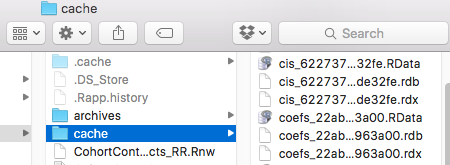
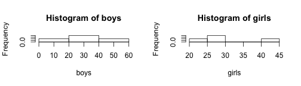
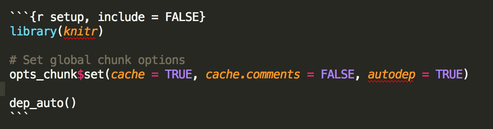
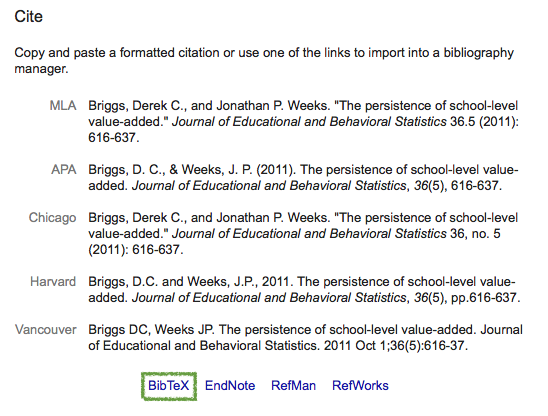
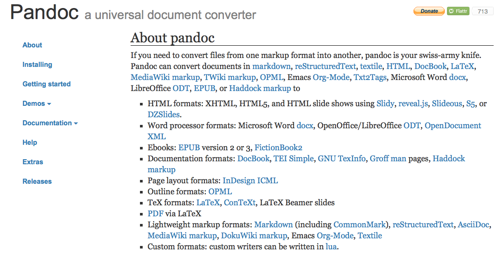

<style>
em {
  font-style: italic
}
</style>

<style>
strong {
  font-weight: bold;
}
</style>

## A Brief Intro to dynamic documents 

(focusing mostly on R Markdown)


---- &twocol
## What is R Markdown

*** =left
* Simple language for converting R code/output into other formats, most notably 
  HTML and PDF
* These slides were produced using a variant of Markdown


*** =right
<div align = "center">

</div>

----
## Why produce dynamic documents?
* Reproducible research principles
  - Increase transparency
* Can (eventually) be more efficient
* Simple for simple tasks (like homeworks)
    + Complexity increases as you ask more of it

Before we get too far...

---- .segue
# Reproducible research

----

## A couple caveats 
* Much of what I'm going to be discussing is largely *not* how I have
  interacted with research to this point. Instead, it represents an ideal that I have only recently begun working towards.
* None of what I will talk about should be taken as a referendum on you or
  your current practices. However, I hope to convince you that you should be working toward the reproducible research ideal, and that, as a field, we should be moving toward reproducible research being the *minimal standard*.
* I will be focusing on reproducible research with R. Other options are
  available but, in my view, none are as clear, comprehensive, and easy to implement as the tools at your disposal through R.

----
## What is reproducible research?
* **Replicability** is the gold standard for research. Ideally, most research
  would be verified through replication. 
* Reproducibility represents a minimal standard, which itself can aid
  replication (tremendously), by conducting and documenting the research sufficiently that **an independent researcher could reproduce all the results from a study**, provided the data were available

----
## Why should we care?
* Reproducibility as an ethical standard
  + More transparency
  + More potential for results to be verified (and errors found/corrected)
* If your work **is not** reproducible, it is usually not truly replicable.
* If your work **is** replicable, then others have a "recipe" for replication


----
## Are journal articles research? 
* Initially, we may think of journal articles as research, but really the
  research is everything that went into the article, not the article itself. 
* Some (Buckheit & Donoho, 2015) conceive of the article as the
  "advertisement".
* If all we have is the advertisement, can we really fully understand the
  steps and decisions made during the research?
    + In large-scale data analysis, the answer is generally "no".  

----
## Tangential benefits
Striving toward reproducible research will:
* Make your own code more efficient/easily interpretable
  + Can help with collaboration on a project
* Reduce errors
* Increase efficiency by not having to redo tables and figures with each tweak
  to a model.

----
## What does the process actually look like?
* Start with a basic text document (not Word, text)
* Use the text document to write your article
* Embed code within the text document that corresponds to your analysis. Note
  this is not just copying the code in. The code should be live and what you're working with while conducting your research.
* Render the document into a different format (pdf, html, etc.).
  + Select which code (if any) will be displayed
  + Build tables of results and plots to be produced
* Readers can then read the "advertisement", but if they are interested 
  in reproducing your results (maybe because they disagree with you, or they think your results are weird and want to clearly see all the steps you took), they can access the text file that contains the computer code.
* The end result is a single product that has the advertisement and the
  research process embedded.

----
## Other reasons dynamic documents are useful
Outside of reproducibility, you may want to use R Markdown to:
* Produce slides
    + Just be careful, I have a horror story
* Keep track of your analysis (notes, essentially), even if you end up using 
  something like Word
* Share code with others
* Quickly share results with others
* etc... ideas?

---- .segue
# On to the mechanics

----
## YAML Front Matter
Not explicitly necessary, but generally helpful

```
---
title: Example Markdown document
author: Daniel Anderson
date: "2015-09-17"
---
```


* Three dashes before and after the YAML fields
* Case sensitive
* Many other fields are possible.
  + For example, you may want to include an `output:` argument (`pdf_document`,
    `html_document`, `word_document`). Must be specified as it is rendered, if
    not supplied.

---- &twocol
## Headings and Lists

*** =left

```
# Level 1
## Level 2 
### Level 3 (etc.)
```

```
* Unordered list
  - inset
    + inset more
  - etc.

1. Ordered list
  a. blah blah
2. More stuff
```

*** =right


---- 
## Code chunks

Start a code chunk with \`\`\`{r chunkName, chunkOptions}, then produce some r code, then close the 
  chunk with three additional back ticks \`\`\`.


```r
a <- 3
b <- 5

a + b * (exp(a)/b)
```

```
## [1] 23.08554
```

----
## A few select chunk options


|Options |Arguments                |Default |Result                                     |
|:-------|:------------------------|:-------|:------------------------------------------|
|eval    |logical                  |TRUE    |Evaluate the code?                         |
|echo    |logical                  |TRUE    |Show the code?                             |
|results |markup, asis, hold, hide |markup  |Render the results                         |
|warning |logical                  |TRUE    |Print warnings?                            |
|error   |logical                  |TRUE    |Preserve errors? (if FALSE, quit)          |
|message |logical                  |TRUE    |Print any messages?                        |
|include |logical                  |TRUE    |Include any of the code or output or code? |
|tidy    |logical                  |FALSE   |Tidy code? (see formatR package)           |

----
# (and a few more)


|   |Options              |Arguments                 |Default |Result                                                                            |
|:--|:--------------------|:-------------------------|:-------|:---------------------------------------------------------------------------------|
|9  |cache                |logical, 0:3              |FALSE   |Cache code chunks?                                                                |
|10 |cache.comments       |logical                   |NULL    |Cache invalidated by comment changes?                                             |
|11 |dependson            |char, num                 |NULL    |Current chunk depend on prior cached chunks?                                      |
|12 |autodep              |logical                   |FALSE   |Should dependencies be determined automatically? (if TRUE, no need for dependson) |
|13 |fig.height/fig.width |numeric                   |7, 7    |Height and width of figure                                                        |
|14 |fig.show             |asis, hold, animate, hide |asis    |How the figure should be displayed                                                |
|15 |interval             |numeric                   |1       |Interval (speed) When fig.show = 'animate'                                        |

For complete documentation, see http://yihui.name/knitr/options/

--- &twocol
## echo and eval

*** =left

You can show code without evaluating it, using `eval = FALSE`. 

<div align = "left">

</div>


```r
a + b * (exp(a)/b)
```

*** =right

Alternatively, you can evaluate the code without displaying it, using `echo = 
  FALSE`.

<div align = "left">

</div>


---- &twocol
## warning


*** =left

# Warning = FALSE

```r
ggplot(msleep, 
  aes(sleep_rem, sleep_total)) + 
  geom_point()
```


Warning is printed to the console when rendering.

*** =right

# Warning = TRUE

```r
ggplot(msleep, 
  aes(sleep_rem, sleep_total)) + 
  geom_point()
```

```
## Warning: Removed 22 rows containing missing values (geom_point).
```


----
## Show errors

# Default


```r
ggplot(msleep, 
  aes(sleep, sleep_total)) + 
  geom_point()
```

```
## Don't know how to automatically pick scale for object of type data.frame. Defaulting to continuous.
```

```
## Error: Aesthetics must be either length 1 or the same as the data (83): x, y
```
<br>

If `error = FALSE`, the document won't render if it encounters an error.


----- &twocol
## Message
Some functions will return messages. You may want to suppress these.

*** =left

# message = FALSE

```r
ggplot(msleep,
  aes(sleep_total)) +
  geom_histogram()
```


*** =right

# message = TRUE

```r
ggplot(msleep,
  aes(sleep_total)) +
  geom_histogram()
```

```
## `stat_bin()` using `bins = 30`. Pick better value with `binwidth`.
```


---- &twocol
## tidy

*** =left

# Tidy = FALSE

```r
matRow<-matrix(c(10,11,12,13,20,21,22,23,
  30,31,32,33),nrow=3,ncol=4,byrow=TRUE)

matRow<-matrix(c(10,11,12,13,
                 20,21,22,23,
                 30,31,32,33),
nrow=3,ncol=4,byrow=TRUE)
```

*** =right

# Tidy = TRUE

```r
matRow <- matrix(c(10, 11, 12, 13, 20, 21, 22, 23, 30, 31, 32, 33), nrow = 3, 
    ncol = 4, byrow = TRUE)

matRow <- matrix(c(10, 11, 12, 13, 20, 21, 22, 23, 30, 31, 32, 33), nrow = 3, 
    ncol = 4, byrow = TRUE)
```
(It can only do so much, and sometimes ends up looking worse. Follow a style!)

----
## cache and dependencies
Somewhat complicated
* When chunks take a long time to process, it is usually a good idea to *cache*
  them.
    + Create temporary files with the results of the chunk
    + These files are then called when the document is rendered, and need not
      be re-run, provided **nothing in the chunk has changed**.
    + Often, chunks may depend on the results of previous chunks. These are
      *dependencies*. All dependencies must then be updated, if a chunk with dependencies is updated.
    + You can declare dependencies manually or automatically

----
## cache 


* Cache files are named according to your chunk names (why it's important to
  name your chunks)
* Note that some packages that use *knitr* (i.e., *slidify*, which was used to
  produce these slides), will cache for you automatically. And the slidify
  cache is in a hidden folder (which can be really annoying)

----
## Declaring dependencies manually

<div align = "left">

</div>


----

```r
boys <- c(25, 32, 11, 54)
girls <- c(30, 29, 22, 43)
mean(boys)
```

```
## [1] 30.5
```

```r
mean(girls)
```

```
## [1] 31
```
As can be seen, boys scored -0.5 points different than girls. Below is a histogram of each.


```r
par(mfrow = c(1,2))
hist(boys)
hist(girls)
```



----
## Setting global options
In other words, change the default behavior


```r
opts_chunk$set(options)
```

For example, you can setup all chunks to be cached, and for the dependencies to be automatically determined, with the following code:


```r
opts_chunk$set(cache = TRUE, autodep = TRUE)

dep_auto()
```

Note that `dep_auto()` is a function that must be run on its own (which finds the dependencies). 

----
In other cases you may wan to suppress all the code. For example, when preparing a report for somebody.


```r
opts_chunk$set(echo = FALSE)
```

You can always override the defaults (global options) within a particular chunk, e.g.

\`\`\`{r, chunkName, echo = TRUE}
<br>
<br>
\`\`\`


----
## include



The `include` argument is used to evaluate code that is not included in the
document at all. For example, when setting up your global options.

-----
## tables (very briefly)
* Packages that can produce tables for R markdown (in order from least to most
  flexible)
    + *knitr*
    + *pander* 
    + *xtable*

# Displaying tables
Change the `results` chunk option to "asis"

---- &twocol
## knitr::kable

For very simple tables, use `kable` from the *knitr* package


```r
id <- rep(1:3, each = 2)
condition <- rep(c("A", "B"), 3)
score <- rnorm(6, 10, 3)
data <- data.frame(id, condition, score)

library(knitr)
kable(data)
```


| id|condition |    score|
|--:|:---------|--------:|
|  1|A         | 8.941231|
|  1|B         | 9.424647|
|  2|A         | 9.292759|
|  2|B         | 9.558533|
|  3|A         | 6.450977|
|  3|B         | 8.117230|

----
## pander

* Great for producing summary tables.
    + Must specify `style = "rmarkdown"`
* Doesn't seem to work well with *slidify* (not sure why).
* Hopefully we'll have time to look at this a bit with the example.


```r
library(pander)
pander(lm(Sepal.Width ~ Species, data = iris), 
    covariate.labels = c("Versicolor" ,  "Virginica" ), 
    style = "rmarkdown")
```


|      &nbsp;       |  Estimate  |  Std. Error  |  t value  |  Pr(>|t|)  |
|:-----------------:|:----------:|:------------:|:---------:|:----------:|
|  **Versicolor**   |   -0.658   |   0.06794    |  -9.685   | 1.832e-17  |
|   **Virginica**   |   -0.454   |   0.06794    |  -6.683   | 4.539e-10  |
|  **(Intercept)**  |   3.428    |   0.04804    |   71.36   | 5.708e-116 |

Table: Fitting linear model: Sepal.Width ~ Species

----
## xtable

For `xtable`, you have to make sure you specify `results = "asis"`. 


If you're in a markup environment (what we've been talking about), you have to also make sure you specify `type = "html"`.


```r
library(xtable)
mat <- round(matrix(c(0.9, 0.89, 200, 0.045, 2.0), c(1, 5)), 4) 
rownames(mat) <- "$y_{t-1}$"
colnames(mat) <- c("$R^2$", "$\\bar{x}$", "F-stat", "S.E.E", "DW") 
mat <- xtable(mat)
print(mat, 
  sanitize.text.function = function(x) {x},
  type = "html")
```

<!-- html table generated in R 3.3.0 by xtable 1.8-2 package -->
<!-- Fri Jun 17 20:37:33 2016 -->
<table border=1>
<tr> <th>  </th> <th> $R^2$ </th> <th> $\bar{x}$ </th> <th> F-stat </th> <th> S.E.E </th> <th> DW </th>  </tr>
  <tr> <td align="right"> $y_{t-1}$ </td> <td align="right"> 0.90 </td> <td align="right"> 0.89 </td> <td align="right"> 200.00 </td> <td align="right"> 0.04 </td> <td align="right"> 2.00 </td> </tr>
   </table>

----
Same example, but without specifying `results = "asis"`


```r
print(mat, 
  sanitize.text.function = function(x) {x},
  type = "html")
```

```
## <!-- html table generated in R 3.3.0 by xtable 1.8-2 package -->
## <!-- Fri Jun 17 20:37:33 2016 -->
## <table border=1>
## <tr> <th>  </th> <th> $R^2$ </th> <th> $\bar{x}$ </th> <th> F-stat </th> <th> S.E.E </th> <th> DW </th>  </tr>
##   <tr> <td align="right"> $y_{t-1}$ </td> <td align="right"> 0.90 </td> <td align="right"> 0.89 </td> <td align="right"> 200.00 </td> <td align="right"> 0.04 </td> <td align="right"> 2.00 </td> </tr>
##    </table>
```

----
## Other options for results: `hold`


```r
m1 <- lm(mpg ~ ., data = mtcars)
coef(m1)
coef(summary(m1))[, "Std. Error"]
arm::display(m1)
```

```
## (Intercept)         cyl        disp          hp        drat          wt 
## 12.30337416 -0.11144048  0.01333524 -0.02148212  0.78711097 -3.71530393 
##        qsec          vs          am        gear        carb 
##  0.82104075  0.31776281  2.52022689  0.65541302 -0.19941925 
## (Intercept)         cyl        disp          hp        drat          wt 
## 18.71788443  1.04502336  0.01785750  0.02176858  1.63537307  1.89441430 
##        qsec          vs          am        gear        carb 
##  0.73084480  2.10450861  2.05665055  1.49325996  0.82875250 
## lm(formula = mpg ~ ., data = mtcars)
##             coef.est coef.se
## (Intercept) 12.30    18.72  
## cyl         -0.11     1.05  
## disp         0.01     0.02  
## hp          -0.02     0.02  
## drat         0.79     1.64  
## wt          -3.72     1.89  
## qsec         0.82     0.73  
## vs           0.32     2.10  
## am           2.52     2.06  
## gear         0.66     1.49  
## carb        -0.20     0.83  
## ---
## n = 32, k = 11
## residual sd = 2.65, R-Squared = 0.87
```

----
## Same chunk, no hold


```r
m1 <- lm(mpg ~ ., data = mtcars)
coef(m1)
```

```
## (Intercept)         cyl        disp          hp        drat          wt 
## 12.30337416 -0.11144048  0.01333524 -0.02148212  0.78711097 -3.71530393 
##        qsec          vs          am        gear        carb 
##  0.82104075  0.31776281  2.52022689  0.65541302 -0.19941925
```

```r
coef(summary(m1))[, "Std. Error"]
```

```
## (Intercept)         cyl        disp          hp        drat          wt 
## 18.71788443  1.04502336  0.01785750  0.02176858  1.63537307  1.89441430 
##        qsec          vs          am        gear        carb 
##  0.73084480  2.10450861  2.05665055  1.49325996  0.82875250
```

```r
arm::display(m1)
```

```
## lm(formula = mpg ~ ., data = mtcars)
##             coef.est coef.se
## (Intercept) 12.30    18.72  
## cyl         -0.11     1.05  
## disp         0.01     0.02  
## hp          -0.02     0.02  
## drat         0.79     1.64  
## wt          -3.72     1.89  
## qsec         0.82     0.73  
## vs           0.32     2.10  
## am           2.52     2.06  
## gear         0.66     1.49  
## carb        -0.20     0.83  
## ---
## n = 32, k = 11
## residual sd = 2.65, R-Squared = 0.87
```

----
## Hold figures

# `fig.show = "hold"` 

```r
x <- seq(-4, 4, 0.1)
plot(x, dnorm(x, 0, 1), type = "l", main = expression(sigma == 1))
plot(x, dnorm(x, 0, 3), type = "l", main = expression(sigma == 3))
```


-----
## Inline code

A single back tick followed by `r` prooduces inline code to be evaluated.

<div align = "center">

</div>
<br>

This is an example of inline code, where I want to refer to the sum of `a` and
  `b`, which is 8.

This is *extremely* useful in writing reports. Never have to update any numbers in text, regardless of changes to your models or data (if you are careful about it).

-----
## Citations (quickly)
To include references in your paper, you must:
* Create an external .bib file using LaTeX formatting (we'll get to this)
* Include `bibliography: nameOfYourBibFile.bib` in your YAML front matter.
* Refer to the citations in text using `@`

---- &twocol
## Creating a .bib doc

*** =left

> * 

*** =right
> * 
> * 

---- &twocol
## In text citations


|Citation Style                  |Output                                 |
|:-------------------------------|:--------------------------------------|
|@Briggs11                       |Briggs and Weeks (2011)                |
|[see @Baldwin2014; @Caruso2000] |(see Baldwin et al. 2014; Caruso 2000) |
|[@Linn02, p. 9]                 |(Linn and Haug 2002, 9)                |
|[-@Goldhaber08]                 |(2008)                                 |
<br>

Note this is not APA. However, references are included automatically at the end of the document. Include `# References` as the last line of your document to give it a title.

----
## References


----- &twocol
## Rendering the document

*** =left

Through a text editor (e.g., SublimeText)


```r
install.packages("rmarkdown")
library(rmarkdown)
setwd("dir/to/Rmd/doc")
render("ExampleRMarkdown.Rmd", 
  "html_document")
```

Note that the document type need not be specified if `output:` is supplied in 
  the YAML front matter. 

*** =right

Through RStudio


---- &twocol
## Final Product!

*** =left
<div align = "right">

</div>

*** =right
<div align = "left">

</div>

----
## A few complications

If you use *RStudio*, you should be able to render HTML output automatically
with the `knit2html` button.

However, if you use a text editor (like I do), then you'll need to also install
*pandoc* (http://pandoc.org).




---- &twocol
## PDF output

Regardless of whether you use RStudio or not, you will also need to install a TeX distribution.

*** =left
* Macs: MacTeX (http://tug.org/mactex/)


*** =right
* Windows: MikTeX (http://miktex.org)


----
## Summarizing
* R Markdown is relatively simple and easy to learn. 
* Tables are probably the most difficult piece.
* Lots of options to get it to do what you want.
* Great for sharing and documenting your work.

**but...**

* The more you ask from it, the more difficult it will become.
* At a certain point, you may need more flexibility.

---- &twocol
## Writing a paper in apa style
* Stick with R Markdown and try the *papaja* package (https://github.com/crsh/papaja)
    + I have little to no experience with it


```r
install.packages("devtools")
library(devtools)
install_github("crsh/papaja")
```
* Go with the more advanced *.RNW* format (versus *.Rmd*)
    + Essentially you build your paper with LaTeX, embedding code through the
      *knitr* package

---- &twocol
*** =left
<div align = "right">

</div>

*** =right
<div align = "left">

</div>


----
## Final remarks on R Markdown

* Make sure to look at the documentation
    + http://RMarkdown.rstudio.com
    + http://RMarkdown.rstudio.com/authoring_basics.html
    + http://RMarkdown.rstudio.com/authoring_rcodechunks.html

* The more you ask from it, the more complicated it becomes.

* Challenges
    + Word is the industry standard (frustratingly so, to me) 
        * Word output is less than ideal
    + Can be difficult when collaborating with others
    + Some journal articles *require* papers submitted in Word
        * Potentially get a pdf to word converter, but still less than ideal
    + Advanced features have a relatively steep learning curve

----
## Take home message
* It's a fairly big challenge to start to write *papers* using this method
* Fairly straightforward as a method to produce reports/keep track of your
  analysis
* Start small and work your way up; don't get discouraged too easily

I'm still actively learning this whole process. I recommend Yihui's book, it's quite good.

<br>

# Let's practice!
(if we have time)

