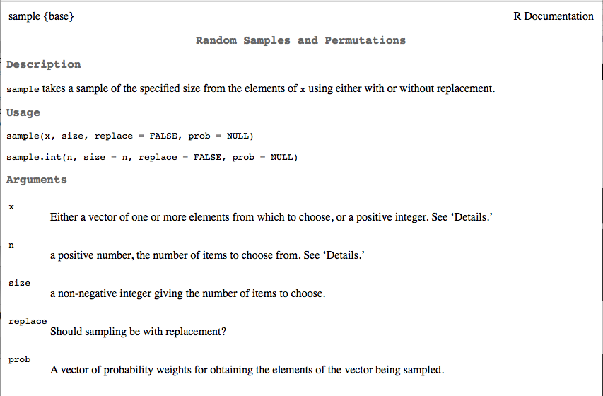

```{r setup, include = FALSE}
knitr::opts_knit$set(root.dir = "/Users/Daniel/Dropbox/Teaching/FSU_June16/")
```
## Agenda
* Overview of functions
* Function components
* Primitive functions
* Basics on writing functions
* Using functions with plotting
* Classes and methods (briefly)


----
## A reminder: The R learning curve

```{r, echo = FALSE}
curve(x^3, from = -50, to = 50, lty = 3, col = "cadetblue3", lwd = 3,
	axes = FALSE, xlab = "Time", ylab = "Learning", 
	main = "The R Learning Curve (as I see it)")
axis(1, at = seq(-50, 50, 10),  labels = seq(0, 100, 10))
axis(2, at = seq(-1e5, 1e5, 2e4),  labels = seq(0, 101, 10))
arrows(10, 2e4, 18, 1e4, col = "gray", length = 0.1)
text(-10, 22e3, "Where we are now", col = "gray", cex = 1.5)
points(19.2, 7500, pch = 21, col = "black", bg = "gray")
```

----
## Functions
Anything that carries out an operation in R is a function. For example

```{r}
3 + 5 + 7
```
Could also be written

```{r}
`+`(3, `+`(5, 7))
```
In other words, the `+` operator is itself a function that takes two arguments (both numeric), which it sums. The `+` operator is an example of an infix function, which we'll discuss more later today.

----
Similarly, the following are the same

```{r}
a <- 7
a
`<-`(a, 7)
a
```

----
## Functions are also objects

```{r}
a <- lm
data(mtcars)
summary( a(hp ~ drat + wt, data = mtcars) )
```

----
## Function components
# Functions have three components
* `body()`
* `formals()`


* `environment()`
	+ A bit more complicated: Deals with scoping, which we'll discuss next 
	  class

----
## Primitive functions
* The one exception to the rule of functions having 3 components, are
  primitive functions, which call C code directly to increase efficiency.

```{r}
names(methods:::.BasicFunsList) # 198 primitive functions total
```

---- &twocol
## Writing functions: A basic example

*** =left

```{r}
pol <- function(x, power) {
	z <- x^power
return(z)
}
```
This function takes two arguments: `x` and `power`, with `x` being a generic
  numeric vector (could be a scalar), and power being the power to which the number or vector will be raised (could also be a vector).

While the function appears (and is) simple, it is actually quite flexible.

```{r}
pol(x = 2, power = 3)
```

*** =right

```{r}
pol(c(3, 5, 7), 9)
pol(c(7, 1, -5, 8), c(2, 3))
pol(c(8, 5), c(3, 5))
pol(8, c(5, 3, 2))
```

---- &twocol
## Function components
You can extract the body, formals, or environment from a function, by using
  the corresponding function.

*** =left

```{r}
body(pol)
formals(pol)
```

*** =right

```{r}
environment(pol)
environment(lm)
formals(lm)
```

----
## Function components
Note that these calls will return `NULL` for primitive functions.

```{r}
formals(sum)
body(sum)
environment(sum)
```

----
## More on formals
Functions do not necessarily have to have formal arguments, but they must have a body.

```{r}

a <- 7; b <- 5

f <- function() {
	x <- 7 + a^2
return(x/b)
}

formals(f)
f()
```
Note: Scoping is important here.

----
## Another basic example

# Just for practice, let's create a new standard deviation function. 

<br>

$$\sigma = \sqrt{\frac{\Sigma(x_i - \bar{x})^2}{(n-1)}}$$

```{r}
stDev <- function(x) {	
	num <- sum( (x - mean(x))^2 )
	denom <- length(x) - 1

	std <- sqrt(num / denom)
return(std)
}
```

This function takes one formal argument, `x`, which must be a numeric vector. The body of the function is the equation, and the standard deviation is returned.

---- &twocol
## Does it work?
# Compare to the base function `sd()`

```{r}
data(mtcars)
sd(mtcars$mpg); stDev(mtcars$mpg)
sd(mtcars$drat); stDev(mtcars$drat)
```

----
## Your turn
The formula for calculating the mean is

$$\bar{x} = \frac{\Sigma x_i}{n}$$

* Write a function that calculates the sample mean, $\bar{x}$. Name the
  function `xbar`. The function must be written without using the base function `mean()`.
* Compare the results of your function with `mean()`. Do the results match?
* What are the formals and body of this function? Describe each.
* How could you modify the function to account for missing data? (we haven't 
  talked about this yet, so don't worry if you are having trouble with it)

---- &twocol
* Write a function that calculates the sample mean, $\bar{x}$. Name the
  function `xbar`. The function must be written without using the base function `mean()`.

```{r}
xbar <- function(x) {
	myMean <- sum(x)/length(x)
return(myMean)
}
```

* Compare the results of your function with `mean()`. Do the results match?

*** =left

```{r}
xbar(mtcars$mpg); mean(mtcars$mpg)
```

*** =right

```{r}
xbar(mtcars$drat); mean(mtcars$drat)
```

----
* What are the formals and body of this function?

Formals = `x`: a generic numeric vector

<br>

Body = `myMean <- sum(x)/length(x)`, sums the generic numeric vector and
  divides the result by the number of elements in the vector.

---- &twocol

* How could you modify the function to account for missing data?

*** =left

There are a few different options here. First, you could modify the function
  so it automatically calculates the mean from only the observed data.

```{r}
xbar2 <- function(x) {
	y <- na.omit(x)
	myMean <- sum(y)/length(y)
return(myMean)
}
```
To test this, we could set some values to missing and then run the function.

```{r}
v <- mtcars$mpg

# Randomly set 10 values to missing
set.seed(101) # Seed for replicability
v[sample(v, 10)] <- NA
```

*** =right

```{r}
v
mean(v, na.rm = TRUE)
xbar2(v)
```

---- &twocol
# Alternatively, add a condition, and make missing data a formal argument

```{r}
xbar3 <- function(x, miss = FALSE) {
	if(miss == FALSE) {
		myMean <- sum(x)/length(x)
	}
	else {
		y <- na.omit(x)
		myMean <- sum(y)/length(y)
	}
return(myMean)
}
```
This function has two formal arguments, `x`, and `miss`. Notice that `miss`
  defaults to `FALSE`. This means the argument does not have to be explicitly called in the function, but it can still handle missing data, if they are present.

*** =left

```{r}
xbar3(mtcars$mpg)
```

*** =right

```{r}
xbar3(v, miss = TRUE)
```

---- &twocol
Because `else {}` was used, rather than `if() {}`, any argument other than 
  `FALSE` supplied to `miss` will result in that portion of the function being evaluated.

```{r}
xbar3(v, 3)
```

You may, or may not, want this type of behavior. If not, just use multiple 
  `if() {}` statements.

*** =left

```{r}
xbar3 <- function(x, miss = FALSE) {
	if(miss == FALSE) {
		myMean <- sum(x)/length(x)
	}
	if(miss == TRUE) {
		y <- na.omit(x)
		myMean <- sum(y)/length(y)
	}
return(myMean)
}
```

*** =right

```{r}
xbar3(v, 3)
```

---- &twocol
## More on `return()`
The `return()` function does not necessarily need to be used within functions (although it can make it a little more clear). If `return()` is not used, the function will output the final expression from the function. For example, the following two functions are equivalent.

*** =left

```{r}
pol <- function(x, power) {
	z <- x^power
return(z)
}
```
```{r}
pol(3, 4)
```


*** =right

```{r}
pol2 <- function(x, power) {
	x^power
}
```
```{r}
pol2(3, 4)
```

----
## Even more compact
If the entire function only takes one line of code, you can eliminate the brackets.

```{r}
pol <- function(x, power) x^power
```
```{r}
pol(3,4)
```


----
## Another simple example
Often it's useful to know the location of variables quickly. Let's write a function that provides us with an output of all the variable names in a dataset, and their location, with a clean and convenient output.

> * What would the formal arguments be here?
> * We should only need one formal argument, the data set.

----
## Doing it without a function to start

```{r loadLongley}
d <- read.csv("./data/longley.csv")
head(d)
```

----
```{r varNames}
varNames <- names(d)
head(varNames)
length(varNames)
```

----
```{r writFun2}
cbind(1:length(varNames), varNames)
```

----
## Wrapping it in a function

```{r, writFun3}
nms <- function(d) {
  varNames <- names(d)
return(cbind(1:length(varNames), varNames))
}
data(sleepstudy, package = "lme4")
nms(sleepstudy)
```

----
## Even simpler (and better)

```{r nmsFunDF}
nms <- function(d) {
	data.frame("VariableName" = names(d))
}
nms(sleepstudy)
```

----
## Simulating dice rolls with the `sample()` function

```{r, eval = FALSE}
?sample
# x = numbers of the die
# size = number of dice
# replace = can a number be sampled more than once?
```


----
## Roll two dice with six sides

```{r}
sample(x = 1:6, size = 2, replace = TRUE)
```

----
## Replicate the roll 100 times

```{r}
replicate(100, sample(x = 1:6, size = 2, replace = TRUE))
```

----
## Transpose the output for nicer output

```{r}
t(replicate(100, sample(x = 1:6, size = 2, replace = TRUE)))
```

----
## Wrap it in a function

# What should the formals be?
```{r, eval = FALSE}
t(replicate(100, sample(x = 1:6, size = 2, replace = TRUE)))
```

----
## `dice()` function

```{r}
dice <- function(nsides, nrolls, ndice) {
	experiment <- t(replicate(nrolls, sample(1:nsides, ndice, replace = TRUE)))

return(experiment)
}
```

Test it out

```{r}
rolls <- dice(4, 1e5, 3)
rolls
```

---- &twocol
## Embedding Messages, Returning Errors
Note that this is not close to the most important part of learning to write 
  functions, but it can be helpful in de-bugging (especially when you start writing functions that call functions). It is also imperitive when you start writing packages, where other people are using your functions. You need to give the user some breadcrumbs so they understand why the function is not working.

# Warning messages
Let's modify `xbar2` to report a warning if missing data are removed.

*** =left 

```{r}
xbar2 <- function(x) {
	y <- na.omit(x)
	
	if(length(y) != length(x)) {
		warning("Missing data removed")
	}

	myMean <- sum(y)/length(y)
return(myMean)
}
```

*** =right 

```{r}
xbar2(v)
```

---- &twocol
## Error Messages

Lets modify the original `xbar` function to report an error, rather than `NA`,
  if missing data are present.

*** =left

```{r}
xbar <- function(x) {
	if(any(is.na(x))) {
		stop("Missing data present")
	}
	myMean <- sum(x)/length(x)
return(myMean)
}
```

*** =right

```{r}
xbar(v)
xbar(na.omit(v))
```

---- &twocol
## Using Functions in Plotting

One of the best ways to get started with functions is by using them to plot
  more efficiently. For, example, let's write a function that produces a bivariate scatterplot with the regression line superimposed.

*** =left

```{r}
regPlot <- function(x, y, ...) {
	plot(x, y, ...)
	mod <- lm(y ~ x)
	abline(coef(mod)[1], coef(mod)[2], 
		col = "blue", lwd = 2, lty = 3)
}
```
Now we can feed the function any two vectors and have the regression plot
  produced automatically. For example, let's explore the relation between car weight and horsepower.

*** =right

```{r, fig.height = 5.5}
regPlot(mtcars$wt, mtcars$hp)
```

--- &twocol
## Digging a bit deeper
```{r}
regPlot <- function(x, y, ...) {
	plot(x, y, ...)
	mod <- lm(y ~ x)
	abline(coef(mod)[1], coef(mod)[2], 
		col = "blue", lwd = 2, lty = 3)
}
```
Note the use of `...`, which is a convention used to pass additional arguments into the function. For example, here, `regPlot` only has three formal arguments, but any of the `plot` arguments can be called through `...` 

*** =left

```{r, eval = FALSE}
regPlot(mtcars$wt, mtcars$hp,
	xlim = c(0,7),
	ylim = c(0,350),
	xlab = "Weight",
	ylab = "Horsepower",
	main = "Regression Plot"
	)
```

*** =right

```{r, echo = FALSE, fig.height = 3.5}
regPlot(mtcars$wt, mtcars$hp,
	xlim = c(0,7),
	ylim = c(0,350),
	xlab = "Weight",
	ylab = "Horsepower",
	main = "Regression Plot"
	)
```

----
## Extending the example
# LSAT theta data

```{r}
d <- read.csv("./data/LSAT_theta.csv")
head(d)
```
We will compute the raw score for each student, and compare the difference
  between students' raw score and theta estimates from a two-parameter logistic item response theory model. In this dataset, theta values are stored in the column labeled `z1`.

----
## Calculate raw scores

```{r}
d$raw <- rowSums(d[ ,1:5])
head(d)
```

----
## Basic relation

```{r}
regPlot(d$raw, d$z1)
```

---- .segue
# Classes and Methods

----
## Classes and Methods

* **Class**: Identifies characteristics about the object
* **Methods**: Define how a function operates

In other words, a generic function, like `plot()` will change in behavior depending on the specific class of object fed to it (i.e., the methods will change).

----
## Objects 
* Every object has a *class* and a *method*. This is generally true of all 
  object-oriented (OO) programming, and not specific to R.
* R has 3 systems, which differ in the way classes and methods are
  implemented: S3, S4, and Reference Classes (RC).
* S3 is the is simplest and most widely used OO system. This is where we will
  focus most of our attention.


---- &twocol
## Classes

*** =left

* Use `class()` to determine the class

```{r}
d <- read.csv("./data/longley.csv")
mod <- lm(Employed ~ Population, 
			data = d)
class(mod)
print(mod)
```

*** =right

* Redefine the class

```{r}
class(mod) <- "data.frame"
print(mod)
```

* The `print()` function now tries to use the `data.frame` method for the
  generic `print()` function, rather than the `lm` method for `print()`.

----
However, note that the data are still there (the generic function calls are
  just using the `data.frame` class, rather than the `lm` class).

```{r}
mod$coefficients
```

----
## Defining class for the `dice()` function

```{r}
dice <- function(nsides, nrolls, ndice) {
	experiment <- t(replicate(nrolls, sample(1:nsides, ndice, replace = TRUE)))

return(structure(experiment, class = "dice"))
}

rolls <- dice(4, 1e5, 3)
class(rolls)
```

----
## Defining methods
Now, because we have a class, we can define a method. Let's define a generic
  plot function for objects of class "dice"

```{r}
plot.dice <- function(x) {
	tot <- rowSums(x)
	
	par(mfrow = c(2, 1), 
		oma = c(5, 4, 1, 0), # outer margins
		mar = c(0, 0, 1, 1)) # margins for each plot
	hist(tot, 
		main = "Histogram of Sum of Simulated Dice Rolls", 
		xlab = "Sum of each roll")
			abline(v = mean(tot), col = "red", lwd = 3)
			abline(v = mean(tot) - sd(tot), col = "gray", lwd = 2, lty = 2)
			abline(v = mean(tot) + sd(tot), col = "gray", lwd = 2, lty = 2)
	boxplot(tot, horizontal = TRUE, frame = FALSE)
}
```

----
```{r}
plot(rolls)
```

----
## Another quick example (one I've actually written)

Generic function that produces a regression plot w/Standard error.
* Formals: `x`, `y` **OR** an object of class *lm* (i.e., the results of a linear model)

# Define generic function
```{r classMeth1}
regPlot <- function(x, y, lcol = "blue", 
        se = TRUE, secol = c(0, 0, 0.5, 0.2), ...) UseMethod("regPlot")
```

----
# Define default method

```{r classMeth2}
regPlot.default <- function(x, y, lcol = "blue", 
        se = TRUE, secol = c(0, 0, 0.5, 0.2), ...) {

  mod <- lm(y ~ x)
  nd <- data.frame(x = c(min(x, na.rm = TRUE) - sd(x, na.rm = TRUE),
               unique(x),
               max(x, na.rm = TRUE) + sd(x, na.rm = TRUE)))
  
  pred <- predict(mod, 
    newdata = nd, 
    se.fit = TRUE)
  
  plot(x, y, ...)
  abline(mod, col = lcol, lwd = 2)
  
  if(se == TRUE) {
    polygon(c(nd$x, rev(nd$x)), 
      c(pred$fit - (1.96 * pred$se.fit), 
        rev(pred$fit + (1.96 * pred$se.fit))),
    col = rgb(secol[1], secol[2], secol[3], secol[4]), border = NA)
  }
}
```

-----
# Define method for class `lm`

```{r classMeth3}
regPlot.lm <- function(mod, lcol = "blue", 
        se = TRUE, secol = c(0, 0, 0.5, 0.2), ...) {
  x <- mod$model[[2]]
  y <- mod$model[[1]]

  nd <- data.frame(x = c(min(x, na.rm = TRUE) - sd(x, na.rm = TRUE),
              unique(x),
              max(x, na.rm = TRUE) + sd(x, na.rm = TRUE)))
  names(nd) <- names(mod$model)[2]

  pred <- predict(mod, 
    newdata = nd, 
    se.fit = TRUE) 
  plot(x, y, ...)
  lines(nd[[1]], pred$fit, col = lcol)
  
  if(se == TRUE) {
    polygon(c(nd[[1]], rev(nd[[1]])), 
      c(pred$fit - (1.96 * pred$se.fit), 
        rev(pred$fit + (1.96 * pred$se.fit))),
    col = rgb(secol[1], secol[2], secol[3], secol[4]), border = NA)
  }
}
```

----
# Test it out: Default method

```{r classMeth4, fig.width = 13}
data(sleepstudy, package = "lme4")
regPlot(sleepstudy$Days, sleepstudy$Reaction)
```

---- &twocol
# Test it out: `lm` method

*** =left

```{r, classMeth5a, eval = FALSE}
test <- lm(Reaction ~ Days + 
            I(Days^2) + I(Days^3) + 
            I(Days^4), 
          data = sleepstudy)

regPlot(test, 
  xlab = "Days",
  ylab = "Reaction Time",
  main = "Overfit model")
```

*** =right

```{r, classMeth5b, echo = FALSE}
test <- lm(Reaction ~ Days + 
            I(Days^2) + I(Days^3) + 
            I(Days^4), 
          data = sleepstudy)

regPlot(test, 
  xlab = "Days",
  ylab = "Reaction Time",
  main = "Overfit model")
```

----
# Limitations 
* `poly()` function can't be used within the lm.
* Only linear relations are shown when two variables are fed to the function
* x and y shown on x and y axes. May want to make it default to the variable
  names.

<span style="color:blue" > 
We could fix these issues!
</span>

-----
## Time to practice?
This one is a bit tricky

* Write a function, `catMean`, that takes a generic numeric vector, `x`, and a
  binary vector, `bin`, and reports the mean of the numeric vector for each of the two categories. Use your `xbar` function you wrote previously to calculate the means.
* The two vectors must be of the same length. Embed an error message if this
  is not the case.
* Run your code with the `mtcars` data, calculating the mean of `mpg` by `vs`,
  and the mean of `disp` by `am`. Then run the following two lines of code to see if the results match: 

```{r, eval = FALSE}
tapply(mtcars$mpg, mtcars$vs, mean)
tapply(mtcars$disp, mtcars$am, mean)
```

* For extra participation credit, make the names of the return meaningful.
  Test this out by calculating the means of a factor.


---- &twocol
Lots of different ways this could be done. This is just one.

```{r}
catMean <- function(x, bin) {
	if(length(x) != length(bin)) {
		stop("Vectors are of different lengths")
	}

	l <- split(x, bin)
	means <- c(xbar(l[[1]]), xbar(l[[2]]))
	names(means) <- names(l)
return(means)
}
```

*** =left

```{r}
catMean(mtcars$mpg, mtcars$vs)
tapply(mtcars$mpg, mtcars$vs, mean)
```

*** =right

```{r}
catMean(mtcars$disp, mtcars$am)
tapply(mtcars$disp, mtcars$am, mean)
```

----
# Checking on error message

```{r}
catMean(mtcars$disp, rep(c(0,1), 100))
```

----
# Checking on `names` of returned vector

```{r}
fact <- as.factor(rep(
					c(rep("red", 3), "blue"), 
				  length.out = nrow(mtcars))
			)
catMean(mtcars$mpg, fact)
tapply(mtcars$mpg, fact, mean)
```


