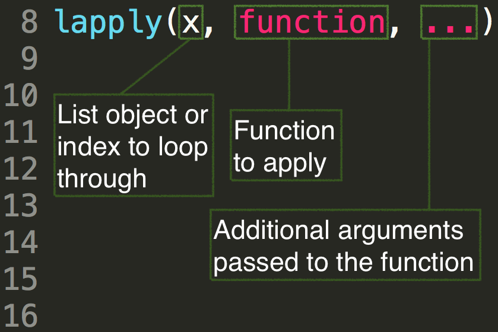
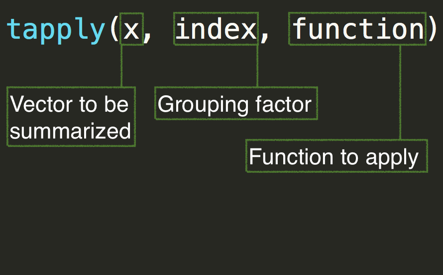
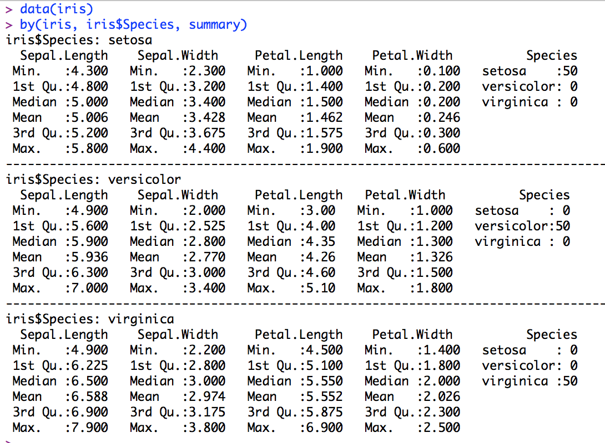
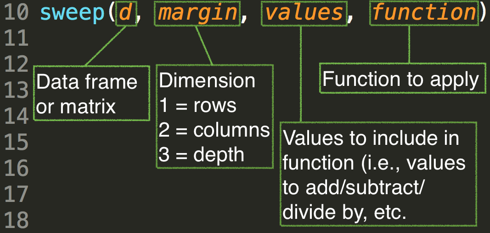

```{r setup, include = FALSE}
knitr::opts_knit$set(root.dir = "/Users/Daniel/Dropbox/Teaching/CourseR/")
```
<style>
em {
  font-style: italic
}
</style>

<style>
strong {
  font-weight: bold;
}
</style>

## Agenda 
* For loops 
* Apply family of loops
    + `apply()`
      - Also `rowSums()` and `colSums()`
    + `lapply()`
    + `sapply()`
    + `mapply()`
    + `tapply()`
      - Also `rowsum()`

---- &twocol
## Basic overview: for loops

*** =left
<div align = "left">

</div>

*** =right

```{r}
a <- letters[1:26]
a
for(i in 1:5){
	print(a[i])
}
```

----
## Another basic example

Simulate tossing a coin, record results

```{r}
b <- rep(NA, 10)
b
for(i in seq_along(b)) {
	b[i] <- sample(c("Heads", "Tails"), 1)
}
b
```

---- &twocol
## Basic example of nested for loops

*** =left

```{r}
m <- matrix(101:112, ncol = 3)
m
```

*** =right

```{r}
for(i in 1:3) {
	for(j in 1:4) {
		print(m[j, i])
	}
}
```

----
## Batch processing with for loops
# Look at the HSB_pieces folder, within the data folder.


---- &twocol
## Load all files

```{r}
# List all files in directory
files <- list.files("./data/HSB_pieces/")
files

# Create empty list
l <- vector("list", length(files))
l
```

----
## For loop to batch read files

```{r}
for(i in seq_along(files)) {
	l[[i]] <- read.csv(paste0("./data/HSB_pieces/", files[i]))
}

# Name elements of the list according to the file name
names(l) <- substr(files, 1, nchar(files) - 4)
```

----
## Inspect the structure of the list

```{r}
str(l)
```

----
## Create a new variable
For each data frame, we're going to create a new variable that is a
  standardized version of `mathach`. Note that this variable will be standardized relative to the specific group.

```{r}
# First, write a z-score function
standardize <- function(x) (x - mean(x, na.rm = TRUE)) / (sd(x, na.rm = TRUE))

# Next, loop through the list to create each new variable
for(i in seq_along(l)) {
	l[[i]]$math_z <- standardize(l[[i]]$mathach)
}
head(l[[1]])
```

----
```{r}
str(l)
```

----
## Matrix creation

```{r}
set.seed(100)
m <- matrix(rnorm(n = 12, mean = 100, sd = 10), ncol = 3)
m
```

----
## For loops to calculate column means

```{r}
colMeans <- rep(NA, ncol(m))
for(i in 1:ncol(m)) {
	colMeans[i] <- mean(m[ ,i])
}
colMeans
```

----
## Store rows in list

```{r}
rows <- vector("list", 4)
for(i in 1:4) {
	rows[[i]] <- m[i, ]
}
rows
```

---- &twocol
## A few things to note
* For loops require you initialize objects

*** =left

```{r}
a <- rep(NA, 100)
for(i in 1:100) {
	a[i] <- rnorm(1, mean = 0, sd = i)
}
a
```

*** =right

```{r}
for(i in 1:100) {
	f[i] <- rnorm(1, mean = 0, sd = i)
}
```

---- &twocol
## No printing by default

*** =left

```{r}
for(i in seq(0, 500, length.out = 40)) {
	rnorm(100, 0, i)
}
```

What sort of object would you need to create to most efficiently store the
  results of this `for` loop?

*** =right

```{r}
for(i in seq(0, 500, length.out = 40)) {
	print( round( rnorm(100, 0, i), 2) )
}
```

----
## Storing random variables
# A bit of a convoluted nested for loop

```{r}
m <- matrix(rep(NA, 40*100), ncol = 100)

for(i in 1:40) {
	for(j in seq(0, 500, length.out = 40)[i]) {
		m[i, ] <- rnorm(100, 0, j)
	}
}
head(m)
```

---- &twocol
## Use the results for plotting

*** =left

```{r, eval = FALSE}
plot(-100:100, 
	seq(0, 0.02, 
		length.out = length(-100:100)), 
	type = "n",
	xlab = "Simulated value",
	ylab = "Density",
	main = "100 Random Normal 
	Draws w/Same Mean and Varying SDs")
for(i in 2:nrow(m)) {
	lines(density(m[i, ]), col = "gray")	
}
```

*** =right

```{r, echo = FALSE}
plot(-100:100, 
	seq(0, 0.02, 
		length.out = length(-100:100) ), 
	type = "n",
	xlab = "Simulated value",
	ylab = "Density",
	main = "100 Random Normal Draws w/Same Mean and Varying SDs")
for(i in 2:nrow(m)) {
	lines(density(m[i, ]), col = "gray")	
}
```

---- &twocol
## A few more plotting examples
# Display likelihood of data, given a distribution: Half-Cauchy

*** =left

```{r, eval = FALSE}
data <- seq(0, 10, .1)
plot(x = data, 
	y = seq(0, 0.6, 
		length.out = length(data)), 
	type = "n",
	ylab = "Density",
	main = "Half-Cauchy Distribtuion")
for(i in seq(0.5, 10, by = 0.5)) {
	lines(x = data, 
		y = dcauchy(data, 0, i), 
		col = "gray")
}
```

*** =right

```{r, echo = FALSE}
data <- seq(0, 10, .1)
plot(x = data, 
	y = seq(0, 0.6, 
		length.out = length(data)), 
	type = "n",
	ylab = "Density",
	main = "Half-Cauchy Distribtuion")
for(i in seq(0.5, 10, by = 0.5)) {
	lines(x = data, 
		y = dcauchy(data, 0, i), 
		col = "gray")
}
```

---- &twocol
## Student's $t$

*** =left

```{r, eval = FALSE}
data2 <- seq(-5, 5, length.out = 100)
plot(x = data2, 
	y = seq(0, 0.4, 
		length.out = length(data2)), 
	type = "n",
	ylab = "Density", 
	main = "Standard Normal vs 
		t-Distribution")

for(i in 1:20) {
	lines(x = data2, 
		y = dt(data2, i), 
		col = i)
}

lines(x = data2, y = dnorm(data2, 0, 1), 
	lwd = 3, lty = 2)
```

*** =right

```{r, echo = FALSE}
data2 <- seq(-5, 5, length.out = 100)
plot(x = data2, 
	y = seq(0, 0.4, 
		length.out = length(data2)), 
	type = "n",
	ylab = "Density", 
	main = "Standard Normal vs t-Distribution")
for(i in 1:20) {
	lines(x = data2, y = dt(data2, i), col = i)
}
lines(x = data2, y = dnorm(data2, 0, 1), 
	lwd = 3, lty = 2)
```

----
## One last for loop example
* Load the beer data, fit a regression within each brewer between style and
  overall score. 
* Plot all the regression lines on one plot to get a sense of the intercept
  and slope variability.

```{r}
beer <- read.delim("./data/ratebeer_beerjobber.txt")
head(beer)
```

----
## Fitting a regression model within each brewery

* First, remove cases with missing data on `score.overall` or 
  `score.by.style`. 

```{r}
beer <- beer[!is.na(beer$score.overall) & !is.na(beer$score.by.style), ]
head(beer)
```

----

* Second, subset the data to only breweries with at least 3 beers (this is a
  really convoluted way of doing it, but works with the topics we've discussed so far. `tapply` would be a much better approach, which we'll talk about shortly).

```{r}
splitd <- split(beer, as.character(beer$brewer)) # overide factor

nBeers <- data.frame(brewer = unique(beer$brewer), 
					 nBeers = rep(NA, length(unique(beer$brewer))))

for(i in seq_along(splitd)) {
	nBeers$nBeers[i] <- nrow(splitd[[i]])
}
beer <- merge(beer, nBeers, by = "brewer", all = TRUE)
head(beer)
```

----
## Finally, subset the data and fit each regression model

```{r}
beer <- subset(beer, nBeers > 2)

regList <- vector("list", length(unique(beer$brewer)))
coefs <- vector("list", length(regList))

for(i in seq_along(regList)) {
	regList[[i]] <- lm(score.overall ~ score.by.style, 
		data = beer, 
		subset = beer$brewer == unique(beer$brewer)[i])
	
	coefs[[i]] <- coef(regList[[i]])
}
```

----
## Now plot all the regression lines

```{r, eval = FALSE}
plot(beer$score.by.style, beer$score.overall, 
	type = "n", 
	xlab = "Style Score", 
	ylab = "Overall Score", 
	main = "Variability in Style and Overall Scores by Brewery")

for(i in seq_along(coefs)) {
	abline(a = coefs[[i]][1], b = coefs[[i]][2], 
		col = i)
}
for(i in 1:nrow(beer)) {
	points(beer$score.by.style[i], beer$score.overall[i],
		pch = 21, 
		col = as.numeric(beer$brewer)[i],
		bg = as.numeric(beer$brewer)[i])
}
```

----


```{r, echo = FALSE, fig.height = 9, fig.width = 9}
plot(beer$score.by.style, beer$score.overall, 
	type = "n", 
	xlab = "Style Score", 
	ylab = "Overall Score", 
	main = "Variability in Style and Overall Scores by Brewery")

for(i in seq_along(coefs)) {
	abline(a = coefs[[i]][1], b = coefs[[i]][2], 
		col = i)
}
for(i in 1:nrow(beer)) {
	points(beer$score.by.style[i], beer$score.overall[i],
		pch = 21, 
		col = as.numeric(beer$brewer)[i],
		bg = as.numeric(beer$brewer)[i])
}
```

----
## Summary on for loops
* Very general
* Some say they are slower 
    * (They're wrong, see https://kbroman.wordpress.com/2013/04/02/apply-vs-for/)
* Pretty intuitive
* Have limitation (initializing objects, etc.)
* Lots of other kinds of loops (outside of the apply family, which we'll talk
  about next) exist outside of for loops (e.g., while, repeat)


---- .segue
# apply family of loops


----
## Some basic background
* The apply family of loops are exceptionally useful, and can often speed up
  your code.
* Advantages over for loops include
	+ No need for initialization of objects
	+ Automatic indexing of an object (if you want)
	+ Simplification of results (can be a massive benefit)

----
## apply
Each of the members of the apply family function a little bit differently. The `apply()` function is probably the most straight forward.

<div align = "center">

</div>

----
## Examples of `apply()`

```{r}
m <- matrix(1:12, ncol = 4)
m
```

```{r}
# Mean of each row
apply(m, 1, mean)

# Mean of each column
apply(m, 2, mean)
```

----
## A few more examples: LSAT data

```{r}
lsat <- read.csv("./data/LSAT_theta.csv")
head(lsat)
```

----
## Calculate raw scores

```{r}
lsat$raw <- apply(lsat[ ,1:5], 1, sum) # Only item-level data
head(lsat)
table(lsat$raw)
```

----
## Calculate p values

```{r}
apply(lsat[ ,1:5], 2, mean, na.rm = TRUE)
```
Notice that additional arguments to the function (in this case `mean`) just
  get passed as additional arguments to `apply()`.

----
## One more example

```{r}
att <- read.delim("./data/attitude.txt")
head(att)
```

----
## Center all but *learning* (which we'll say is our outcome)

```{r}
center <- function(x) x - mean(x, na.rm = TRUE) # write the centering function
att2 <- att # copy dataset
att2[ ,-4] <- apply(att[ ,-4], 2, center) # apply the function to all but the 4th column
head(att2)
```

----
## Check that centering worked

```{r}
round( apply(att2, 2, mean, na.rm = TRUE), 2)
```

---- 
## Summing rows 

The following are equivalent

```{r}
apply(att, 1, sum)
rowSums(att)
```
However, `rowSums` is optimized for speed (but it often doesn't have a huge
  practical impact)

----
## Summing columns

The same rules apply for summing collumns. The following are equivalent

```{r}
apply(att, 2, sum) 
colSums(att)
```

but `colSums` is, again, optimized for speed

----
## Column and row means

No examples, but just a note that `colMeans()` and `rowMeans()` are equivalent
  optimized versions of `apply()` for computing the mean of a column or row.

----
## lapply and sapply
* `lapply()` allows you to apply a function to a **l**ist. You can also use it
   similarly to a `for` loop. In both cases, `lapply()` will return a **l**ist.
* `sapply()` does the same thing as `lapply()`, but simplifies the result if it
  can, into a vector, matrix, or array.

----
## Basic structure of an lapply loop


----
## Batch loading
# Alternative to for loop

```{r}
files <- list.files("./data/HSB_pieces/")
l <- lapply(seq_along(files), function(i) {
  read.csv(paste0("./data/HSB_pieces/", files[i]))
})
names(l) <- substr(files, 1, nchar(files) - 4)
str(l)
```

----
## Create group-standardized mathach variable

```{r}
standardize <- function(x) (x - mean(x, na.rm = TRUE)) / (sd(x, na.rm = TRUE))
l <- lapply(l, function(x) {
  x$mathach_z <- standardize(x$mathach)
  return(x) # This part is important if you want the full data frame returned
})
str(l)
```

----
## Example without return

```{r}
standardized <- lapply(l, function(x) standardize(x$mathach))
str(standardized)
```

----
## Revisiting the convoluted random matrix from earlier

```{r}
m <- matrix(rep(NA, 40*100), ncol = 100)

for(i in 1:40) {
  for(j in seq(0, 500, length.out = 40)[i]) {
    m[i, ] <- rnorm(100, 0, j)
  }
}
head(m)
```

----
## Creating the same matrix with lapply

```{r}
norm <- lapply(seq(0, 500, length.out = 40), function(i) rnorm(100, 0, i))
str(norm)
```

----
```{r}
m <- matrix(unlist(norm), ncol = 100, byrow = TRUE)
head(m)
```

----
## Even better, use sapply

```{r}
m <- sapply(seq(0, 500, length.out = 40), function(i) rnorm(100, 0, i))
head(m) 
```

----
Note that by default, sapply returned the transpose of the matrix we were
 going for before. That's really not a problem, now each column represent 100 draws from the corresponding random normal distribution rather than rows. We can easily verify this.

```{r}
nrow(m)
ncol(m)
```
<br>
Of course, we can also easily get the matrix back by just transposing it.

```{r}
m <- t(m)
head(m)
```

----
## Contrasting lapply and sapply

```{r}
sapply(l, function(x) cor(x$ses, x$mathach_z, use = "complete.obs"))
```

```{r}
lapply(l, function(x) cor(x$ses, x$mathach_z, use = "complete.obs"))
```

----
## Summary on lapply/sapply
Major benefits over for loops include:
* No need to initialize objects
* Names from the list are maintained
* Overall, can substantially reduce the amount of code you may need to write,
  and can therefore also make your code more clear.

----
## Multivariate apply

Consider the following

```{r}
list(rnorm(1, 1, 5), 
     rnorm(2, 2, 4), 
     rnorm(3, 3, 3), 
     rnorm(4, 4, 2), 
     rnorm(5, 5, 1))
```
----
## Alternatively: mapply

```{r}
mapply(rnorm, 1:5, 1:5, 5:1)
```

----
## An example from my *r2Winsteps* package

$$
p = \frac{e^{\theta - \delta}}{1 + e^{\theta - \delta}}
$$

```{r r2WinstepsEx}

prob <- function(delta) exp(theta - delta) / (1 + exp(theta - delta))
# p <- mapply(prob, sfile$delta)
dvec <- c(-0.8, 0.8)

theta <- seq(-4, 4, 0.1)
mapply(prob, dvec)
```


----
## What's this used for?
Plotting

```{r r2WinstepsPlotting, fig.height = 5, fig.width = 11}
library(r2Winsteps)
data(science)
pars <- runWinsteps(science[ ,1:25], science[ ,26:29])
plot(pars)
```

----
## ICCs
(basically because I can't help myself)

```{r r2WinstepsPlot2}
plot(pars, type = "ICCs", colors = colorRamps::rgb.tables(25), lwd = 2)
```

---- .segue
# Summaries by grouping variables

----
## Applying function by group

The `tapply()` function is useful for applying any generic function to each
  level of a grouping factor




----
## Load the beer data
```{r}
beer <- read.delim("./data/ratebeer_beerjobber.txt") # Load beer data
head(beer)
```

----
## Mean overall score by brewer

```{r}
tapply(beer$score.overall, beer$brewer, mean, na.rm = TRUE)
```

----
## Number of beers rated by brewer

```{r}
tapply(beer$name, beer$brewer, length)
```

----
## Average overall score by abv 
# (rounded to nearest whole number)

```{r}
tapply(beer$score.overall, round(beer$abv), mean, na.rm = TRUE)
```

----
## Make a summary by abv

```{r}
abv <- round(beer$abv)

summary <- data.frame(
  row.names = names(table(abv)),
  meanOverallScore = tapply(beer$score.overall, abv, mean, na.rm = TRUE),
  numberRatings = tapply(beer$ratings, abv, sum, na.rm = TRUE),
  numberBreweries = tapply(beer$brewer, abv, function(x) length(unique(x)))
  )
```

----
```{r}
summary
```

----
## An alternative to tapply for summation

Just as `rowSums` and `colSums` are optimized versions of `apply` for summation, `rowsum` is an optimized version of `tapply` for summation.

Compute the total number of ratings by brewer

```{r}
rowsum(beer$ratings, beer$brewer)
```

----
## Calculate average overall score for each brewer

```{r}
tot <- rowsum(beer$score.overall, beer$brewer)
n <- tapply(beer$score.overall, beer$brewer, length)
av <- tot[ ,1]/n # Note tot is an integer matrix
as.matrix(av)
```

----
## The `by()` function

Apply a function to groups.

```{r, message = FALSE}
library(openintro) # Lots of nice datasets (which I just discovered)
data(census)
head(census)
```

----
## Calculate means by state, race, and sex

```{r}
means <- by(census$totalPersonalIncome, 
              list(census$stateFIPScode, 
                   census$raceGeneral,
                   census$sex), mean, na.rm = TRUE)
means # Note there's a lot of missing data
```

----
## Structure of means

```{r}
str(means)
```

----
## Compute marginal means by state

```{r}
apply(means, 1, mean, na.rm = TRUE)
```

----
## Compute marginal means by race/ethnicity

```{r}
apply(means, 2, mean, na.rm = TRUE)
```

----
## Compute marginal means by sex

```{r}
apply(means, 3, mean, na.rm = TRUE)
```

----
## Look within a particular state

```{r}
means["Oregon", , ]
```

----
## Only individuals identifying as Black

```{r}
means[ ,"Black", ]
```

----
## Only Males

```{r}
means[ , ,"Male"]
```

----
## The `aggregate()` Function

Aggregate is another way of summarizing data, but the output returned is different.

Note that a formula can be used.

```{r}
ag <- aggregate(totalPersonalIncome ~ stateFIPScode + raceGeneral + sex, 
        data = census, mean, na.rm = TRUE)
str(ag)
```

----
## View output

```{r}
ag[3:15, ]
```

----
## Compare to `tapply()`
The below output (and syntax, essentially) will produce exactly the same array
  produced earlier with `by()`, but that of course is different than `aggregate()`.

```{r}
means2 <- with(census, tapply(totalPersonalIncome, 
                            list(stateFIPScode, raceGeneral, sex),
                          mean, na.rm = TRUE))
str(means2)
```

----
## Contrasting functions
Why `tapply()` or `by()` or `aggregate()`?
* The `aggregate()` function provides different output from the other two, 
  which may be preferable at times.
* `tapply()` and `by()` are essentially the same, but `by()` can occasionally
  produce summaries when `tapply()` fails

----
## Contrasting functions example
(Note. The example shown is from SabDeM on [SO](http://stackoverflow.com/questions/3505701/r-grouping-functions-sapply-vs-lapply-vs-apply-vs-tapply-vs-by-vs-aggrega) (the response from joran there is also worth reading))

```{r}
data(iris)
head(iris)
```

----
Note that `tapply()` fails in this context

```{r}
tapply(iris, iris$Species, summary)
```
<br>

But `by()` can handle this situation

----
```{r, tapplyFail_byWins}
by(iris, iris$Species, summary)
```
(It works, but *slidify* doesn't like it for some reason!)



----
## Finally: `sweep()`
* Used when you want to *sweep* a function across an array.
* Generally used when you want to apply an operation to an array, but the
  values differ for each column.



----
## Example

`sweep()` can be an efficient way to **center** variables, because you need to
   subtract each value within a column by the mean of that column (rather than subtracting a specific value from each column, in which case we'd just us `apply()`)

----
## Centering columns 4-7 in beer data
```{r}
head(beer)
```

----
```{r}
col_M <- colMeans(beer[ ,4:ncol(beer)], na.rm = TRUE)
col_M
centered <- sweep(beer[ ,4:ncol(beer)], 2, col_M, "-")
head(centered)
```

----
```{r}
names(centered) <- paste0(names(centered), "_c")
names(centered)

# Check that centering worked properly
round(colMeans(centered, na.rm = TRUE), digits = 2)
```

----
## Put it all back together
```{r}
beer <- cbind(beer, centered)
head(beer)
```

----
## Any time left?

* Load the LSAT_theta data
* Use a for loop to calculate *p* values: The proportion of students correctly
  responding to each of items 1 through 5. 
* Use `apply` to create a new *raw score* variable. Split the data frame by
  raw score.
* Use a for loop or `apply` to create a new standardized version of *z1* within
  each raw score. Why does it fail for raw scores of 0 and 5?

----
# Load the LSAT_theta data

```{r}
lsat <- read.csv("./data/LSAT_theta.csv")
head(lsat)
```

----
# Calculate p values with a for loop

```{r}
pvals <- rep(NA, 5)
for(i in 1:5) {
	pvals[i] <- mean(lsat[ ,i], na.rm = TRUE)
}
pvals
```

----
# Calculate raw scores 
(Again, there are better ways to do this. We're just practicing.)

```{r}
for(i in 1:nrow(lsat)) {
	lsat$raw[i] <- sum(lsat[i, 1:5])	
}
head(lsat)
```

----
# Split the data fram by raw score

```{r}
l <- split(lsat, lsat$raw)
str(l)
```

----
# Create within-group standardized *z1* variable

```{r}
standardize <- function(x) (x - mean(x, na.rm = TRUE)) / (sd(x, na.rm = TRUE))
for(i in seq_along(l)) {
	l[[i]]$z1_z <- standardize(l[[i]]$z1)
}
str(l)
```
