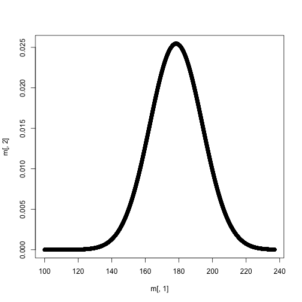

Descending order


```r
mtcars[order(mtcars$mpg, decreasing = TRUE), ]
```

```
##    carb  mpg cyl  disp  hp drat    wt  qsec vs am gear carbMeanMPG
## 6     1 33.9   4  71.1  65 4.22 1.835 19.90  1  1    4    25.34286
## 4     1 32.4   4  78.7  66 4.08 2.200 19.47  1  1    4    25.34286
## 9     2 30.4   4  75.7  52 4.93 1.615 18.52  1  1    4    22.40000
## 14    2 30.4   4  95.1 113 3.77 1.513 16.90  1  1    5    22.40000
## 7     1 27.3   4  79.0  66 4.08 1.935 18.90  1  1    4    25.34286
## 16    2 26.0   4 120.3  91 4.43 2.140 16.70  0  1    5    22.40000
## 10    2 24.4   4 146.7  62 3.69 3.190 20.00  1  0    4    22.40000
## 5     1 22.8   4 108.0  93 3.85 2.320 18.61  1  1    4    25.34286
## 11    2 22.8   4 140.8  95 3.92 3.150 22.90  1  0    4    22.40000
## 3     1 21.5   4 120.1  97 3.70 2.465 20.01  1  0    3    25.34286
## 2     1 21.4   6 258.0 110 3.08 3.215 19.44  1  0    3    25.34286
## 17    2 21.4   4 121.0 109 4.11 2.780 18.60  1  1    4    22.40000
## 21    4 21.0   6 160.0 110 3.90 2.620 16.46  0  1    4    15.79000
## 22    4 21.0   6 160.0 110 3.90 2.875 17.02  0  1    4    15.79000
## 31    6 19.7   6 145.0 175 3.62 2.770 15.50  0  1    5    19.70000
## 15    2 19.2   8 400.0 175 3.08 3.845 17.05  0  0    3    22.40000
## 26    4 19.2   6 167.6 123 3.92 3.440 18.30  1  0    4    15.79000
## 8     2 18.7   8 360.0 175 3.15 3.440 17.02  0  0    3    22.40000
## 1     1 18.1   6 225.0 105 2.76 3.460 20.22  1  0    3    25.34286
## 27    4 17.8   6 167.6 123 3.92 3.440 18.90  1  0    4    15.79000
## 19    3 17.3   8 275.8 180 3.07 3.730 17.60  0  0    3    16.30000
## 20    3 16.4   8 275.8 180 3.07 4.070 17.40  0  0    3    16.30000
## 29    4 15.8   8 351.0 264 4.22 3.170 14.50  0  1    5    15.79000
## 12    2 15.5   8 318.0 150 2.76 3.520 16.87  0  0    3    22.40000
## 13    2 15.2   8 304.0 150 3.15 3.435 17.30  0  0    3    22.40000
## 18    3 15.2   8 275.8 180 3.07 3.780 18.00  0  0    3    16.30000
## 32    8 15.0   8 301.0 335 3.54 3.570 14.60  0  1    5    15.00000
## 25    4 14.7   8 440.0 230 3.23 5.345 17.42  0  0    3    15.79000
## 23    4 14.3   8 360.0 245 3.21 3.570 15.84  0  0    3    15.79000
## 28    4 13.3   8 350.0 245 3.73 3.840 15.41  0  0    3    15.79000
## 24    4 10.4   8 460.0 215 3.00 5.424 17.82  0  0    3    15.79000
## 30    4 10.4   8 472.0 205 2.93 5.250 17.98  0  0    3    15.79000
```

---
## rev


```r
rev(c("a", "b", "c"))
```

```
## [1] "c" "b" "a"
```

Helpful in producing standard error polygons around regression lines

---
## which


```r
which(mtcars$mpg > 30)
```

```
## [1]  4  6  9 14
```

```r
mtcars$mpg[which(mtcars$mpg > 30)]
```

```
## [1] 32.4 33.9 30.4 30.4
```

----
## which.max/which.min


```r
mtcars$mpg[which.max(mtcars$mpg)]
```

```
## [1] 33.9
```

```r
mtcars$mpg[which.min(mtcars$mpg)]
```

```
## [1] 10.4
```

----
## cut


```r
mtcars$catMPG <- cut(mtcars$mpg, seq(0, 40, 10))
head(mtcars)
```

```
##   carb  mpg cyl  disp  hp drat    wt  qsec vs am gear carbMeanMPG  catMPG
## 1    1 18.1   6 225.0 105 2.76 3.460 20.22  1  0    3    25.34286 (10,20]
## 2    1 21.4   6 258.0 110 3.08 3.215 19.44  1  0    3    25.34286 (20,30]
## 3    1 21.5   4 120.1  97 3.70 2.465 20.01  1  0    3    25.34286 (20,30]
## 4    1 32.4   4  78.7  66 4.08 2.200 19.47  1  1    4    25.34286 (30,40]
## 5    1 22.8   4 108.0  93 3.85 2.320 18.61  1  1    4    25.34286 (20,30]
## 6    1 33.9   4  71.1  65 4.22 1.835 19.90  1  1    4    25.34286 (30,40]
```

----
## unique


```r
library(openintro)
head(births)
```

```
##   fAge mAge weeks premature visits gained weight sexBaby     smoke
## 1   31   30    39 full term     13      1   6.88    male    smoker
## 2   34   36    39 full term      5     35   7.69    male nonsmoker
## 3   36   35    40 full term     12     29   8.88    male nonsmoker
## 4   41   40    40 full term     13     30   9.00  female nonsmoker
## 5   42   37    40 full term     NA     10   7.94    male nonsmoker
## 6   37   28    40 full term     12     35   8.25    male    smoker
```

----
How many different weeks were women pregnant?


```r
unique(births$weeks)
```

```
##  [1] 39 40 28 35 32 41 38 36 33 34 37 42 43 44 29 26
```

```r
length(unique(births$weeks))
```

```
## [1] 16
```

----
## paste


```r
paste("Variable", 1:5, sep = "_")
```

```
## [1] "Variable_1" "Variable_2" "Variable_3" "Variable_4" "Variable_5"
```

```r
paste("Variable", rep(1:3, each = 2), c("a", "b"), sep = ".")
```

```
## [1] "Variable.1.a" "Variable.1.b" "Variable.2.a" "Variable.2.b"
## [5] "Variable.3.a" "Variable.3.b"
```

```r
paste0("Variable", 1:5)
```

```
## [1] "Variable1" "Variable2" "Variable3" "Variable4" "Variable5"
```

```r
paste0("Variable", rep(1:3, each = 2), c("a", "b"))
```

```
## [1] "Variable1a" "Variable1b" "Variable2a" "Variable2b" "Variable3a"
## [6] "Variable3b"
```

----
## is.na


```r
library(mi)
data(nlsyV)
head(nlsyV)
```

```
##      ppvtr.36 first b.marr income momage momed momrace
## 535       105     1      1  21446     20     2       3
## 2932       91     1      1  12125     22     2       3
## 2906       89     0      1  13560     22     2       1
## 4510       85     0      1  24500     28     3      NA
## 3869       66     0      0   3304     20     1      NA
## 2952       NA     0      0   5832     27     2      NA
```

-----


```r
table(is.na(nlsyV$momrace))
```

```
## 
## FALSE  TRUE 
##   283   117
```

Count number of missing cases for each row


```r
nlsyV$missRowTot <- apply(nlsyV, 1, function(x) sum(is.na(x)))
head(nlsyV)
```

```
##      ppvtr.36 first b.marr income momage momed momrace missRowTot
## 535       105     1      1  21446     20     2       3          0
## 2932       91     1      1  12125     22     2       3          0
## 2906       89     0      1  13560     22     2       1          0
## 4510       85     0      1  24500     28     3      NA          1
## 3869       66     0      0   3304     20     1      NA          1
## 2952       NA     0      0   5832     27     2      NA          2
```

----
## Your Turn (probably fairly tough)
# Use some of the common/routine functions to do the following:
* Create a sequence vector from 100 to 237 that is of length 1000.
* Randomly order the vector
* Compute the likelihood of each point occurring from a normal distribution
  with $\mu$ = 178.32 and $\sigma$ = 15.67. Store the result in a new vector.
* Form a 1000 by 2 matrix that is composed of the sequence vector and
  the likelihood vector.
* Use the matrix to plot the relation between the sequence vector and the
  likelihood of each point.

----
* Create a sequence vector from 100 to 237 that is of length 10,000.


```r
v <- seq(100, 237, length.out = 1e4)
head(v)
```

```
## [1] 100.0000 100.0137 100.0274 100.0411 100.0548 100.0685
```

* Randomly order the vector


```r
v <- sample(v, length(v))
head(v)
```

```
## [1] 136.0483 117.7022 183.4550 139.0626 207.8709 153.1065
```

----
* Compute the likelihood of each point, and store the result in a new vector


```r
lik <- dnorm(v, 178.32, 15.67)
head(lik)
```

```
## [1] 0.000669311 0.000014333 0.024128056 0.001103967 0.004301224 0.006976735
```

* Form a 1000 by 2 matrix that is composed of the sequence vector and
  the likelihood vector.


```r
m <- cbind(v, lik)
head(m)
```

```
##             v         lik
## [1,] 136.0483 0.000669311
## [2,] 117.7022 0.000014333
## [3,] 183.4550 0.024128056
## [4,] 139.0626 0.001103967
## [5,] 207.8709 0.004301224
## [6,] 153.1065 0.006976735
```

----
* Use the matrix to plot the relation between the sequence vector and the
  likelihood of each point.


```r
plot(m[ ,1], m[ ,2])
```


